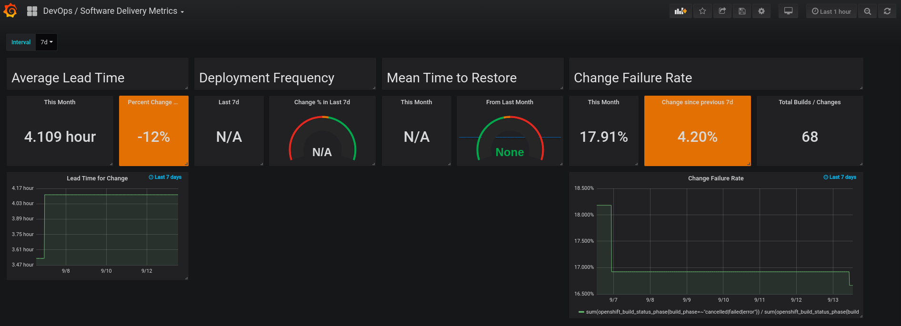

# Metrics Driven Transformation

This repository contains tooling to help organizations measure Software Delivery and Value Stream metrics.

## Features

* [Software Delivey Metrics Dashboard](#software-delivery-metrics-dashboard)
* Platform Adoption Dashboard (Planned Feature)
* Value Stream Metrics Dashboard (Planned Feature)

### Software Delivery Metrics Dashboard

The Software Delivery Metrics Dashboard is a Grafana dashboard that can easily be deployed to an OpenShift cluster, and provides and organizational level view of the [four critical measures of software delivery performance](https://blog.openshift.com/exploring-a-metrics-driven-approach-to-transformation/).



## Installation

The following will walk through the deployment of the MDT tooling.

### Prerequisites

Before deploying the tooling, you must have the following prepared

* An OpenShift 3.11 or higher Environment
* A machine from which to run the install (usually your laptop)
  * The OpenShift Command Line Tool (oc)
  * Helm 3

### Deployment Instructions

To deploy pelorus, run the following script from within the root repository directory

```
./runhelm.sh
```

Pelorus also has additional (optional) exporters that can be deployed to gather additional data and integrate with external systems. Consult the docs for each exporter below:

* [Commit Time Exporter](exporters/committime/README.md)
* Deploy Time (Coming Soon)

### Adding extra prometheus instances

By default, this tool will pull in data from the cluster in which it is running. The tool also supports collecting data across mulitple OpenShift clusters. In order to do this, we need to point the Pelorus instance at these other clusters.

To do this, create a new variables file , `extra_prometheus_hosts.yaml`.  It is a yaml file with an array of entries with the following parameters:

* id - a description of the prometheus host (this will be used as a label to select metrics in the federated instance).
* hostname - the fully qualified domain name or ip address of the host with the extra prometheus instance
* password - the password used for the 'internal' basic auth account (this is provided by the k8s metrics prometheus instances in a secret).

For example:

    extra_prometheus_hosts:
      - id: "ci-1"
        hostname: "prometheus-k8s-openshift-monitoring.apps.ci-1.example.com"
        password: "<redacted>"

Once you are finished adding your extra hosts, you can update your stack by re-running the helm command above, passing your values file with `--values extra-prometheus-hosts.yaml`

```
./runhelm.sh --values extra-prometheus-hosts.yaml
```

### Cleaning Up

Cleaning up Pelorus is very simple.

    helm template --namespace pelorus pelorus ./charts/deploy/ | oc delete -f-
