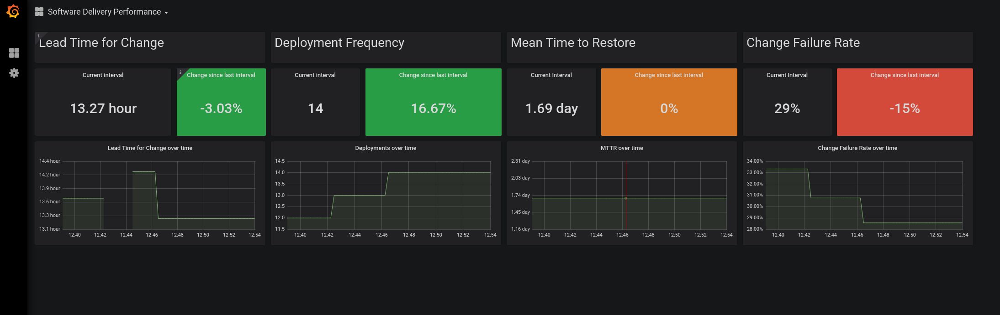

# Pelorus

Pelorus is a tool that helps IT organizations measure their impact on the overall performance on their organization. It does this by gathering metrics about team and organizational behaviors over time in some key areas of IT that have been shown to impact the value they deliver to the organization as a whole. Some of the key areas Pelorus focuses on are:

- Software Delivery Performance
- Product Performance and Adoption
- IT Platform Performance and Adoption

For more background on the project you can read @trevorquinn's blog post on [Metrics Driven Transformation](https://www.openshift.com/blog/exploring-a-metrics-driven-approach-to-transformation)

### Software Delivery Metrics Dashboard

The Software Delivery Metrics Dashboard is a Grafana dashboard that can easily be deployed to an OpenShift cluster, and provides and organizational level view of the [four critical measures of software delivery performance](https://blog.openshift.com/exploring-a-metrics-driven-approach-to-transformation/).

## Installation

A guide for installation can be found in the install document found  in the [install guide](./docs/Install.md)

## Configuration

A guide for configuration can be found in the configuration document found in the [configuration document](./docs/Configuration.md)

## Contributing to Pelorus

If you are interested in contributing to the Pelorus project, please review our Contribution guide which can be found in the [contribution guide](./docs/CONTRIBUTING.md)
