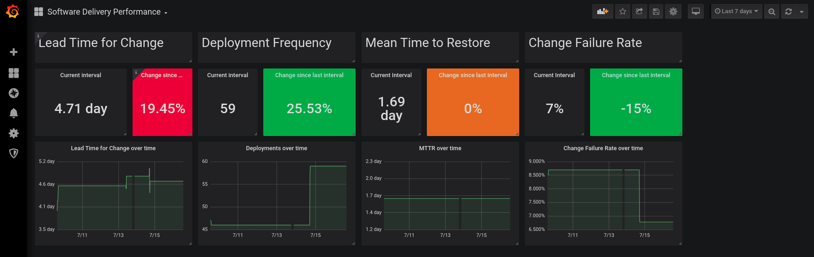

Pelorus is a tool that helps IT organizations measure their impact on the overall performance of their organization. It does this by gathering metrics about team and organizational behaviors over time in some key areas of IT that have been shown to impact the value they deliver to the organization as a whole. Some of the key outcomes Pelorus can focus on are:

- Software Delivery Performance
- Product Quality and Sustainability
- Customer experience

For more background on the project you can read @trevorquinn's blog post on [Metrics Driven Transformation](https://www.openshift.com/blog/exploring-a-metrics-driven-approach-to-transformation)

### Software Delivery Performance as an outcome

Currently, Pelorus functionality can capture proven metrics that measure Software Delivery Performance -- a significant outcome that IT organizations aim to deliver.

Pelorus is a Grafana dashboard that can easily be deployed to an OpenShift cluster, and provides an organizational-level view of the [four critical measures of software delivery performance](https://blog.openshift.com/exploring-a-metrics-driven-approach-to-transformation/).

A short video describing each of these metrics is available [here](https://www.youtube.com/watch?v=7-iB_KhUaQg).

## Documentation

Pelorus documentation is available at [pelorus.readthedocs.io](https://pelorus.readthedocs.io/).

## Contributing to Pelorus

If you are interested in contributing to the Pelorus project, please review our Contribution guide which can be found in the [contribution guide](./CONTRIBUTING.md)
