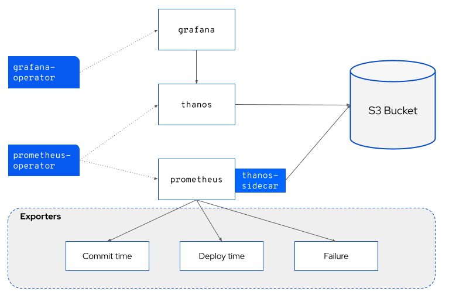
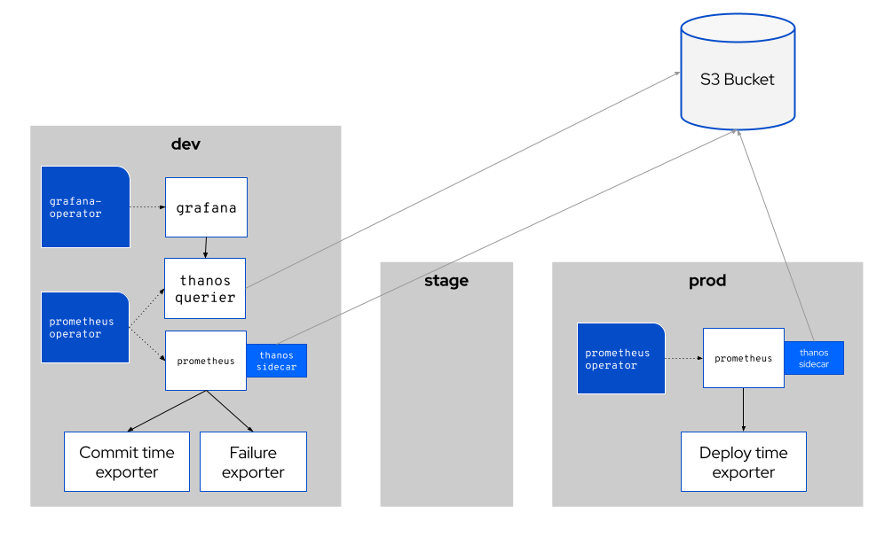

# Pelorus Architecture

The following diagram shows the various components and traffic flows in the Pelorus ecosystem.

## Basic Architecture and Components

Pelorus is composed of the following open source components.

* Prometheus Operator
  * Prometheus
  * Thanos (backed by Object Store)
* Grafana Operator
  * Grafana
* Pelorus Exporters
  * Commit Time
  * Deploy Time
  * Failure

### Prometheus and Grafana

Pelorus is built on top of [Prometheus](https://prometheus.io/) and [Grafana](https://grafana.com/), an industry standard open source metrics gathering and dashboarding stack. This allows for us to focus on the core differntiators for Pelorus - the metrics we care about, methods of gathering then, and building information radiators from those metrics.

[Thanos](https://thanos.io/) is a set of Prometheus components that provide high availability and long term storage of Prometheus data. We use Thanos in Pelorus to give our dashboards the ability to look back over months or years of organizational data.

### Pelorus Exporters

An [exporter](https://prometheus.io/docs/instrumenting/exporters/) is a Prometheus concept of a bot that gathers and exposes data. Pelorus uses the exporter framework to build integrations with a myriad of common IT systems from which we can then gather the relevant data for our dashboards.

## Multi-Cluster Architecture (Production)

In production environments, Pelorus will typically need to be installed across multiple kubernetes clusters. In most cases, the two clusters that matter are the "Development" cluster (where builds are happening)

