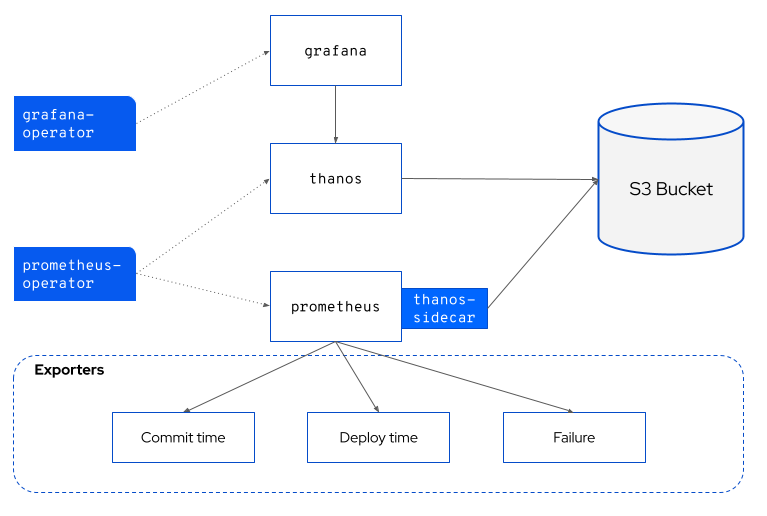
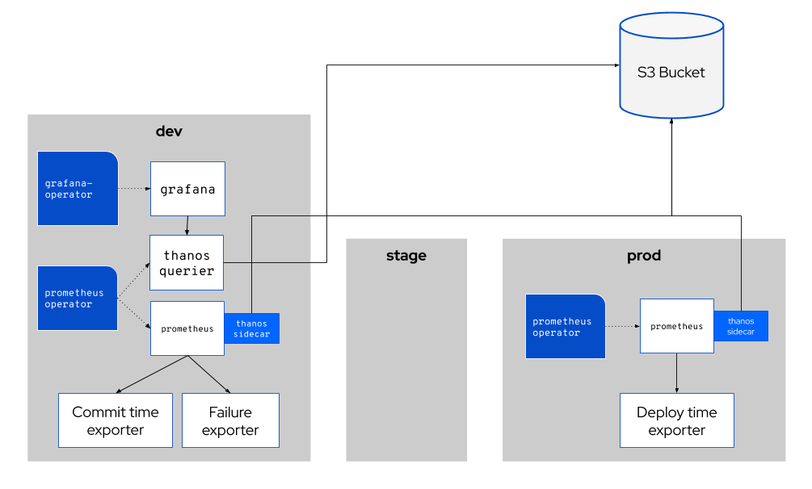

# Pelorus Architecture

The following diagram shows the various components and traffic flows in the Pelorus ecosystem.

Pelorus is composed of the following open source components.

* Prometheus Operator
  * Prometheus
  * Thanos (backed by Object Store)
* Grafana Operator
  * Grafana
* Pelorus Exporters
  * Commit Time
  * Deploy Time
  * Failure

## Pelorus Multi-Cluster Architecture

The following diagram shows how a multi-cluster implementation is configured.

In the multi-cluster configuration there is a shared S3 bucket that Thanos uses to serve metrics.
