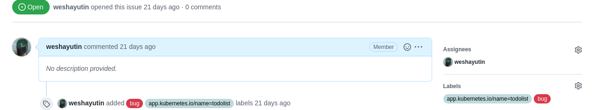

# Configuration

## Configuring The Pelorus Stack

The Pelorus stack (Prometheus, Grafana, Thanos, etc.) can be configured by changing the `values.yaml` file that is passed to helm. The recommended practice is to make a copy of the one [values.yaml](https://github.com/konveyor/pelorus/blob/master/charts/pelorus/values.yaml) file and [charts/pelorus/configmaps/](https://github.com/konveyor/pelorus/blob/master/charts/pelorus/configmaps) directory, and store in in your own configuration repo for safe keeping, and updating. Once established, you can make configuration changes by updating your `charts/pelorus/configmaps` files with `values.yaml` and applying the changes like so:

```
oc apply -f `myclusterconfigs/pelorus/configmaps
helm upgrade pelorus charts/pelorus --namespace pelorus --values myclusterconfigs/pelorus/values.yaml
```

The following configurations may be made through the `values.yaml` file:

| Variable                               | Required | Explanation                                                                                                                                                                                                                                                                                                                       | Default Value                          |
|----------------------------------------|----------|-----------------------------------------------------------------------------------------------------------------------------------------------------------------------------------------------------------------------------------------------------------------------------------------------------------------------------------|----------------------------------------|
| `openshift_prometheus_htpasswd_auth`   | yes      | The contents for the htpasswd file that Prometheus will use for basic authentication user.                                                                                                                                                                                                                                        | User: `internal`, Password: `changeme` |
| `openshift_prometheus_basic_auth_pass` | yes      | The password that grafana will use for its Prometheus datasource. Must match the above.                                                                                                                                                                                                                                           | `changme`                              |
| `custom_ca`                            | no       | Whether or not the cluster serves custom signed certificates for ingress (e.g. router certs). If `true` we will load the custom via the [certificate injection method](https://docs.openshift.com/container-platform/4.4/networking/configuring-a-custom-pki.html#certificate-injection-using-operators_configuring-a-custom-pki) | `false`                                |
| `exporters`                            | no       | Specified which exporters to install. See [Configuring Exporters](#configuring-exporters).                                                                                                                                                                                                                                        | Installs deploytime exporter only.     |

## Configuring Exporters Overview

An _exporter_ is a data collection application that pulls data from various tools and platforms and exposes it such that it can be consumed by Pelorus dashboards. Each exporter gets deployed individually alongside the core Pelorus stack.

There are currently three _exporter_ types which needs to be specified via `exporters.instances.exporter_type` value, those are `deploytime`, `failure` or `comittime`.


Exporters can be deployed via a list of `exporters.instances` inside the `values.yaml` file that corresponds to the OpenShift ConfigMap configurations from the `charts/pelorus/configmaps/` directory. Some exporters also require secrets to be created when integrating with external tools and platforms. A sample exporter configuration may look like this:

```yaml
exporters:
  instances:
  - app_name: deploytime-exporter
    exporter_type: deploytime
    env_from_configmaps:
    - pelorus-config
    - deploytime-config
```

Additionally, you may want to deploy a single exporter multiple times to gather data from different sources. For example, if you wanted to pull commit data from both GitHub and a private GitHub Enterprise instance, you would deploy two instances of the Commit Time Exporter.

Each exporter additionally takes a unique set of environment variables to further configure its integrations and behavior. These can be set by using example ConfigMap object configurations similarly to the kubernetes secrets and listing them under `env_from_configmaps` or under `env_from_secrets` accordingly. As shown below.

```yaml
exporters:
  instances:
  - app_name: committime-github
    exporter_type: comittime
    env_from_secrets:
    - github-credentials
    env_from_configmaps:
    - pelorus-config
    - committime-config

  - app_name: committime-gh-enterprise
    exporter_type: comittime
    env_from_secrets:
    - github-enterprise-credentials
    env_from_configmaps:
    - pelorus-config
    - comittime-enterprise-config
```

### ConfigMap configuration values

Configuration for each exporter is done via ConfigMap objects. Best practice is to store the folder outside of local Pelorus Git repository and modify accordingly.
Each ConfigMap must be in a separate file and must be applied to the cluster before deploying pelorus helm chart.

ConfigMap can be applied individually or all together:
```shell
# Only deploytime ConfigMap
oc apply -f charts/pelorus/configmaps/deploytime.yaml

# All at once
oc apply -f charts/pelorus/configmaps/
```

Example ConfigMap for the `deploytime-exporter` with the unique name `deploytime-config`:
```
apiVersion: v1
kind: ConfigMap
metadata:
  name: deploytime-config
  namespace: pelorus
data:
  PROD_LABEL: "default"    # "" / PROD_LABEL is ignored if NAMESPACES are provided
  NAMESPACES: "default"    # ""
```

### Exporter installation sources

Each exporter can be deployed from the pre-built images or from the source code hosted in the accessible from the cluster GIT repository. Each exporter instance may be deployed using different method.

If not defined specifically, exporters are using pre-built container images with the `stable` tag from the following sources:

  * Quay repository for the [committime-exporter](https://quay.io/repository/pelorus/pelorus-committime-exporter)
  * Quay repository for the [failure-exporter](https://quay.io/repository/pelorus/pelorus-failure-exporter)
  * Quay repository for the [deploytime-exporter](https://quay.io/repository/pelorus/pelorus-deploytime-exporter)

#### Pre-built Quay images

Each Pelorus GitHub pull request that is [merged](https://github.com/konveyor/pelorus/pulls?q=is%3Apr+is%3Amerged) results in a new set of images that are tagged with the GitHub commit hash, for example `d6f6e6fa1c9d48ca1deeaf1c72585b94964cbf31` for the following [Pull Request](https://github.com/konveyor/pelorus/commit/d6f6e6fa1c9d48ca1deeaf1c72585b94964cbf31). The newest merged commit results in additional image tag `latest`.

Each new Pelorus [release](https://github.com/konveyor/pelorus/releases) results in a new set of images that are tagged with the release number, for example `v1.7.1`. At the same time when release is made a `stable` tag is updated to point to the latest released version of the images.

During Pelorus Helm deployment or update time user have option to specify the image tag for each exporter instance individually. Example below shows two different tags for the commit time exporter and two tags for the failure exporter.

```yaml
exporters:
  instances:
  - app_name: committime-github
    exporter_type: comittime
    image_tag: latest # Newest image from the last merged source code
    env_from_secrets:
    - github-credentials
    env_from_configmaps:
    - pelorus-config
    - committime-config

  - app_name: committime-gh-enterprise
    exporter_type: comittime
    image_tag: stable # By default it's `stable`, so we do not need to include image_tag here
    env_from_secrets:
    - github-enterprise-credentials
    env_from_configmaps:
    - pelorus-config
    - comittime-enterprise-config

  - app_name: failure-github
    exporter_type: deploytime
    image_tag: d6f6e6fa1c9d48ca1deeaf1c72585b94964cbf31 # Specific merge build
    env_from_secrets:
    - github-credentials
    env_from_configmaps:
    - pelorus-config
    - my-failure-github-config

- app_name: jira-failure-exporter
    exporter_type: failure
    image_tag: v1.7.1 # Specific release
    env_from_secrets:
    - jira-credentials
    env_from_configmaps:
    - pelorus-config
    - my-failure-jira-config
```

#### Pre-built custom images

This method can be used to deploy Pelorus with the user built images or pre-built images mirrored in other than [quay.io](quay.io) registry.

In such case the exporter instance configuration needs to include `image_name` that is in a format of full path to the image including image `:tag` or just image path without the `:tag` part. Not including image `:tag` results to use default `stable` tag unless `image_tag` configuration option is specified.

Example of such exporter instances are below:

```yaml
exporters:
  instances:
  - app_name: committime-github
    exporter_type: comittime
    image_name: my.container.registry.io/pelorus/my-committime-exporter:latest # :stable would be used if no :latest was specified
    env_from_secrets:
    - github-credentials
    env_from_configmaps:
    - pelorus-config
    - committime-config

  - app_name: committime-gh-enterprise
    exporter_type: comittime
    image_name: my.container.registry.io/pelorus/my-committime-exporter # image tag specified in the image_tag line below
    image_tag: mytag
    env_from_secrets:
    - github-enterprise-credentials
    env_from_configmaps:
    - pelorus-config
    - comittime-enterprise-config
```

#### Source-to-image (S2I)

By specyfing `source_url` and optionally `source_ref` Pelorus exporters will use installation method that performs incremental builds of the exporter images using source from the GIT repository. Images are being stored in an OpenShift Container Platform registry and used during Pelorus Helm deployment or update. Each instance that uses this method results in a new build. This method is recommended for development or unmerged bug-fixes as it may point to any GIT and any branch or GIT reference. By default `source_ref` points to the latest [released](https://github.com/konveyor/pelorus/releases) Pelorus.

Example of such exporter instances are below:

```yaml
exporters:
  instances:
  - app_name: committime-github
    exporter_type: comittime
    source_url: https://github.com/konveyor/pelorus.git
    source_ref: refs/pull/567/head # References not merged GitHub pull request number 567
    env_from_secrets:
    - github-credentials
    env_from_configmaps:
    - pelorus-config
    - committime-config

  - app_name: committime-gh-enterprise
    exporter_type: comittime
    source_url: https://github.com/mypelorusfork/pelorus.git
    source_ref: testbranch # Use testbranch from mypelorusfork org
    env_from_secrets:
    - github-enterprise-credentials
    env_from_configmaps:
    - pelorus-config
    - comittime-enterprise-config
```

### Authentication to Remote Services

Pelorus exporters make use of `personal access tokens` when authentication is 
required.  It is recommended to configure the Pelorus exporters with authenticaion
via the `TOKEN` key to avoid connection rate limiting and access restrictions.

More information about personal access tokens:
* [Github Personal Access Tokens](https://docs.github.com/en/authentication/keeping-your-account-and-data-secure/creating-a-personal-access-token)

* [Jira / Bitbucket Personal Access Tokens](https://confluence.atlassian.com/bitbucketserver/personal-access-tokens-939515499.html)

* [Gitlab Personal Access Tokens](https://docs.gitlab.com/ee/user/profile/personal_access_tokens.html)

* [Microsoft Azure DevOps Tokens](https://docs.microsoft.com/en-us/azure/devops/organizations/accounts/use-personal-access-tokens-to-authenticate?view=azure-devops&tabs=Windows)

* [Gitea Tokens](https://docs.gitea.io/en-us/api-usage/#generating-and-listing-api-tokens)

To store a personal access token securely and to make the token available to Pelorus use
Openshift secrets. Pelorus can utilize secrets for all of the exporters. The following
is an example for the committime exporter.

A simple Github example:
```shell
oc create secret generic github-secret --from-literal=TOKEN=<personal access token> -n pelorus
```

A Pelorus exporter can require additional information to collect data such as the 
remote `GIT_API` or `API_USER` information.  It is recommended to consult the requirements
for each Pelorus exporter in this guide and include the additional key / value information in the Openshift secret. An API example is `github.mycompany.com/api/v3`
or `https://gitea.mycompany.com`.

The cli commands can also be substituted with Secret templates. Example files can be found [here](https://github.com/konveyor/pelorus/tree/master/charts/pelorus/secrets)

Create a secret containing your Git username, token, and API example:

```shell
oc create secret generic github-secret --from-literal=API_USER=<username> --from-literal=TOKEN=<personal access token> --from-literal=GIT_API=<api> -n pelorus
```

A Jira example:
```shell
oc create secret generic jira-secret \
--from-literal=SERVER=<Jira Server> \
--from-literal=API_USER=<username/e-mail> \
--from-literal=TOKEN=<personal access token> \
-n pelorus
```

A ServiceNow example:
```shell
oc create secret generic snow-secret \
--from-literal=SERVER=<ServiceNow Server> \
--from-literal=API_USER=<username> \
--from-literal=TOKEN=<personal access token> \
--from-literal=TRACKER_PROVICER=servicenow \
--from-literal=APP_FIELD=<Custom app label field> \
-n pelorus
```

### Custom Certificates

If you run services internally with certificates not signed by typical public root CAs,
you can supply your own custom certificates.

Currently, this is only supported for the following exporters:

| Exporter Type | Exporter Backend |
|---------------|------------------|
| Commit Time   | BitBucket        |
| Commit Time   | Gitea            |
| Commit Time   | GitHub           |
| Commit Time   | GitLab           |
| Failure       | GitHub           |

We hope to expand this list in the future.

To use custom certificates, create `ConfigMap`s that have keys ending in `.pem`,
with their values as PEM-formatted certificate files.
Then under each exporter's `custom_certs` key, list each cert with `map_name: $NAME_HERE`. 

#### Custom Certificates Example

First, you need a dir full of PEM-formatted certificates. Be careful not to expose private keys!

```console
$ ls ./certificates
trusted_internal_CA.pem
$ cat trusted_internal_CA.pem
-----BEGIN CERTIFICATE-----
(elided)
-----END CERTIFICATE-----
```

Next, create the secret based on this directory.
```shell
oc create configmap my-certs --from-file=./certificates
```

Then configure the exporter to use the `ConfigMap`'s certificates:
```yaml
- app_name: committime-exporter
  exporter_type: committime
  custom_certs:
    - map_name: my-certs
```

When it starts up, you should see information about custom certificate usage, depending upon your `LOG_LEVEL`:
```log
08-24-2022 19:08:59 INFO Combining custom certificate file /etc/pelorus/custom_certs/my-certs/foo.pem
08-24-2022 19:08:59 DEBUG /opt/app-root/lib64/python3.9/site-packages/pelorus/certificates.py:48 _combine_certificates() Combined certificate bundle created at /tmp/custom-certsklkg4hel.pem
```

...and then requests to internal services using certs in the given chains should work.


### Labels

Labels are key/value pairs that are attached to objects, such as pods. Labels are intended to be used to specify identifying attributes of objects that are meaningful and relevant to users and Pelorus.

The commit time, deploy time, and failure exporters all rely on labels to indentify the application that is associated with an object.  The object can
include a build, build configuration, deployment or issue.

In Pelorus the default label is: `app.kubernetes.io/name=<app_name>` where 
app_name is the name of the application(s) being monitored. The label can
be customized by setting the `APP_LABEL` variable to your custom value. 

An example may be to override the APP_LABEL for the failure exporter to indicate a production bug or issue.
The `APP_LABEL` with the value `production_issue/name` may give more context than `app.kubernetes.io/name`
In this case the Github issue would be labeled with `production_issue/name=todolist`

Example Failure exporter config:
```
- app_name: failure-exporter
  exporter_type: failure
  env_from_secrets:
  - github-secret
  extraEnv:
  - name: LOG_LEVEL
    value: DEBUG
  - name: PROVIDER
    value: github
  - name: PROJECTS
    value: konveyor/mig-demo-apps,konveyor/oadp-operator
  - name: APP_LABEL
    value: production_issue/name
```

> **Warning** 
> If the application label is not properly configured, Pelorus will not collect data for that object.

In the following examples an application named [todolist](https://github.com/konveyor/mig-demo-apps/blob/master/apps/todolist-mongo-go/mongo-persistent.yaml) is being monitored.

Example BuildConfig:
```
- kind: BuildConfig
  apiVersion: build.openshift.io/v1
  metadata:
    name: todolist
    namespace: mongo-persistent
    labels:
      app.kubernetes.io/name: todolist
```

Example DeploymentConfig:
```
- apiVersion: apps.openshift.io/v1
  kind: DeploymentConfig
  metadata:
    name: todolist
    namespace: mongo-persistent
    labels:
      app: todolist
      app.kubernetes.io/name: todolist
      application: todolist
      deploymentconfig: todolist-mongo-go
```

Example ReplicaSet:
```
replicas: 1
template:
  metadata:
    creationTimestamp:
    labels:
      e2e-app: "true"
      application: todolist
      deploymentconfig: todolist-mongo-go
      app.kubernetes.io/name: todolist
```

Example Application via the cli:
```
oc -n mongo-persistent new-app todolist -l "app.kubernetes.io/name=todolist"
```

Example Github issue:

Create an issue, and create a Github issue label: "app.kubernetes.io/name=todolist".  Here is a working [example](https://github.com/konveyor/mig-demo-apps/issues/82)



Jira issue:

In the Jira project issue settings, create a label with the text "app.kubernetes.io/name=todolist". 


### Annotations and local build support

Commit Time Exporter may be used in conjunction with Builds **where values required to gather commit time from the source repository are missing**. In such case each Build is required to be annotated with two values allowing Commit Time Exporter to calculate metric from the Build.

To annotate Build use the following commands:

```shell
oc annotate build <build-name> -n <namespace> --overwrite io.openshift.build.commit.id=<commit_hash>

oc annotate build <build-name> -n <namespace> --overwrite io.openshift.build.source-location=<repo_uri>
```

Custom Annotation names may also be configured using Commit Time Exporter [ConfigMap Data Values](#configmap-data-values).

Note: The requirement to label the build with `app.kubernetes.io/name=<app_name>` for the annotated Builds applies.

#### Example workflow for an OpenShift binary build

* Sample Application

```
cat app.py 
#!/usr/bin/env python3
print("Hello World")
```

* Binary build steps

```
NS=binary-build
NAME=python-binary-build

oc create namespace "${NS}"

oc new-build python --name="${NAME}" --binary=true -n "${NS}"  -l "app.kubernetes.io/name=${NAME}"
oc start-build "bc/${NAME}" --from-file=./app.py --follow -n "${NS}"

oc get builds -n "${NS}"
oc -n "${NS}" annotate build "${NAME}-1" --overwrite \
io.openshift.build.commit.id=7810f2a85d5c89cb4b17e9a3208a311af65338d8 \
io.openshift.build.source-location=http://github.com/konveyor/pelorus

oc -n "${NS}" new-app "${NAME}" -l "app.kubernetes.io/name=${NAME}"
```

#### Additional Examples

There are many ways to build and deploy applications in OpenShift.  Additional examples of how to annotate builds such that Pelorus will properly discover the commit metadata can be found in the  [Pelorus tekton demo](https://github.com/konveyor/pelorus/tree/master/demo)

### Annotations, Docker Labels and Image support

Image object annotations similarly to [Annotations and local build support](#annotations-and-local-build-support) may be used for the Commit Time Exporter **where values from the Build objects required to gather commit time from the source repository are missing**.

Note: The requirement to label the image SHA with `app.kubernetes.io/name=<app_name>` for the annotated or Labeled Image objects applies.

Custom Annotation names may also be configured using Commit Time Exporter [ConfigMap Data Values](#configmap-data-values).

An Image object which is a result of Docker or Source-to-Image (S2I) builds set includes Docker Label `io.openshift.build.commit.date` metadata from which Commit Time Exporter gets the commit date. In such case Image object do not need to be annotated.

Example image metadata with `io.openshift.build.commit.date` Docker Labels and `app.kubernetes.io/name=<app_name>` Label required for the Commit Time Exporter:

```
IMAGE_SHA=588fb67a63ccbadf245b6d30747c404d809a851551b67c615a18217bf443a78e

$ oc describe image "sha256:${IMAGE_SHA}"

Docker Image:	image-registry.openshift-image-registry.svc:5000/mongo-persistent/todolist-mongo-go@sha256:588fb67a63ccbadf245b6d30747c404d809a851551b67c615a18217bf443a78e
Name:		    sha256:588fb67a63ccbadf245b6d30747c404d809a851551b67c615a18217bf443a78e
[...]
Labels:		    app.kubernetes.io/name=my-demo-application
[...]
Docker Labels:	io.buildah.version=1.22.4
		        io.openshift.build.commit.author=Wesley Hayutin <weshayutin@gmail.com>
		        io.openshift.build.commit.date=Mon Aug 8 13:13:58 2022 -0600
		        io.openshift.build.commit.id=b6abfb214557289bdaa9bed3dcc570ffd5b9ad4f
		        io.openshift.build.commit.message=Merge pull request #90 from mpryc/master
		        io.openshift.build.commit.ref=master
		        io.openshift.build.name=todolist-1
		        io.openshift.build.namespace=mongo-persistent
		        io.openshift.build.source-location=https://github.com/konveyor/mig-demo-apps.git
```

To annotate Image and ensure Commit Time Exporter can gather relevant values, use `oc annotate` CLI as in the following example:

```
$ NAME=my-application
$ IMAGE_SHA=588fb67a63ccbadf245b6d30747c404d809a851551b67c615a18217bf443a78e
$ oc label image "sha256:${IMAGE_SHA}" "app.kubernetes.io/name=${NAME}"

# In case image already has the `app.kubernetes.io/name` label, use --overwrite CLI option
$ oc label image "sha256:${IMAGE_SHA}" --overwrite "app.kubernetes.io/name=${NAME}"

> image.image.openshift.io/sha256:588fb67a63ccbadf245b6d30747c404d809a851551b67c615a18217bf443a78e labeled

$ oc annotate image "sha256:${IMAGE_SHA}" --overwrite \
     io.openshift.build.commit.date="Mon Aug 8 13:13:58 2022 -0600"

> image.image.openshift.io/sha256:588fb67a63ccbadf245b6d30747c404d809a851551b67c615a18217bf443a78e annotated

# It's not necessary for the Pelorus metric, but for completeness of the data, you may also annotate Git commit corresponding
# with the Image build:

$ oc annotate image "sha256:${IMAGE_SHA}" --overwrite \
    io.openshift.build.commit.id=b6abfb214557289bdaa9bed3dcc570ffd5b9ad4f \
    io.openshift.build.commit.date="Mon Aug 8 13:13:58 2022 -0600"

> image.image.openshift.io/sha256:588fb67a63ccbadf245b6d30747c404d809a851551b67c615a18217bf443a78e annotated
```

The Image may be also annotated with 10 digit EPOCH timestamp. Allowed format is one, where milliseconds are ignored:

```
$ EPOCH_TIMESTAMP=`git log -1 --format=%ct`
$ echo ${EPOCH_TIMESTAMP}
1663770655

$ NAME=my-application
$ IMAGE_SHA=588fb67a63ccbadf245b6d30747c404d809a851551b67c615a18217bf443a78e
$ oc label image "sha256:${IMAGE_SHA}" "app.kubernetes.io/name=${NAME}"

$ oc annotate image "sha256:${IMAGE_SHA}" --overwrite \
     io.openshift.build.commit.date="${EPOCH_TIMESTAMP}"
```

### Configuring JIRA workflow(s)

#### Default JIRA workflow

Failure Time Exporter configured to work with JIRA issue tracking and project management software, by default will collect information about *all* of the Issues with the following attributes:

1. JIRA Issue to be type of `Bug` with the `Highest` priority.
2. The Resolved JIRA Issue must have `resolutiondate` field.

Optionally user may configure:

1. Pelorus to track only relevant JIRA projects by specyfing `PROJECTS` ConfigMap Data Value. This comma separated value may include either JIRA Project name or JIRA Project Key. Ensure the project key or project name exists in the JIRA, otherwise none of the metrics will get collected.
2. Issue labeled with the `app.kubernetes.io/name=<application_name>`, where `<application_name>` is a user defined application name to be monitored by Pelorus. This name needs to be consistent across other exporters, so the performance metrics presented in the Grafana dashboard are correct. Issues without such label are collected by the failure exporter with the application name: `unknown`.

#### Example Failure Time Exporter ConfigMap with optional fields

Three JIRA projects to be monitored and custom application label to be used within JIRA Issues:

```yaml
apiVersion: v1
kind: ConfigMap
metadata:
  name: custom-failure-config
  namespace: pelorus
data:
  PROVIDER: "jira"
  PROJECTS: "Testproject,SECONDPROJECTKEY,thirdproject"
  APP_LABEL: "my.app.label/myname"
```

#### Custom JIRA workflow

The Failure Time Exporter(s) can be easilly adjusted to adapt custom JIRA workflow(s), this includes:

1. Custom JIRA JQL query to find all matching issues to be tracked. *NOTE* in such case `PROJECTS` value is ignored, because user may or may not include `project` as part of the custom JQL query. More information is available at [Advanced Jira Query Language (JQL) site](https://support.atlassian.com/jira-service-management-cloud/docs/use-advanced-search-with-jira-query-language-jql/).

2. Custom label name to track `<application_name>`. Similarly to the previously explained example in the [Default JIRA workflow](#default-jira-workflow) section. 

3. Custom Resolved state(s). Moving JIRA Issue to one of those states reflects resolution date of an Issue, which is different from the default `resolutiondate` field.

#### Example Failure Time Exporter ConfigMap for custom JIRA workflow

Custom JIRA query to collect all Issues with type of `Bug` that has one of the priorities `Highest` or `Medium` and is within JIRA project name `Sample` or `MYJIRAPROJ` project key name. Additionally each JIRA Issue should be labelled with the custom `my.company.org/appname=<application_name>` label. Pelorus expects the Issue to be marked as Resolved if the Issue is moved to one of the states: `Done`, `Closed` or `Resolved`.

```yaml
apiVersion: v1
kind: ConfigMap
metadata:
  name: second-custom-failure-config
  namespace: pelorus
data:
  PROVIDER: "jira"
  JIRA_JQL_SEARCH_QUERY: 'type in ("Bug") AND priority in ("Highest","Medium") AND project in ("Sample","MYJIRAPROJ")'
  JIRA_RESOLVED_STATUS: 'Done,Closed,Resolved'
  APP_LABEL: "my.company.org/appname"
```

#### Custom JIRA Failure Instance Config

User may deploy multiple Failure Time Exporter instances to gather metrics from multiple JIRA servers or different JIRA workflows. This is achieved by passing different ConfigMap for each instance.

Example ConfigMaps from the previous [Configuring JIRA workflow(s)](#configuring-jira-workflows) section may be used to deploy two separate instances. As shown in the below Pelorus configuration, each of the ConfigMap may be configured variously:

```yaml
exporters:
  instances:
  - app_name: custom-failure-exporter
    exporter_type: failure
    env_from_secrets:
    - my-jira-secret
    env_from_configmaps:
    - pelorus-config
    - custom-failure-config

  - app_name: second-custom-failure-exporter
    exporter_type: failure
    env_from_secrets:
    - my-jira-secret
    env_from_configmaps:
    - pelorus-config
    - second-custom-failure-config
```

## Configuring Exporters Details

### Commit Time Exporter

The job of the commit time exporter is to find and associate time of the relevant source code commit with a container image SHA built from that source code.
Later the Deploy Time Exporter can associate that image SHA with a production deployment and allow to calculate [Lead Time for Change](../dashboards/SoftwareDeliveryPerformance/#lead-time-for-change) metrics.

Commit Time Exporter may be used with an Build or Image cluster objects.

#### Using Commit Time with Git APIs

This is the default method of gathering commit time from the source code that triggered container build. Git commit hash and FQDN from the Build metadata are used to perform a query to a relevant Git API and collect commit time.

Currently we support GitHub, GitLab, BitBucket, Gitea and Azure DevOps Git services.

Open an [issue](https://github.com/konveyor/pelorus/issues/new) or a pull request to add support for additional Git providers!

We require that all builds associated with a particular application be labeled with the same `app.kubernetes.io/name=<app_name>` label. Different label name may be used with provided exporter instance configuration option `APP_LABEL`.

In some cases, such as binary build the `Build` object may be missing information required to gather Git commit time. Refer to the [Annotations and local build support](#annotations-and-local-build-support) for information how to enable Commit Time Exporter for such builds.

##### Instance Config

```yaml
exporters:
  instances:
  - app_name: committime-exporter
    exporter_type: committime
    env_from_secrets:
    - github-secret
    env_from_configmaps:
    - pelorus-config
    - committime-config
```

#### Using Commit Time with Images

This is the method of gathering source commit time associated directly with an `Image` object, where `Build` object may be missing.

To configure Commit Time Exporter with an `image` provider type, ensure ConfigMap has such option and it's used in the committime instance config, similarly to the example:

ConfigMap file:

```
kind: ConfigMap
metadata:
  name: image-committime-config
  namespace: pelorus
data:
  PROVIDER: "image"
```

Instance Config:

```yaml
exporters:
  instances:
  - app_name: image-committime-exporter
    exporter_type: committime
    env_from_configmaps:
    - pelorus-config
    - image-committime-config
```
Refer to the [Annotations, Docker Labels and Image support](#annotations-docker-labels-and-image-support) for information how to enable Commit Time Exporter for the Image use case.

#### ConfigMap Data Values

This exporter provides several configuration options, passed via `pelorus-config` and `committime-config` variables. User may define own ConfigMaps and pass to the committime exporter in a similar way.

| Variable                     | Required | Supported provider | Explanation                                                                                                                                                              | Default Value                                                             |
|------------------------------|----------|--------------------|--------------------------------------------------------------------------------------------------------------------------------------------------------------------------|---------------------------------------------------------------------------|
| `PROVIDER`                   | no       |                    | Provider from which commit date is taken. `git` or `image`                                                                                                               |                                                                           |
| `API_USER`                   | yes      | `git`              | User's github username                                                                                                                                                   | unset                                                                     |
| `TOKEN`                      | yes      | `git`              | User's Github API Token                                                                                                                                                  | unset                                                                     |
| `GIT_API`                    | no       | `git`              | GitHub, Gitea or Azure DevOps API FQDN. This allows the override for Enterprise users. Currently only applicable to `github`, `gitea` and `azure-devops` provider types. | `api.github.com`, or `https://try.gitea.io`. No default for Azure DevOps. |
| `GIT_PROVIDER`               | no       | `git`              | Set Git provider type. Can be `github`, `bitbucket`, `gitea`, `azure-devops` or `gitlab`                                                                                 | `github`                                                                  |
| `LOG_LEVEL`                  | no       | `git`, `image`     | Set the log level. One of `DEBUG`, `INFO`, `WARNING`, `ERROR`                                                                                                            | `INFO`                                                                    |
| `APP_LABEL`                  | no       | `git`, `image`     | Changes the label key used to identify applications                                                                                                                      | `app.kubernetes.io/name`                                                  |
| `NAMESPACES`                 | no       | `git`              | Restricts the set of namespaces from which metrics will be collected. ex: `myapp-ns-dev,otherapp-ci`                                                                     | unset; scans all namespaces                                               |
| `PELORUS_DEFAULT_KEYWORD`    | no       | `git`, `image`     | ConfigMap default keyword. If specified it's used in other data values to indicate "Default Value" should be used                                                        | `default`                                                                 |
| `COMMIT_HASH_ANNOTATION`     | no       | `git`, `image`     | Annotation name associated with the Build from which hash is used to calculate commit time                                                                               | `io.openshift.build.commit.id`                                            |
| `COMMIT_REPO_URL_ANNOTATION` | no       | `git`, `image`     | Annotation name associated with the Build from which GIT repository URL is used to calculate commit time                                                                 | `io.openshift.build.source-location`                                      |
| `COMMIT_DATE_ANNOTATION`     | no       | `image`            | Annotation name associated with the Image from which commit time is taken.                                                                                               | `io.openshift.build.commit.date`                                          |
| `COMMIT_DATE_FORMAT`         | no       | `image`            | Format in `1989 C standard` to convert time and date found in the Docker Label `io.openshift.build.commit.date` or annotation for the Image                              | `%a %b %d %H:%M:%S %Y %z`                                                 |

### Deploy Time Exporter

The job of the deploy time exporter is to capture the timestamp at which a deployment event happen in a production environment.

In order for proper collection, we require that all deployments associated with a particular application be labelled with the same `app.kubernetes.io/name=<app_name>` label.

#### Instance Config

```yaml
exporters:
  instances:
  - app_name: deploytime-exporter
    exporter_type: deploytime
    env_from_configmaps:
    - pelorus-config
    - deploytime-config
```

#### ConfigMap Data Values

This exporter provides several configuration options, passed via `pelorus-config` and `deploytime-config` variables. User may define own ConfigMaps and pass to the committime exporter in a similar way.

| Variable                  | Required | Explanation                                                                                                       | Default Value                 |
|---------------------------|----------|-------------------------------------------------------------------------------------------------------------------|-------------------------------|
| `LOG_LEVEL`               | no       | Set the log level. One of `DEBUG`, `INFO`, `WARNING`, `ERROR`                                                     | `INFO`                        |
| `APP_LABEL`               | no       | Changes the label key used to identify applications                                                               | `app.kubernetes.io/name`      |
| `PROD_LABEL`              | no       | Changes the label key used to identify namespaces that are considered production environments.                    | unset; matches all namespaces |
| `NAMESPACES`              | no       | Restricts the set of namespaces from which metrics will be collected. ex: `myapp-ns-dev,otherapp-ci`              | unset; scans all namespaces   |
| `PELORUS_DEFAULT_KEYWORD` | no       | ConfigMap default keyword. If specified it's used in other data values to indicate "Default Value" should be used | `default`                     |

### Failure Time Exporter

The job of the failure time exporter is to capture the timestamp at which a failure occurs in a production environment and when it is resolved.

Failure Time Exporter may be deployed with one of three backends, such as JIRA, GithHub Issues and ServiceNow. In one clusters' namespace there may be multiple instances of the Failure Time Exporter for each of the backends or/and watched projects.

Each of the backend requires specific [configuration](#failureconfigmap), that may be used via ConfigMap associated with the exporter instance.

For GitHub Issues and JIRA backends we require that all issues associated with a particular application be labelled with the same `app.kubernetes.io/name=<app_name>` label, or custom label if it was configured via `APP_LABEL`.


#### Instance Config JIRA

Note: By default JIRA exporter expects specific workflow to be used, where the issue needs to be `Resolved` with `resolutiondate` and all the relevant issues to be type of `Bug` with `Highest` priority with `app.kubernetes.io/name=<app_name>` label. This however can be customized to the orgaization needs by configuring `JIRA_JQL_SEARCH_QUERY`, `JIRA_RESOLVED_STATUS` and `APP_LABEL` options as explained in the [Configuring JIRA workflow(s)](#configuring-jira-workflows).

For all JIRA configuration options refer to the [Failure Exporter ConfigMap Data Values](#failureconfigmap).

```yaml
exporters:
  instances:
  - app_name: failuretime-exporter
    exporter_type: failure
    env_from_secrets:
    - jira-secret
    env_from_configmaps:
    - pelorus-config
    - failuretime-config
```

#### Instance Config Github
```yaml
exporters:
  instances:
  - app_name: failuretime-exporter
    exporter_type: failure
    env_from_secrets:
    - github-issue-secret
    env_from_configmaps:
    - pelorus-config
    - failuretime-github-config
```

#### <a id="failureconfigmap"></a>ConfigMap Data Values
This exporter provides several configuration options, passed via `pelorus-config` and `failuretime-config` variables. User may define own ConfigMaps and pass to the committime exporter in a similar way.

| Variable                  | Required | Explanation                                                                                                                                                                        | Default Value            |
|---------------------------|----------|------------------------------------------------------------------------------------------------------------------------------------------------------------------------------------|--------------------------|
| `PROVIDER`                | no       | Set the type of failure provider. One of `jira`, `github`, `servicenow`                                                                                                            | `jira`                   |
| `LOG_LEVEL`               | no       | Set the log level. One of `DEBUG`, `INFO`, `WARNING`, `ERROR`                                                                                                                      | `INFO`                   |
| `SERVER`                  | yes      | URL to the Jira or ServiceNowServer                                                                                                                                                | unset                    |
| `API_USER`                | yes      | Tracker Username                                                                                                                                                                   | unset                    |
| `TOKEN`                   | yes      | User's API Token                                                                                                                                                                   | unset                    |
| `APP_LABEL`               | no       | Used in GitHub and JIRA only. Changes the label key used to identify applications                                                                                                  | `app.kubernetes.io/name` |
| `APP_FIELD`               | no       | Required for ServiceNow, field used for the Application label. ex: "u_appName"                                                                                                     | 'u_application'          |
| `PROJECTS`                | no       | Used for Jira Exporter to query issues from a list of project keys. Comma separated string. ex: `PROJECTKEY1,PROJECTKEY2`. Value is ignored if `JIRA_JQL_SEARCH_QUERY` is defined. | unset                    |
| `PELORUS_DEFAULT_KEYWORD` | no       | ConfigMap default keyword. If specified it's used in other data values to indicate "Default Value" should be used                                                                  | `default`                |
| `JIRA_JQL_SEARCH_QUERY`   | no       | Used for Jira Exporter to define custom JQL query to gather list issues. Ex: `type in ("Bug") AND priority in ("Highest","Medium") AND project in ("Project_1","Project_2")`       | unset                    |
| `JIRA_RESOLVED_STATUS`    | no       | Used for Jira Exporter to define list Issue states that indicates whether issue is considered resolved. Comma separated string. ex: `Done,Closed,Resolved,Fixed`                   | unset                    |

### Github failure exporter details

The recommendation for utilizing the Github failure exporter is to define the Github token and Github projects.
The `TOKEN` should be defined in an OpenShift secret as described above.
The `PROJECTS` are best defined in the failure exporter ConfigMap. An example is found below.

```
kind: ConfigMap
metadata:
  name: failuretime-config
  namespace: pelorus
data:
  PROVIDER: "github"     # jira  |  jira, github, servicenow
  SERVER:                #       |  URL to the Jira or ServiceNowServer, can be overriden by env_from_secrets
  API_USER:                  #       |  Tracker Username, can be overriden by env_from_secrets
  TOKEN:                 #       |  User's API Token, can be overriden by env_from_secrets
  PROJECTS: "konveyor/todolist-mongo-go,konveyor/todolist-mariadb-go"
  APP_FIELD: "todolist"  #       |  This is optional for the Github failure exporter
```

The `PROJECTS` key is comma deliniated and formated at "Github_organization/Github_repository"
The `APP_FIELD` key may be used to associate the Github repository with a particular application

Any Github issue must be labeled as a "bug".  Any issue optionally can be labeled with a label associated
with a particular application.  If an application is not found it will default the app to the Github repository name.

An example of the output with the `APP_FIELD` for the [todolist-mongo-go repository](https://github.com/konveyor/todolist-mongo-go)  is found below:
```
05-25-2022 13:09:40 INFO     Collected failure_creation_timestamp{ app=todolist, issue_number=3 } 1652305808.0
05-25-2022 13:09:40 INFO     Collected failure_creation_timestamp{ app=todolist-mariadb-go, issue_number=4 } 1652462194.0
05-25-2022 13:09:40 INFO     Collected failure_creation_timestamp{ app=todolist, issue_number=3 } 1652394664.0
```

An example of not setting the `APP_FIELD` is here:
```
05-25-2022 13:16:14 INFO     Collected failure_creation_timestamp{ app=todolist-mongo-go, issue_number=3 } 1652305808.0
05-25-2022 13:16:14 INFO     Collected failure_creation_timestamp{ app=todolist-mariadb-go, issue_number=4 } 1652462194.0
05-25-2022 13:16:14 INFO     Collected failure_creation_timestamp{ app=todolist-mariadb-go, issue_number=3 } 1652394664.0
```

### ServiceNow failure exporter details

The integration with ServiceNow is configured to process Incident objects that have been resolved (stage=6).  Since there are not Tags in all versions of ServiceNow there may be a need to configure a custom field on the Incident object to provide an application name to match Openshift Labels.  The exporter uses the opened_at field for created timestamp and the resolved_at field for the resolution timestamp.  The exporter will traverse through all the incidents and when a resolved_at field is populated it will create a resolution record.

A custom field can be configure with the following steps:

- Navigate to an existing Incident
- Use the upper left Menu and select Configure -> Form Layout
- Create a new field (String, Table or reference a List)
- You can use the API Explorer to verify the name of the field to be used as the APP_FIELD
