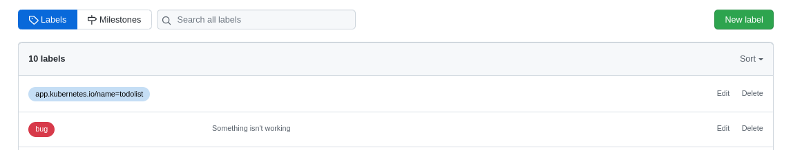
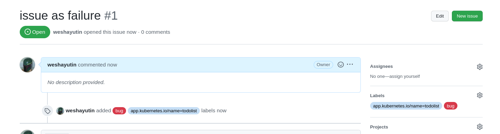
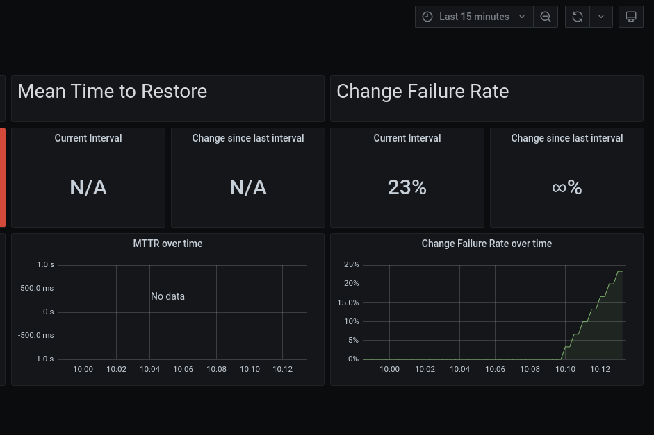
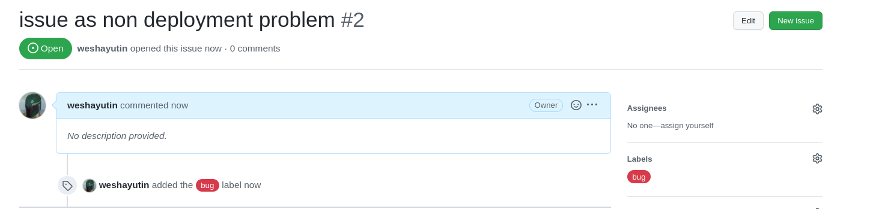
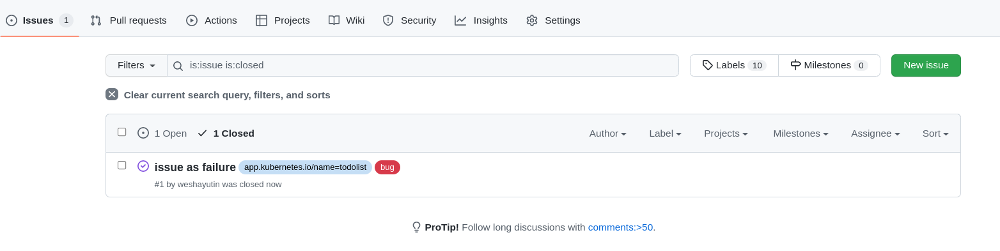
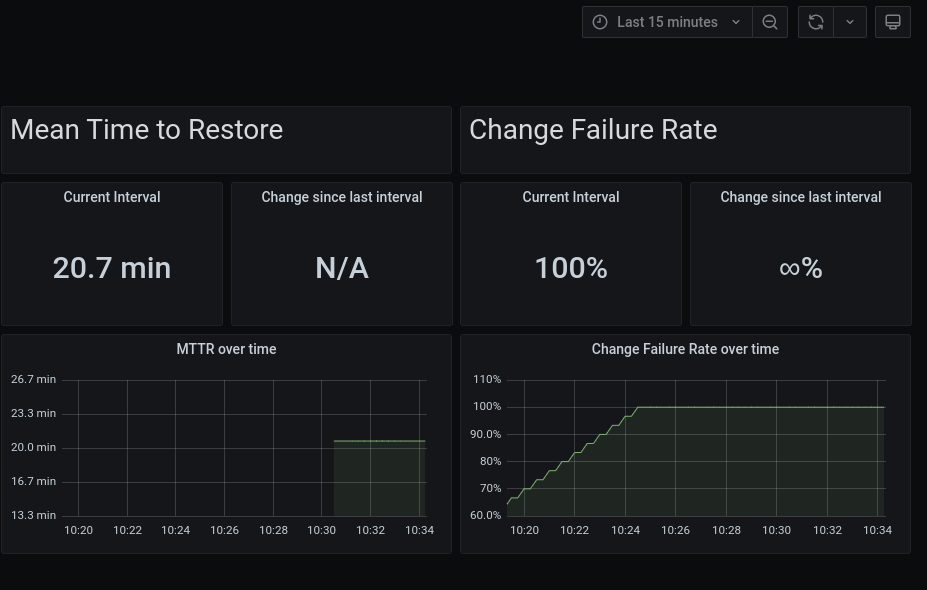

# Pelorus Demo
## Lead Time for Change and Deployment Frequency


### Assumptions
- oc command line tools installed
- Logged into OCP Cluster via the CLI and UI as kubeadmin

### Goal

In this demo, you will get a taste of how Pelorus captures a change going through the application's delivery cycle.

1. Initializing Pelorus sets the baseline by looking at existing stored data
2. Create a new commit
3. Watch as the metrics and trends change as new versions roll out

Pelorus should be used as a conversation tool to read the trends in metrics and react by making informed investments in the software delivery process.

## Prerequisites

* Pelorus is installed and running
  * Follow the steps outlined in the [todolist install guide](../samples/todolist.md#pelorus-install-steps)

* The todolist sample application is installed and running
  * Follow the steps outlined [todolist sample install guide](../samples/todolist.md#todolist-sample-application-install-steps)

> **Note:**
> Ensure that your github fork of mig-demo-apps is correctly set as the uri value in the todolist BuildConfig.
```
- kind: BuildConfig
  apiVersion: build.openshift.io/v1
  metadata:
    name: todolist
<snip>
      source:
        type: Git
        git:
          uri: https://github.com/weshayutin/mig-demo-apps.git
          ref: master

```

## Flow
- Make changes to the application, e.g. replace a line to index.html
- commit changes to source control
- Watch the application redeploy with the changes to be captured by Pelorus

## Github Webhook

One can more easily watch how Pelorus works by automatically building and deploying the todolist app when a commit is pushed to Github by utizing Github's webhooks.

1. To get the build webhook URL you can navigate to the todolist BuildConfig details or via the cli:
```
oc get all -n mongo-persistent
oc describe buildconfig.build.openshift.io/todolist -n mongo-persistent
```
> **Note:**
> The secret is hardcoded in the todolist manifest template to be:
```
4Xwu0tyAab90aaoasd88qweAasdaqvjknfrl3qwpo
```
* Navigate to https://github.com/your_org/mig-demo-apps/settings/hooks
* Paste the URL with the real secret replacing the text <secret>
* Toggle SSL as needed, for testing consider disabling.
* Content type: application/json
* Click, "Add webhook"

## Update the application source
The following screenshot is the original todolist application prior to a change


* The text "Enter an activity" does not seem clear, let's change that to "Add a todo"

```
cd mig-demo-apps/apps/todolist-mongo-go
sed -i.bak 's/Enter an activity../Add a todo../g' index.html
```

* If you are happy with the change, commit and push
```
git add .
git commit -m "update text box"
git push origin master
```

### Rebuilding and Deploying the todolist application
* Once the commit is pushed the application will automatically rebuild because we have setup the github webhook.

* You will now see the todolist application start to rebuild


### Understand the changes to the Grafana Dashboard

> **Note:**
> The dashboard is avaiable by navigating to grafana via the url found with:<br />
> `oc -n pelorus get route grafana-route -o json | jq -r '.spec.host'`<br />
> And navigating Home(top left) -> pelorus -> Softare Delivery Performance

* Navigate to the Granfa Dashboard, Software Delivery Performance by App, set the interval to 15 minutes.
Pelorus will now read the updated commit and register a new deploytime.  You should now see a total for two deployments.


* Lead Time for Change:
  * Lead Time = {deploy time} - {commit time}

  * The lead time for change should initially go down as we just pushed a commit.  The time difference between changes to the original git repository and your personal forked repo will most likely cause this metric to go down.

* Deployment Frequency:
  * Deployment Frequency = {number of deploys in a defined time frame}

  * There have been two deployments since this demonstration was started, the initial deployment and now the redeployment after pushing a change to the git repository.  The deployment frequency should have gone up by 100% in the last 15 minutes.  Once your initial deployment time is longer than 15 minutes in the past, you will find your interval has fallen by 50%.

### See the raw data in the Pelorus Exporter logs
Check the Pelorus committime output for the commit hash that was pushed

```
git log -p -1
```
Compare the output with the following command:
```
curl $(oc get route -n pelorus committime-exporter -o=template='http://{{.spec.host | printf "%s\n"}}')
```

Also notice the built deployed image sha is visible via the deploytime-exporter

```
curl $(oc get route -n pelorus deploytime-exporter -o=template='http://{{.spec.host | printf "%s\n"}}')
```

### See the change to your todolist application
You can now also check on your todolist application and see the updated text change "Add a todo"


## Troubleshooting

If exporters are not functioning or deployed, no data will show up in the dashboard. It will look like the following:


* Please check the logs of exporter pod.

An "idle" state could resemble:


## Automated Demo

The Pelorus and todolist application can be installed automatically.  Using the forked copy of [mig-demo-apps](https://github.com/konveyor/mig-demo-apps) referenced as `https://github.com/<your_org>/mig-demo-apps`, execute the following steps:

> **Note:**
> The automated demo expects that Pelorus is not installed and the Pelorus namespace is *not* present.

1. Setup the github webhook prior to execution

2. Execute `run-pelorus-e2e-tests`
```
# ensure pelorus has been uninstalled completely
cd pelorus
export KUBECONFIG=$PATH_TO_KUBECONFIG_FILE
make dev-env
source .venv/bin/activate
scripts/run-pelorus-e2e-tests -o <your_org>
```

3. Create a change to the todolist app
For example:
```
cd mig-demo-apps/apps/todolist-mongo-go
sed -i.bak 's/Enter an activity../Add a todo../g' index.html
git add .
git commit -m "update text box"
git push origin main
```

4. If the Github webhook is enabled, wait for the rebuild or trigger the build manually in OpenShift.

5. Repeat with additional git commits

## Mean Time to Restore and Change Failure Rate


### Assumptions
- oc command line tools installed
- Logged into OCP Cluster via the CLI and UI as kubeadmin
- The todolist-mongo sample application is deployed and the `Lead Time for Change` and `Deployment Frequency` measurements are monitoring the todolist application.
- Github issues are enabled in https://github.com/your_org/mig-demo-apps/settings

### Goals
- Create and resolve bugs in Github issues that exercise Pelorus metrics
- View the changes to the `Mean Time to Restore` and `Change Failure Rate` metrics.


### Pelorus configuration
1. Make a copy of [the values.yaml file in the pelorus repo](https://github.com/konveyor/pelorus/blob/master/charts/pelorus/values.yaml) ([raw link for curl-ing](https://raw.githubusercontent.com/konveyor/pelorus/master/charts/pelorus/values.yaml)) and save it to /var/tmp/values.yaml
```
cp charts/pelorus/values.yaml /var/tmp/
```
2. Update the /var/tmp/values.yaml to match the following text. You may already have the deploytime and committime exporters configured from a previous example.

>Note:
> * A users [Github personal access token](https://github.com/settings/tokens) is required
> * The `PROJECTS` key's value is the fork of the mig-apps-demo repository.


```yaml
exporters:
  instances:
  - app_name: deploytime-exporter
    exporter_type: deploytime
    source_ref: master
    extraEnv:
    - name: NAMESPACES
      value: mongo-persistent
  - app_name: committime-exporter
    exporter_type: committime
    source_ref: master
  - app_name: failure-exporter
    exporter_type: failure
    source_ref: master
    extraEnv:
     - name: PROVIDER
       value: github
     - name: TOKEN
       value: ghp_J<snip>
     - name: PROJECTS
       value: <your_org>/mig-demo-apps
```
3. Documentation regarding values.yaml can be found on our [readthedocs page.](../docs/Configuration.md)
  Apply the updated values for Pelorus by executing:
```
helm upgrade pelorus charts/pelorus --namespace pelorus --values /var/tmp/values.yaml
```

>Note: pause to allow the failure exporter pod to build and deploy.

4. Check the output from the failure exporter.  No bugs should be found at this time.
```
curl $(oc get route -n pelorus failure-exporter -o=template='http://{{.spec.host | printf "%s\n"}}')
```

### Github Issues

#### Configuration: Enable the appropriate tags

Pelorus will utilize two tags to determine if a Github issue is associated with the todolist-mongo application.  We'll need the default `bug` tag. Additionally, Pelorus requires that all issues associated with a particular application be labelled with the `app.kubernetes.io/name=<app_name>` label.  This works the same way as the deployment configuration.

* Navigate to https://github.com/your_org/mig-demo-apps/issues
  * Required Github issue tags:
    * `bug`
    * `app.kubernetes.io/name=todolist`




### Create a Github issues

Now we will create an issue in Github and set the appropriate labels.
Pelorus will register an issue as a deployment failure only if it is labeled as a `bug` and labeled with the application name `app.kubernetes.io/name=todolist`

1. Create a Github issue and label it appropriately to register a failure.



2. Now refresh the Grafana dashboard and you should see the Change Failure Rate go up.



3. Let's now create a non critical bug. A bug that does not indicate a deployment failure in your todolist application.  A the bug label however do *not* add the application label



4. Ensure that issue #2 is not impacting our failure rate metric by curl-ing the output of the failure exporter.

```
curl $(oc get route -n pelorus failure-exporter -o=template='http://{{.spec.host | printf "%s\n"}}')
```

*  Issue #1 should be found in the output of the curl.  Issue #2 will not be registered as a deployment failure because the issue is *not* tagged with `app.kubernetes.io/name=todolist`

>Note: Notice the message `failure_creation_timestamp`.  This indicates the time the issue was created.

```
failure_creation_timestamp{app="todolist",issue_number="1"} 1.654704543e+09
```

5. Now lets resolve issue #1 and see how that impacts our `Failure Rate` and the `Mean Time to Restore`

* close issue #1



* Check the output from the failure exporter again and we should see a `failure_resolution_timestamp`, which indicates when a bug was closed.

```
curl $(oc get route -n pelorus failure-exporter -o=template='http://{{.spec.host | printf "%s\n"}}')


failure_creation_timestamp{app="todolist",issue_number="1"} 1.654704543e+09
failure_resolution_timestamp{app="todolist",issue_number="1"} 1.654705784e+09
```

* Now we should also data in the `Mean Time to Restore` metric in Grafana

