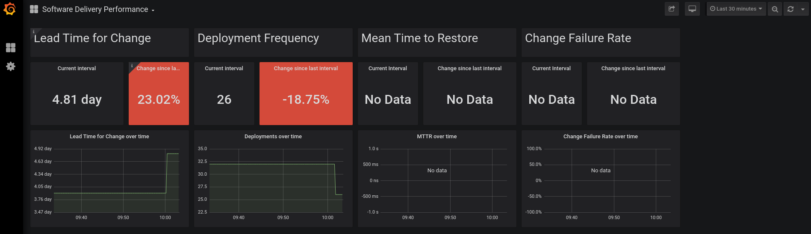
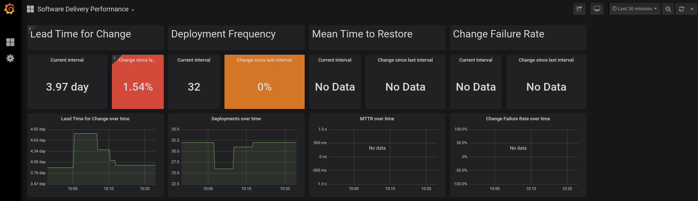

# Pelorus Demo

## Assumptions
- Github SSH key is setup on the machine where the demo will run.
- Ansible is installed
- oc command line tools installed
- Logged into OCP Cluster

## Goal

In this demo, you will get a taste of how Pelorus captures a change going through the application's delivery cycle.

1. Initializing Pelorus sets the baseline by looking at existing, stored data
2. Running the demo script will create a new commit to go through the pipeline
3. Watch as the metrics and trends change as new versions roll out

Pelorus should be used as a conversation tool to read the trends in metrics and react by making informed investments in the software delivery process.

## Prerequisites

Pelorus is up and running

Clone the [pelorus repo](https://github.com/redhat-cop/pelorus).

Fork the [RedHat COP Container Pipeline Repo](https://github.com/redhat-cop/container-pipelines), then clone (using ssh).

The location of the repo will be passed as an argument to the pelorus demo script, e.g. `/home/USER/projects/container-pipelines`

The second argument the script takes is the url of the forked repo, e.g. `https://github.com/kenwilli/container-pipelines.git`

## Flow
- Deploy sample application (basic-nginx)
- Make changes to the application (adding a line to index.html)
- commit changes to source control
- redeploy application with the changes to be captured by pelorus

## Execution

An "idle" state could resemble:


> **Note**  
> Dashboard can be found by going to grafana which url can found with:  
> `oc get route grafana-route -o json | jq -r '.spec.host'`  
> And navigating Home(top left) -> pelorus -> Softare Delivery Performance

Run the demo script
```shell
pelorus/demo/demo.sh path_to_container-pipelines url_to_forked_repo
```

The script will start and will begin to run the ansible-applier on the path to container-pipelines. It will attempt to install ansible-galaxy, skipping if it is, and then run the ansible-applier playbook. This will setup a build (jenkins) as well as a dev, stage and prod environment. Once jenkins has been setup, an initial run of the basic-nginx app will build and deploy. Once that is complete, the dashboard should resemble the following:


A prompt will appear on the screen waiting for user input, the user can "rerun" the script. What this will do is create a change in the index.html file, git commit and push it to the url of the forked repo, then create another pipeline build. Then the second pipeline build of basic-nginx will start. Once complete, the dashboard will update again:

