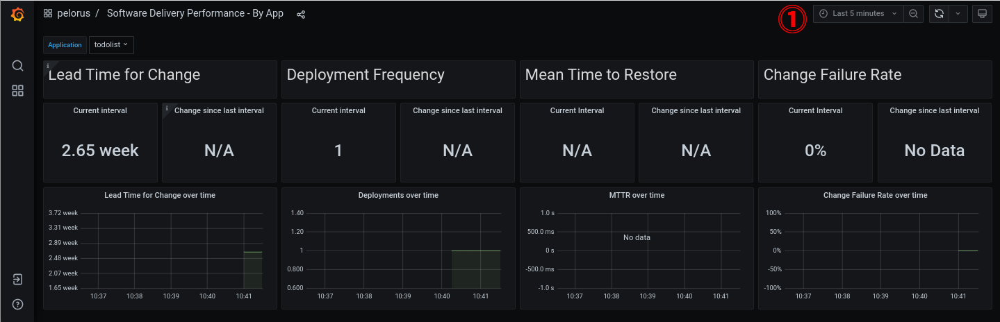

# Pelorus Demo

For Pelorus installation to monitor your application's workflow, please skip this Demo and jump straight to the [Installation](Install.md) and [Configuration](configuration2.md) part of the documentation.

In this demo, you will

* Get a taste of how Pelorus captures a change going through the application's delivery cycle.
* Understand that Pelorus should be used as a conversation tool to read the trends in metrics and react by making informed investments in the software delivery process.
* Use GitHub as the Hosting Service for Version Control System (used by commit time exporter) and as the Issue Tracker System (used by failure exporter) (a GitHub account is necessary).

To do so, you will

* Install a sample application that Pelorus will measure
* Create new commits and issues
* Watch as the metrics and trends change as new versions roll out**\***

> **Note:** More information about the four key DORA metrics can be found in our [Outcomes documentation](./philosophy/outcomes/index.md).

## Lead Time for Change and Deployment Frequency

In this section you see how Pelorus measures two DORA metrics: **Lead time for change** and **Deployment frequency**.


### Install the sample application

Clone **your** forked copy of [konveyor/mig-demo-apps](https://github.com/konveyor/mig-demo-apps), by running
```
git clone https://github.com/your_org/mig-demo-apps.git
```

To install the `todolist-mongo-go` sample application, run
```
cd mig-demo-apps/apps/todolist-mongo-go
export GITHUB_ORG=<YOUR_REAL_GITHUB_FORK_ORG>
sed -i "s/your_org/${GITHUB_ORG}/g" mongo-persistent.yaml
oc create -f mongo-persistent.yaml
```
The todolist application and mongo database should now build and deploy into the `mongo-persistent` namespace.

To check the build, run
```
oc get all --namespace mongo-persistent
```

> **Note:** Please pause to allow the todolist pod to build and deploy. (follow same methods as before)

Ensure that your github fork of mig-demo-apps is correctly set as the uri value in the todolist BuildConfig, by running
```
oc get buildconfig.build.openshift.io/todolist --namespace mongo-persistent -o=go-template='URI value: {{.spec.source.git.uri | printf "%s\n"}}'
```

### Pelorus configuration

After following [Installation guide](Install.md), copy `values.yaml` file to `/var/tmp/values.yaml`, by running
```
cp charts/pelorus/values.yaml /var/tmp/
```

Update the **exporters** section of the `/var/tmp/values.yaml` to match the following example:
```yaml
[...]
exporters:
  instances:
  - app_name: deploytime-exporter
    exporter_type: deploytime
    extraEnv:
    - name: LOG_LEVEL
      value: DEBUG
    - name: NAMESPACES
      value: mongo-persistent
  - app_name: committime-exporter
    exporter_type: committime
    extraEnv:
    - name: LOG_LEVEL
      value: DEBUG
    - name: NAMESPACES
      value: mongo-persistent
```

Apply the updated values for Pelorus by executing:
```
helm upgrade pelorus charts/pelorus --namespace pelorus --values /var/tmp/values.yaml
```

Wait for the upgrade to complete.

Pelorus is now configured to measure the sample application. Now, we'll have to deploy the sample application to view measurements from Pelorus' Grafana dashboard.

### View the Pelorus measurements

In your OpenShift Pelorus project page, open the link to Grafana or get the link, by running
```
oc get route grafana-route --namespace pelorus -o=go-template='https://{{.spec.host | printf "%s\n" }}'
```

Navigate to **"pelorus / Software Delivery Performance - By App"** and select the **todolist** application.

You should now see at least one measurement for **Lead Time for Change** and **Deployment Frequency**, like in the following image.



### Update application

In this section we will

- Make changes to the application
- Commit changes to source control
- Watch the application redeploy with the changes to be captured by Pelorus

#### Github Webhook

You can easily watch how Pelorus works by automatically building and deploying the todolist app when a commit is pushed to Github by utilizing Github's webhooks.

To get the build webhook URL you can navigate to the todolist BuildConfig details or by running
```
oc describe buildconfig.build.openshift.io/todolist -n mongo-persistent
```
> **Note:** The secret is hardcoded in the todolist manifest template to be: `4Xwu0tyAab90aaoasd88qweAasdaqvjknfrl3qwpo`.

To add the webhook

* Navigate to https://github.com/your_org/mig-demo-apps/settings/hooks
* Click **Add webhook**
* Paste the URL in **Payload URL**, with the real secret replacing the text `<secret>`
* Select content type **application/json**
* Toggle SSL as needed, for testing consider disabling
* Click **Add webhook**

For more information, consult [GitHub's documentation](https://docs.github.com/en/developers/webhooks-and-events/webhooks/about-webhooks).

#### Update the application source code

In your OpenShift mongo-persistent project page, open the link to the sample application or get the link, by running
```
oc get route todolist-route --namespace mongo-persistent -o=go-template='http://{{.spec.host | printf "%s\n" }}'
```

It should look like in the following image.


The text "Enter an activity" does not seem clear, let's change that to "Add a todo", by running
```
sed -i 's/Enter an activity/Add a todo/g' index.html
```

If you are happy with the change, commit and push
```
git add index.html
git commit -m "update text box"
git push origin master
```

Once the commit is pushed to the repository, it will automatically rebuild because we have setup the GitHub webhook.

You will now see that the todolist application starts to rebuild, like in the following image.


After it finishes, you can now see on your todolist application the updated text change "Add a todo", like in the following image.


### Understand the changes to the Grafana Dashboard

Navigate to **"pelorus / Software Delivery Performance - By App"** and set the interval to 15 minutes.
Pelorus will now read the updated commit and register a new deploytime.  You should now see a total for two deployments, like in the following image.


The **Lead Time for Change** should initially go down as we just pushed a commit.  The time difference between changes to the original git repository and your personal forked repo will most likely cause this metric to go down.

There have been two deployments since this demonstration was started, the initial deployment and now the redeployment after pushing a change to the git repository. The **Deployment Frequency** should have gone up by 100% in the last 15 minutes.  Once your initial deployment time is longer than 15 minutes in the past, you will find your interval has fallen by 50%.

## Mean Time to Restore and Change Failure Rate

In this section you see how Pelorus measures the last two DORA metrics: **Mean time to recovery** and **Change failure rate**.


It is necessary to have Github issues enabled in your fork of the mig-apps-demo repository (visit settings to enable it).

### Pelorus configuration

After following [Lead Time for Change and Deployment Frequency](#lead-time-for-change-and-deployment-frequency), update the **exporters** section of the `/var/tmp/values.yaml` to match the following example:
```yaml
[...]
exporters:
  instances:
  - app_name: deploytime-exporter
    exporter_type: deploytime
    extraEnv:
    - name: LOG_LEVEL
      value: DEBUG
    - name: NAMESPACES
      value: mongo-persistent
  - app_name: committime-exporter
    exporter_type: committime
    extraEnv:
    - name: LOG_LEVEL
      value: DEBUG
    - name: NAMESPACES
      value: mongo-persistent
  - app_name: failure-exporter
    exporter_type: failure
    extraEnv:
    - name: LOG_LEVEL
      value: DEBUG
    - name: PROVIDER
      value: github
    - name: TOKEN
      value: <TOKEN>
    - name: PROJECTS
      value: <your_org>/mig-demo-apps
```

>**Note:**
>
> * A user [Github personal access token](https://github.com/settings/tokens) is required.
> * The `PROJECTS` key's value is the fork of the mig-apps-demo repository.

Apply the updated values for Pelorus by executing:
```
helm upgrade pelorus charts/pelorus --namespace pelorus --values /var/tmp/values.yaml
```

Wait for the upgrade to complete.

Check the output from the failure exporter, by running
```
curl $(oc get route failure-exporter --namespace pelorus -o=template='http://{{.spec.host | printf "%s\n"}}')
```
No bugs should be found at this time.

### GitHub Issues

Pelorus will utilize two labels to determine if a GitHub issue is associated with the todolist-mongo application:

* `bug`: We'll need the default `bug` label.
* `app.kubernetes.io/name=todolist`: Additionally, by default Pelorus requires that all issues associated with a particular application be labeled with the `app.kubernetes.io/name=<app_name>` label. This works the same way as the deployment configuration.

Navigate to https://github.com/your_org/mig-demo-apps/labels and check/create the following Github issue labels exists, like in the following image.


Now, we will create an issue in Github and set the appropriate labels. Pelorus will register an issue as a deployment failure only if it is labeled as a `bug` and `app.kubernetes.io/name=todolist` (our application name).

Create a Github issue and label it appropriately to register a failure, like in the following image.


Refresh the Grafana dashboard and you should see the Change Failure Rate go up.


Now, let's create a non critical bug: a bug that does not indicate a deployment failure in your todolist application.

Create another Github issue and add the bug label, however do **not** add the application label.


Now, let's resolve issue #1 and see how that impacts our `Failure Rate` and the `Mean Time to Restore`.


Check the output from the failure exporter again, by running
```
curl $(oc get route failure-exporter --namespace pelorus -o=template='http://{{.spec.host | printf "%s\n"}}')
```
Issue #1 should be found in the output of the curl. Issue #2 will not be registered as a deployment failure because the issue is **not** tagged with `app.kubernetes.io/name=todolist`.

Notice the fields `failure_creation_timestamp` and `failure_resolution_timestamp` in the previous command's output. They indicate the time the issue was created and when it was closed.

### Understand the changes to the Grafana Dashboard

Now, we should also have data in the `Mean Time to Restore` metric in Grafana dashboard, like in the following image.


**Mean Time to Restore** measures how long it takes to restore the service when an incident occurs.

**Change Failure Rate** is a key quality metric that measures what percentage of changes fails in the production environment. It is crucial to have alignment on what constitutes a failure. The recommended definition is a change that either results in degraded service or subsequently requires remediation.

<!-- ## Partially Automated Demo

The Pelorus and todolist application can be installed automatically. Using the forked copy of [mig-demo-apps](https://github.com/konveyor/mig-demo-apps) referenced as `https://github.com/<your_org>/mig-demo-apps`, execute the following steps:

* [**Optional step**] Setup the [GitHub webhook](#github-webhook).

* Enable Github Issues in the repository's settings and create at least one Github issue with the `bug` and `app.kubernetes.io/name=todolist` issue labels.

* Execute `run-pelorus-e2e-tests`
```
cd pelorus
export KUBECONFIG=$PATH_TO_KUBECONFIG_FILE
export TOKEN=<github_personal_access_token>
make dev-env
source .venv/bin/activate
scripts/run-pelorus-e2e-tests -o <your_org> -e failure
```

Then, after the script finishes its execution, just follow this steps to test Pelorus:

* Create a source code change to the todolist app and push it. If the GitHub webhook is enabled, wait for the rebuild. Otherwise, trigger the build manually in OpenShift.

* Create and close GitHub issues while ensuring the appropriate issue labels are set. -->

## Uninstall sample application

To uninstall the sample application, run
```
curl https://raw.githubusercontent.com/konveyor/mig-demo-apps/master/apps/todolist-mongo-go/mongo-persistent.yaml | oc delete -f -
```
