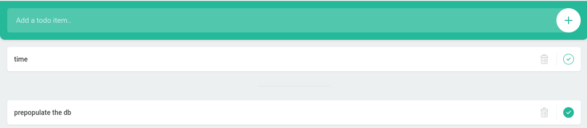

# Pelorus Demo

### Assumptions
- oc, helm command line tools installed
- Logged into OCP Cluster via the CLI and UI as kubeadmin

### Goal

This demo shows how Pelorus captures a change going through the application's delivery cycle.
* Install and configure Pelorus
* Install a sample application that Pelorus will measure
* Set a baseline of data for Pelorus measurements
* Create a new commits, and Github issues
* Watch as the metrics and trends change as new versions roll out

# Lead Time for Change and Deployment Frequency


> **Note:** More information about the four key DORA metrics can be found in the [Software Delivery Performance](https://github.com/konveyor/konveyor.github.io/blob/main/content/Pelorus/SoftwareDeliveryPerformance.md) section.

## Installing Pelorus
There are two steps to installing Pelorus:
* Install and configure Pelorus
* Install a sample application

**Prequisites**
Python virtual environment: This is an optional step for developers that will setup a Python virtual environment and install prerequisite Python and OpenShift CLI tools and libraries.
```
    cd pelorus
    make dev-env
    source .venv/bin/activate
    make help
```
**Procedure**
1. Create the Pelorus namespace.
```
oc create namespace pelorus
```
1. Install the required Granfa and Prometheus operators.
```
helm install operators charts/operators --namespace pelorus
```
The following information will display when the operator install is complete.
```
$ oc get pods -n pelorus
NAME                                                   READY     STATUS    RESTARTS   AGE
grafana-operator-controller-manager-7678cc5c7c-spvls   2/2       Running   0          22s
prometheus-operator-559d659944-fvsjg                   1/1       Running   0          10s
```
1. Install Pelorus.
```
helm install pelorus charts/pelorus --namespace pelorus
```
The following information will display when the Pelorus install is complete.
```
$ oc get pods -n pelorus
NAME                                                   READY     STATUS      RESTARTS      AGE
deploytime-exporter-1-deploy                           0/1       Completed   0             93s
deploytime-exporter-1-rwk5l                            1/1       Running     0             90s
grafana-deployment-55f77ccc8f-d7m92                    2/2       Running     0             84s
grafana-operator-controller-manager-7678cc5c7c-spvls   2/2       Running     0             4m5s
prometheus-operator-559d659944-fvsjg                   1/1       Running     0             3m53s
prometheus-prometheus-pelorus-0                        3/3       Running     1 (89s ago)   93s
prometheus-prometheus-pelorus-1                        3/3       Running     1 (89s ago)   93s
```
1. Check the installation.
```
oc get all -n pelorus
```

## Configuring Pelorus
Follow the steps below to configure and apply the instance exporters for Pelorus to measure a sample application named todolist That will be deployed in the next procedure.

**Procedure**
1. Make a copy of the [values.yaml file](https://github.com/konveyor/pelorus/blob/master/charts/pelorus/values.yaml) in the pelorus repo ([raw link for curl-ing](https://raw.githubusercontent.com/konveyor/pelorus/master/charts/pelorus/values.yaml)) and save it to /var/tmp/values.yaml.
```
cp charts/pelorus/values.yaml /var/tmp/
```
1. Update the **exporters** section of the /var/tmp/values.yaml to match the following example.
```
exporters:
  instances:
  - app_name: deploytime-exporter
    exporter_type: deploytime
    extraEnv:
    - name: LOG_LEVEL
      value: DEBUG
    - name: NAMESPACES
      value: mongo-persistent
  - app_name: committime-exporter
    exporter_type: committime
    extraEnv:
    - name: LOG_LEVEL
      value: DEBUG
    - name: NAMESPACES
      value: mongo-persistent
```
>**Note:** [Documentation regarding values.yaml can be found on the Pelorus readthedocs page.](https://pelorus.readthedocs.io/en/latest/Configuration/)

1. Apply the updated values for Pelorus by executing.
```
helm upgrade pelorus charts/pelorus --namespace pelorus --values /var/tmp/values.yaml
```
> **Note:** Allow time for the the committime exporter pod to be deployed.

Pelorus should now be installed and configured to measure the todolist sample app. We'll have to deploy the sample application to view measurements from Pelorus's Grafana dashboard.

## Installing the Todolist sample application
Pelorus is installed and configured to measure the todolist sample app. Follow the steps below to deploy the sample application and view measurements from Pelorus's Grafana dashboard.

**Procedure**
1. git clone the forked copy of konveyor/mig-demo-apps.
```
git clone https://github.com/your_org/mig-demo-apps.git
```
1. Install the todolist-mongo-go sample application.
```
cd mig-demo-apps/apps/todolist-mongo-go
export GITHUB_ORG=<YOUR_REAL_GITHUB_FORK_ORG>
sed -i.original "s/your_org/${GITHUB_ORG}/g" mongo-persistent.yaml
oc create -f mongo-persistent.yaml
```
The todolist application and mongo database builds and deploys into the mongo-persistent namespace.

1. Check the build.
```
oc get all -n mongo-persistent
```
> **Note:** Allow time for the todolist pod to build and deploy.
1. Verify the github fork of mig-demo-apps is correctly set as the uri value in the todolist BuildConfig.
```
  apiVersion: build.openshift.io/v1
  metadata:
    name: todolist
<snip>
      source:
        type: Git
        git:
          uri: https://github.com/weshayutin/mig-demo-apps.git
          ref: master
```
## Viewing Pelorus measurements
Follow the steps below to view measurements in the OpenShift Pelorus project page.

**Procedure**
1. Open the link to granafa or get the link using the CLI.
```
oc get route grafana-route -o=go-template='https://{{.spec.host | printf "%s\n" }}'
```
1. Navigate to **pelorus / Software Delivery Performance - By App**.
1. Select the todolist application.

At least one measurement for "Lead time for Change" and "Deployment Frequency" should now be viewable.


## Updating application source code
Making updates to an applicaiton's source code consists of three steps:
* Make changes to the application (e.g. replace a line to index.html)
* Commit changes to source control
* Watch the application redeploy with the changes to be captured by Pelorus

## Deploying Github webhook
How Pelorus works can be easily viewed by automatically building and deploying the todolist app when a commit is pushed to Github by using Github's webhooks.

**Procedure**
1. Navigate to the todolist BuildConfig details or via the cli to get the build webhook URL.
```
oc describe buildconfig.build.openshift.io/todolist -n mongo-persistent
```
> **Note:** The secret is hardcoded in the todolist manifest template is: `4Xwu0tyAab90aaoasd88qweAasdaqvjknfrl3qwpo`

1. Navigate to https://github.com/your_org/mig-demo-apps/settings/hooks.
1. Paste the URL with the real secret replacing the <secret> placeholder.
> **Note** Toggle SSL as needed. Consider disabling while testing.

1. Set **Content type** to **application/json**.
1. Click **Add webhook**.

## Updating the application source
The screenshot below displays the original todolist application prior to a change.


Follow the steps below to make the changes to the source code, then rebuild and redeploy the application.

**Procedure**
1. Change the text "Enter an activity" to "Add a todo" for clarity.
```
cd mig-demo-apps/apps/todolist-mongo-go
sed -i.bak 's/Enter an activity../Add a todo../g' index.html
```
1. Verify the change, then commit and push.
```
git add .
git commit -m "update text box"
git push origin master
```

When the commit is pushed the todolist application will automatically rebuild using the GitHub webhook.


### View raw data in the Pelorus exporter logs
Follow the steps below to navigate to the Granfa Dashboard/Software Delivery Performance by App and set the interval to 15 minutes. Pelorus will then read the updated commit and register a new deploytime and display a total for two deployments. The last step will display the changes made to the todolist application.

* **Lead Time for Change:**
    * Lead Time = {deploy time} - {commit time}
    * The lead time for change should initially go down as the commit is pushed. The time difference between changes to the original git repository and the personal forked repo will most likely cause this metric to go down.
* **Deployment Frequency:**
    * Deployment Frequency = {number of deploys in a defined time frame}
    * There have been two deployments since this demonstration was started, the initial deployment and now the redeployment after pushing a change to the git repository. The deployment frequency should have gone up by 100% in the last 15 minutes. Once the initial deployment time is longer than 15 minutes in the past the interval will fall by 50%.

**Procedure**
1. Get the URL to navigate to Grafana.
`oc -n pelorus get route grafana-route -o json | jq -r '.spec.host'`
1. Click **Home** at the top left of the screen, **Pelorus**, then **Software Delivery Performance**.


The raw data can now be viewed in the Pelorus Exporter logs.

1. Check the Pelorus committime output for the commit hash that was pushed.
```
git log -p -1
```
1. Compare the output with the following command.
```
curl $(oc get route -n pelorus committime-exporter -o=template='http://{{.spec.host | printf "%s\n"}}')
```
1. View the built deployed image sha using the deploytime-exporter.
```
curl $(oc get route -n pelorus deploytime-exporter -o=template='http://{{.spec.host | printf "%s\n"}}')
```
1. Check the todolist application and verify the text has changed to "Add a todo".




## Troubleshooting
If the exporters are not deployed or functioning, no data will show up in the dashboard and instead will look like the following:


* Please check the logs of exporter pod.

Check the logs of exporter pod. An "idle" state might look like the following:


## Setting Mean Time to Restore and Change Failure Rate
Configuring these settings is done in two steps:
* Create and resolve bugs in Github issues that exercise Pelorus metrics
* View the changes to the `Mean Time to Restore` and `Change Failure Rate` metrics.


> **Note:** More information about the four key DORA metrics can be found at the [Software Delivery Performance section](Dashboards.md).

**Prerequisites**
* Github issues are enabled in https://github.com/your_org/mig-demo-apps/settings.
* A users [Github personal access token](https://github.com/settings/tokens) is required.
> **Important:** The `PROJECTS` key's value is the fork of the mig-apps-demo repository.


**Procedure**
1. Update the **exporters** section of the /var/tmp/values.yaml to match the following example.
```
exporters:
  instances:
  - app_name: deploytime-exporter
    exporter_type: deploytime
    extraEnv:
    - name: LOG_LEVEL
      value: DEBUG
    - name: NAMESPACES
      value: mongo-persistent
  - app_name: committime-exporter
    exporter_type: committime
    extraEnv:
    - name: LOG_LEVEL
      value: DEBUG
    - name: NAMESPACES
      value: mongo-persistent
  - app_name: failure-exporter
    exporter_type: failure
    extraEnv:
    - name: LOG_LEVEL
      value: DEBUG
    - name: PROVIDER
      value: github
    - name: TOKEN
      value: ghp_J<snip>
    - name: PROJECTS
      value: <your_org>/mig-demo-apps
```

> Note: Documentation regarding values.yaml can be found in the [Configuration ](Configuration.md) section.

1. Apply the updated values for Pelorus.
```
helm upgrade pelorus charts/pelorus --namespace pelorus --values /var/tmp/values.yaml
```
> **Note:** Allow time for the failure exporter pod to build and deploy.

1. Check the output from the failure exporter and that no bugs are found.
```
curl $(oc get route -n pelorus failure-exporter -o=template='http://{{.spec.host | printf "%s\n"}}')
```

### Github Issues
Pelorus uses two tags to determine if a Github issue is associated with the todolist-mongo application and includes the default `bug` tag. Pelorus requires that all issues associated with a particular application be labeled with the app.kubernetes.io/name= label by default. This works the same way as the deployment configuration.

**Procedure**
1. Navigate to https://github.com/your_org/mig-demo-apps/issues
1. Set the required Github issue tags:
    * `bug`
    * `app.kubernetes.io/name=todolist`


## Creating Github issues
Follow the steps below to create an issue in Github and set the appropriate labels. Pelorus will register an issue as a deployment failure only if it is labeled as a `bug` and labeled with the application name `app.kubernetes.io/name=todolist`

**Procedure**
1. Create a Github issue and label it appropriately to register a failure.


2. Refresh the Grafana dashboard.

The Change Failure Rate should go up.

1. Create a non critical bug that does not indicate a deployment failure in the todolist application.

> **Important** Add the bug label but do not add the application label.


4. Verify issue #2 is not impacting the  failure rate metric by curl-ing the output of the failure exporter.
```
curl $(oc get route -n pelorus failure-exporter -o=template='http://{{.spec.host | printf "%s\n"}}')
```
Issue #1 should be found in the output of the curl. Issue #2 will not be registered as a deployment failure because the issue is *not* tagged with `app.kubernetes.io/name=todolist`.

Notice the message `failure_creation_timestamp`.  This indicates the time the issue was created.
```
failure_creation_timestamp{app="todolist",issue_number="1"} *654704543e+09
```

5. Resolve issue #1 and see how that impacts the `Failure Rate` and the `Mean Time to Restore`.


6. Check the output from the failure exporter again to see a `failure_resolution_timestamp`.
```
  curl $(oc get route -n pelorus failure-exporter -o=template='http://{{.spec.host | printf "%s\n"}}')
  ```
The output indicates when a bug was closed.
```
  failure_creation_timestamp{app="todolist",issue_number="1"} *654704543e+09
  failure_resolution_timestamp{app="todolist",issue_number="1"} *654705784e+09
```
> Note: There should be data in the `Mean Time to Restore` metric in Grafana.


* **Mean Time to Restore:**
    * Mean Time to Restore = Average( {failure_resolution_timestamp} - {failure_creation_timestamp} )
    * How long it takes to restore service when a service incident occurs.
* **Change Failure Rate:**
    * Change Failure Rate = {number of failed changes} / {total number of changes to the system}
    * A key quality metric that measures what percentage of changes made to production fail. It is crucial to have alignment on what constitutes a failure. The recommended definition is a change that either results in degraded service or subsequently requires remediation.

## Running a partially automated demo
> **Important**: Uninstall Pelorus completely before starting this procedure. The automated demo scripts expect that Pelorus is not installed and the Pelorus namespace is not present.

The Pelorus and todolist application can be installed automatically using the forked copy of mig-demo-apps referenced as `https://github.com/<your_org>/mig-demo-apps`.

**Procedure**
1. Setup the github webhook prior to execution using Github webhook address.
```
https://api.cluster-<snip>.com:6443/apis/build.openshift.io/v1/namespaces/mongo-persistent/buildconfigs/todolist/webhooks/4Xwu0tyAab90aaoasd88qweAasdaqvjknfrl3qwpo/github
```
1. Enable Github Issues in the repository's settings prior to execution.

> **Note:** In order for the demo to fully succeed at least one Github issue must be present with the `bug` and `app.kubernetes.io/name=todolist` issue labels.

3. Execute `run-pelorus-e2e-tests`.
```
cd pelorus
export KUBECONFIG=$PATH_TO_KUBECONFIG_FILE
export TOKEN=<github_personal_access_token>
make dev-env
source .venv/bin/activate
scripts/run-pelorus-e2e-tests -o <your_org> -e failure
```
Wait as Pelorus is installed and the todolist application are deployed.

1. Create a source code change to the todolist app and git push.

> **Note:** If the Github webhook is enabled, wait for the rebuild or trigger the build manually in OpenShift.

5. Repeat with additional git commits.
1. Create and close Github issues using the appropriate issue labels.
