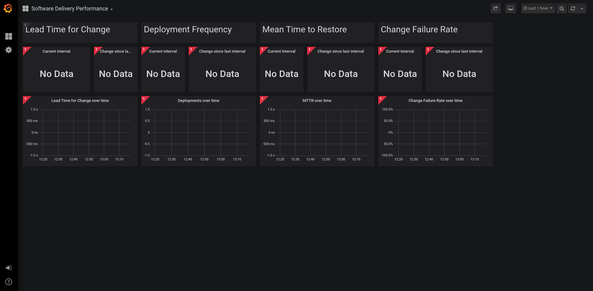

# Pelorus Demo

## Demo Assumptions
- Github SSH key is setup on the machine where the demo will run.
- Ansible is installed
- oc command line tools installed
- Logged into OCP Cluster

## Demo Purpose
- Deploy sample application (basic-nginx)
- Make changes to the application (adding a line to index.html)
- commit changes to source control
- redeploy application with the changes to be captured by pelorus

## Demo Prerequisites

Clone the [pelorus repo](https://github.com/redhat-cop/pelorus).

Fork the [RedHat COP Container Pipeline Repo](https://github.com/redhat-cop/container-pipelines), then clone (using ssh).

The location of the repo will be passed as an argument to the pelorus demo script (i.e. /home/<user>/projects/container-pipelines).

The second argument the script takes is the url of the forked repo, so for example ,"https://github.com/kenwilli/container-pipelines.git".

## Demo Execution

Note: If exporters are not functioning or deployed, no data will show up in the dashboard. It will look like the following:


An "idle" state could resemble:


Run the demo script
``` pelorus/demo/demo.sh <path to container-pipelines> <url to forked repo>```

Once the script has completed the openshift applier segment, it will pause for 5 minutes in order for jenkins to get setup and basic-nginx to run through it's first pipeline build. Once the pipeline has completed the dashboard will update accordingly:


Once the 5 minute rest period is up, a simple change will be committed and pushed back to the forked repo. Then the second pipeline build of basic-nginx will start. Once complete, the dashboard will update again:


