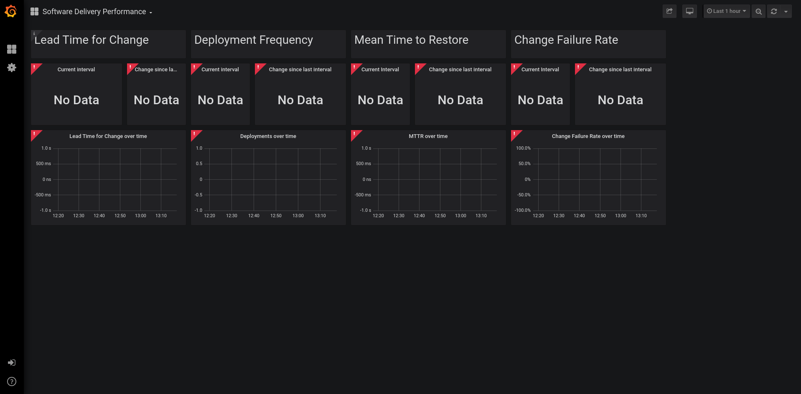
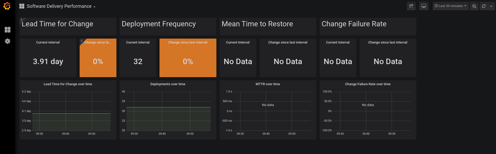
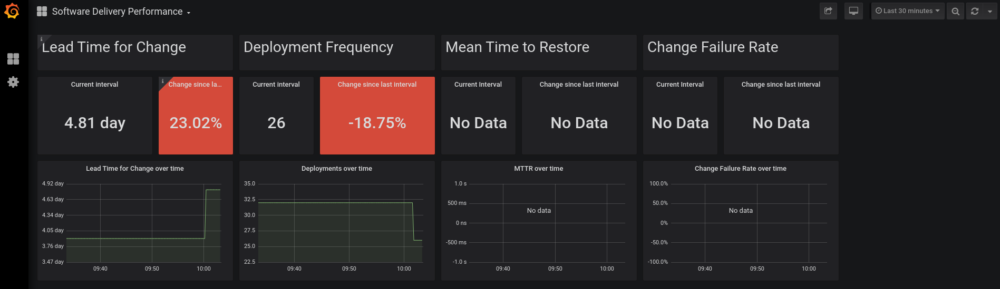
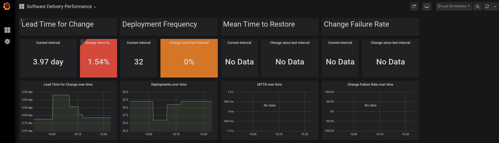

# Demo Execution

Note: If exporters are not functioning or deployed, no data will show up in the dashboard. It will look like the following:


An "idle" state could resemble:


Run the demo script
``` pelorus/demo/demo.sh <path to container-pipelines> <url to forked repo>```

Once the script has completed the openshift applier segment, it will pause for 5 minutes in order for jenkins to get setup and basic-nginx to run through it's first pipeline build. Once the pipeline has completed the dashboard will update accordingly:


Once the 5 minute rest period is up, a simple change will be committed and pushed back to the forked repo. Then the second pipeline build of basic-nginx will start. Once complete, the dashboard will update again:

