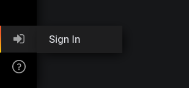

# Pelorus Development Guide

We appreciate your interest in contributing to Pelorus! Use this guide to help you get up and running.

There are three main tracks of Pelorus development to consider.

1. [Deployment Automation](#contributing-to-deployment-development)
    
    This track mostly involves testing, fixing, and updating our Helm chart(s) to streamline the installation and configuration experience. Knowledge of Helm, OpenShift, Operators and Prometheus configuration is assumed for this work.
1. [Dashboard Development](#dashboard-development)

    This is where we take the raw data we've collected and turn it into actionable visual representations that will help IT organizations make important decisions. Knowledge of Grafana and PromQL is required for contribution here.
1. [Exporter Development](#exporter-development)

    This track is focused around the development of custom [Prometheus exporters](https://prometheus.io/docs/instrumenting/writing_exporters/) to gather the information we need in order to calculate our core metrics. Python development experience is assumed.

## Contributing to Deployment Automation

We use [Helm](https://helm.sh) to provide an automated deployment and configuration experience for Pelorus. We are always doing work to cover more and more complex use cases with our helm charts. In order to be able to effectively contribute to these charts, you'll need a cluster that satisfies all of the installation prerequisites for Pelorus.

See the [Install guide](/page/Install.md) for more details on that.

Currently we have two charts:

1. The [operators](https://github.com/redhat-cop/pelorus/blob/master/charts/operators/) chart installs the community operators on which Pelorus depends.
    * [Prometheus Operator](https://operatorhub.io/operator/prometheus)
    * [Grafana Operator](https://operatorhub.io/operator/grafana-operator)
2. The [pelorus](https://github.com/redhat-cop/pelorus/blob/master/charts/pelorus/) chart manages the Pelorus stack, which includes:
    * Prometheus
    * Thanos
    * Grafana
    * A set of Grafana Dashboards and Datasources
    * The Pelorus exporters, managed in an [exporter](https://github.com/redhat-cop/pelorus/blob/master/charts/pelorus/charts/exporters) subchart.

We use Helm's [chart-testing](https://github.com/helm/chart-testing) tool to ensure quality and consistency in the chart. When making updates to one of the charts, ensure that the chart still passes lint testing using `ct lint`. The most common linting failure is forgetting to bump the `version` field in the `Chart.yaml`. See below for instructions on updating the version.

### Updating the chart versions

When any of our Helm charts are updated, we need to bump the version number. This allows for a seemless upgrade experience. In order to maintain versioning with our repository, our version numbers are derived from our tagged releases. Git provides a command which will give us that version, via `git describe`. However, the [git generated version number is not fully semver compatible](https://github.com/semver/semver/issues/200). To bridge that gap we use a tool called [Version Tester (vert)](https://github.com/Masterminds/vert). We have also written a pre-commit hook script that will automatically detect when a version bump is needed and will make the required change. Here are the steps to get the hook set up.

1. Install Helm's [chart-testing](https://github.com/helm/chart-testing) tool.
1. Install the latest release of [vert](https://github.com/Masterminds/vert/releases/)
    1. Run `vert -g ^1 $(git describe)` to test that its working.
1. Copy the pre-commit hook into your git hooks directory.
    ```
    cp _test/pre-commit .git/hooks/pre-commit
    ```

This script will use Helm's built-in linter to check whether a version bump is necessary, and if it is, it will take the current `version` from Chart.yaml and increment it one patch version. It will also keep `appVersion` fo the Pelorus chart up to date with the repo version using `git describe`.

## Dashboard Development

We are continually doing work to enhance and bugfix the Pelorus dashboards. Doing so requires a complete Pelorus stack, including all exporters required to populate a given dashboard. See the [Dashboards](/page/Dashboards.md) user guide for that information.

To effectively do dashboard development, you'll likely need at least two browser windows open, one with Grafana, and another with Prometheus for testing queries. Since our dashboards are imported to Grafana via the Grafana Operator, they get imported in read-only mode. Because of this, you'll need to make a copy of it for development purposes.

The following outlines a workflow for working on a dashboard:

1. Sign in to Grafana via the Grafana route.
1. Once signed in, sign as an administrator
  1. Click the signin button in the bottom right corner
    
  1. The admin credentials can be pulled from the following commands:
    ```
    oc get secrets -n pelorus grafana-admin-credentials -o jsonpath='{.data.GF_SECURITY_ADMIN_USER}' | base64 -d
    oc get secrets -n pelorus grafana-admin-credentials -o jsonpath='{.data.GF_SECURITY_ADMIN_PASSWORD}' | base64 -d
    ```
1. Export the dashboard JSON.
   * Open the dashboard, and select the **Share...** button.
   * Select the **Export** tab.
   * Click **View JSON**.
   * Click **Copy to Clipboard**.
1. Import as a new dashboard
   1. Click **Create** -> **Import**.
   1. Paste your JSON code in the box and click **Load**.
   1. Change the _Name_ and _Unique Identifier_ fields, and click **Import**.
1. Make changes to the live dashboard. You can do this by clicking the dropdown by the panel names, and selecting **Edit**.
1. Once you are happy with your changes, export your updated dashboard, and replace the existing content in the `GrafanaDashbaord` CR.
   1. Open the dashboard, and select the **Share...** button.
   1. Select the **Export** tab.
   1. Click **View JSON**.
   1. Click **Copy to Clipboard**.
   1. Open the appropriate `GrafanaDashboard` CR file, and paste the new dashboard JSON over the existing.
      >:mag: **NOTE**<br/>
      >Be sure to match the indentation of the previous dashboard JSON. Your git diffs should still show only the lines changed like the example below
            
            $ git diff charts/deploy/templates/metrics-dashboard.yaml
            diff --git a/charts/deploy/templates/metrics-dashboard.yaml b/charts/deploy/templates/metrics-dashboard.yaml
            index 73151ad..c470afc 100644
            --- a/charts/deploy/templates/metrics-dashboard.yaml
            +++ b/charts/deploy/templates/metrics-dashboard.yaml
            @@ -25,7 +25,7 @@ spec:
                        "editable": true,
                        "gnetId": null,
                        "graphTooltip": 0,
            -            "id": 2,
            +            "id": 3,
                        "links": [],
                        "panels": [
                            {
            @@ -323,7 +323,7 @@ spec:
                            "tableColumn": "",
                            "targets": [
                                {
            -                    "expr": "count (deploy_timestamp)",
            +                    "expr": "count (count_over_time (deploy_timestamp [$__range]) )",
                                "format": "time_series",
                                "instant": true,
                                "intervalFactor": 1,
            @@ -410,7 +410,7 @@ spec:

You're done! Commit your changes and open a PR!

## Exporter Development

A Pelorus exporter is simply a [Prometheus exporter](https://prometheus.io/docs/instrumenting/writing_exporters/). While they can technically be written in many languages, we've written ours in Python using the [Prometheus python client](https://github.com/prometheus/client_python) library. We chose Python because it seems to be the most popular programming language for operations teams.

### Exporter directory layout

The following is a minimal directory structure for a Pelorus exporter.

```
exporters/exporter/
├── app.py
├── __init__.py
├── pelorus -> ../pelorus
├── README.md
└── values.yaml
```

### Running locally

Running an exporter on your local machine should follow this process:

1. Install dependencies

        pip install -r exporters/requirements.txt
        pip install -r exporters/requirements-dev.txt

1. Set any environment variables required (or desired) for the given exporter (see [Configuring Exporters](/page/Configuration.md#configuring-exporters) to see supported variables).

        export GIT_TOKEN=xxxx
        export GIT_USER=xxxx

1. Log in to your OpenShift cluster

        oc login --token=<token> --server=https://api.cluster-my.fun.domain.com:6443 

1. (Optional) To avoid certificate warnings and some possible errors, you need to set up your local machine to trust your cluster certificate

    1.  Download your cluster ca.crt file
    1.  Add cert to system trust bundle
    1.  Pass cert bundle with your login command

            oc login --token=<token> --server=https://api.cluster-my.fun.domain.com:6443  --certificate-authority=/etc/pki/tls/certs/ca-bundle.crt

1. Start the exporter
        
        python exporters/committime/app.py

At this point, your exporter should be available at http://localhost:8080

    curl http://localhost:8080

### IDE Setup (VSCode)

Most of us use Visual Studio Code to do our python development. The following extensions for VSCode are useful. Each can be installed by hitting `Ctrl+P` and pasting the commands below.

* [Markdown Preview Github Styling](https://marketplace.visualstudio.com/items?itemName=bierner.markdown-preview-github-styles)

        ext install bierner.markdown-preview-github-styles
* [Python](https://marketplace.visualstudio.com/items?itemName=ms-python.python)

        ext install ms-python.python
   

Code also comes with a nice debugger feature. Here is a starter configuration to use with our exporters. Just create a file called `.vscode/launch.json` in your `pelorus/` project directory with the following content.

```
{
    // Use IntelliSense to learn about possible attributes.
    // Hover to view descriptions of existing attributes.
    // For more information, visit: https://go.microsoft.com/fwlink/?linkid=830387
    "version": "0.2.0",
    "configurations": [
        {
            "name": "Commit Time Exporter",
            "type": "python",
            "request": "launch",
            "program": "${workspaceFolder}/exporters/committime/app.py",
            "console": "integratedTerminal",
            "env": {
                "GITHUB_USER": "<github username here>", 
                "GITHUB_TOKEN": "<personal access token here>",
                "LOG_LEVEL": "INFO",
                "APP_LABEL": "app.kubernetes.io/name"
            }
        },
        {
            "name": "Deploy Time Exporter",
            "type": "python",
            "request": "launch",
            "program": "${workspaceFolder}/exporters/deploytime/app.py",
            "console": "integratedTerminal",
            "env": {
                "LOG_LEVEL": "INFO",
                "APP_LABEL": "app.kubernetes.io/name"
            }        },
        {
            "name": "Deploy Time Exporter",
            "type": "python",
            "request": "launch",
            "program": "${workspaceFolder}/exporters/failure/app.py",
            "console": "integratedTerminal",
            "env": {
                "SERVER": "<Jira server url>",
                "PROJECT": "<Jira project ID>",
                "USER": "<Jira username>",
                "TOKEN": "<Jira personal access token>",
                "LOG_LEVEL": "INFO",
                "APP_LABEL": "app.kubernetes.io/name"
            }
        }
    ]
}
```

For more information, see the [Debugging](https://code.visualstudio.com/docs/editor/debugging) doc in VS Code.

## Testing Pull Requests

The following are notes and general steps for testing Pull Requests for specific types of changes.

### Dashboard Changes

1. Clone/checkout the PR fork/branch
    ```
    git remote add themoosman git@github.com:themoosman/pelorus.git
    git fetch themoosman
    git checkout themoosman/feature-branch
    ```
2. [Install Pelorus](/page/Install.md) from checked out fork/branch.
    >:mag: **Note**<br/>
    >:mag: In most cases you can deploy changes to an existing deployment to retain existing data.
3. Log into Grafana via the grafana route.
    ```
    oc get route grafana-route -n pelorus
    ```
4. Click on the dashboard containing changes, and visually validate the behavior change described in the PR
    >:mag: **Note**<br/>
    >Eventually we'd like to have some Selenium tests in place to validate dashboards. If you have skills in this area let us know!

### Exporter Changes

Most exporter changes can be tested locally.

1. Clone/checkout the PR fork/branch
    ```
    git remote add themoosman git@github.com:themoosman/pelorus.git
    git fetch themoosman
    git checkout themoosman/feature-branch
    ```
1. Install both the runtime and development dependencies.
    ```
    pip install -r exporters/requirements.txt
    pip install -r exporters/requirements-dev.txt
    ```
1. Run unit tests using `python -m pytest`.
  1. You can also run coverage reports with the following:
        ```
        coverage run -m pytest
        coverage report
        ```
1. Gather necessary [configuration information](/page/Configuration.md#configuring-exporters).
1. [Run exporter localy](#running-locally). You can do this either via the command line, or use the provided [VSCode debug confuration](#ide-setup-vscode) to run it in your IDE Debugger.
1. Once exporter is running, you can test it via a simple `curl localhost:8080`. You should be validating that:
   1. You get a valid response with metrics.
   1. Confirm the format of expected metrics.

### Helm Install changes

For testing changes to the helm chart, you should just follow the [standard install process](/page/Install.md), then verify that:

* All expected pods are running and healthy
* Any expected behavior changes mentioned in the PR can be observed.

We are in the process of refactoring our helm charts such that they can be tested more automatically using [helm chart-testing](https://github.com/helm/chart-testing). Some general guidelines are outlined in the [CoP Helm testing strategy](https://redhat-cop.github.io/ci/linting-testing-helm-charts.html). More to come soon.

### Helm tests

Once Pelorus has been successfully installed, and after waiting a couple of minutes so all Pelorus components (Grafana, Prometheus, etc) are up and running, helm tests can be run.
At the moment the number of helm tests is small, hopefully in the future it will be larger. Bear in mind that helm tests main purposes is to be part of the Pelorus CI workflow.

```bash
helm test pelorus -n pelorus
```

## Release Management Process

The following is a walkthrough of the process we follow to create and manage versioned releases of Pelorus.

1. Create a lightweight _release candidate_ tag from the `master` branch. The tag name should be the next sequential [Semantic Version](https://semver.org) with the suffix `-rc`. Then push the new tag to the main repository.

        git tag <version>-rc
        git push -u upstream <version>-rc
2. Generate git release notes from the `git log`.

        git log <previous tag>..<new tag> --pretty=format:"- %h %s by %an" --no-merges
3. On the [Pelorus releases](https://github.com/redhat-cop/pelorus/releases) page, click **Draft a new release**. 
    * Select the tag that was pushed in the first step
    * The release _title_ should be `Release candidate for <version>`. 
    * In the main text area, create a `# Release Notes` heading, and then paste in the git log output.
    * Check the box that says **This is a pre-release**.
    * Click **Publish Release**.
4. Test. Test. Test.
    * Ensure that all github actions in the repo are passing.
    * Ensure that you can install Pelorus from the tagged version of the code, including all exporters and optional configurations. (Ensure you update the values.yaml file you are using to refer to the tagged version of the code in all builds)
    * Follow the above guidance for testing Pull requests.
5. If any bugs are found, open PRs to fix them, then delete the release and tag that was created, and start again from step 1.
6. Create an annotated tag for the final release with the `-rc` suffix removed.

        git checkout <version>-rc
        git tag -a <version>
        git push -u upstream <version>
8. Generate git release notes from the `git log`.

        git log <previous tag>..<new tag> --pretty=format:"- %h %s by %an" --no-merges
7. On the [Pelorus releases](https://github.com/redhat-cop/pelorus/releases) page, click **Draft a new release**. 
    * Select the tag that was pushed in the previous step.
    * The release _title_ should be `Release <version>`. 
    * In the main text area, create a `# Release Notes` heading, and then paste in the git log output.
    * Click **Publish Release**.