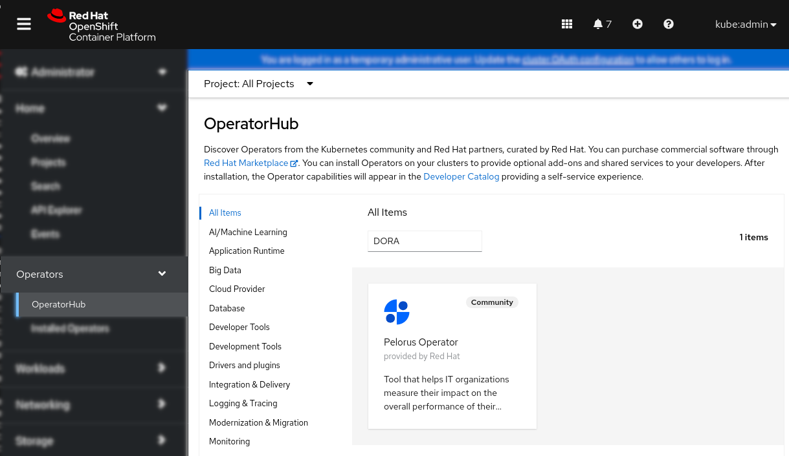
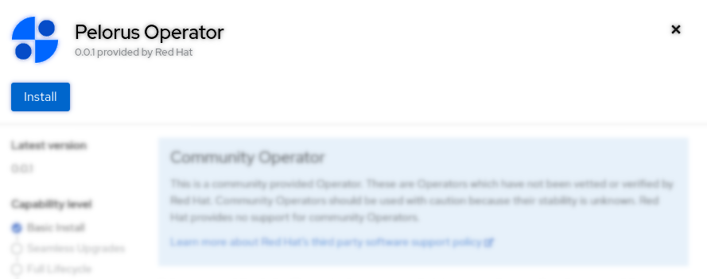
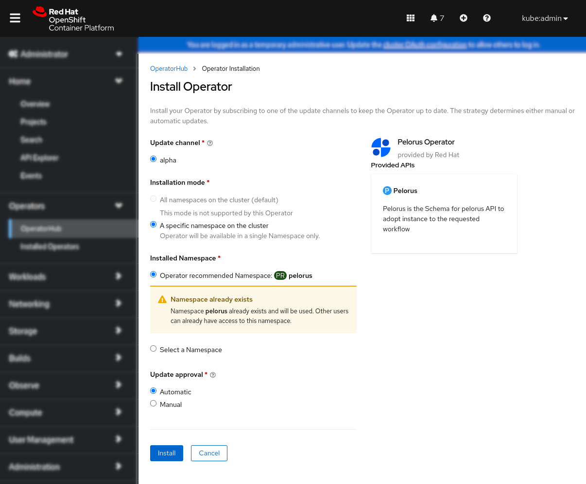
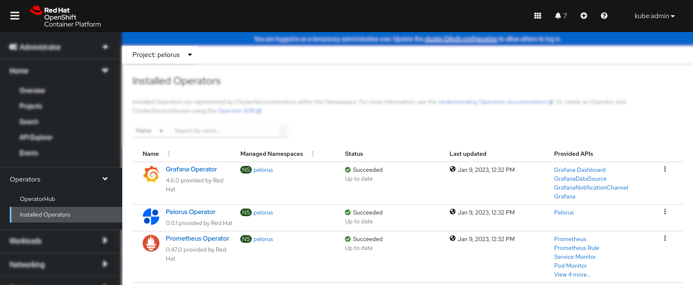
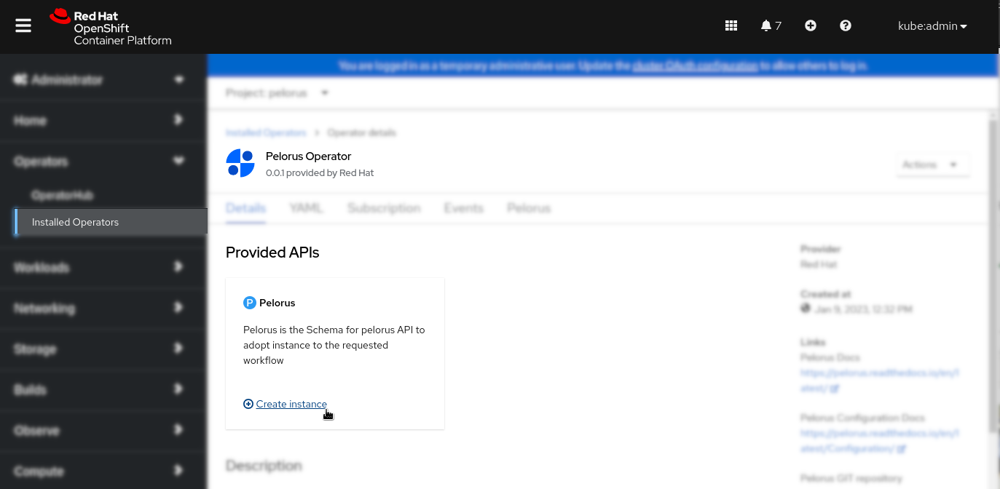
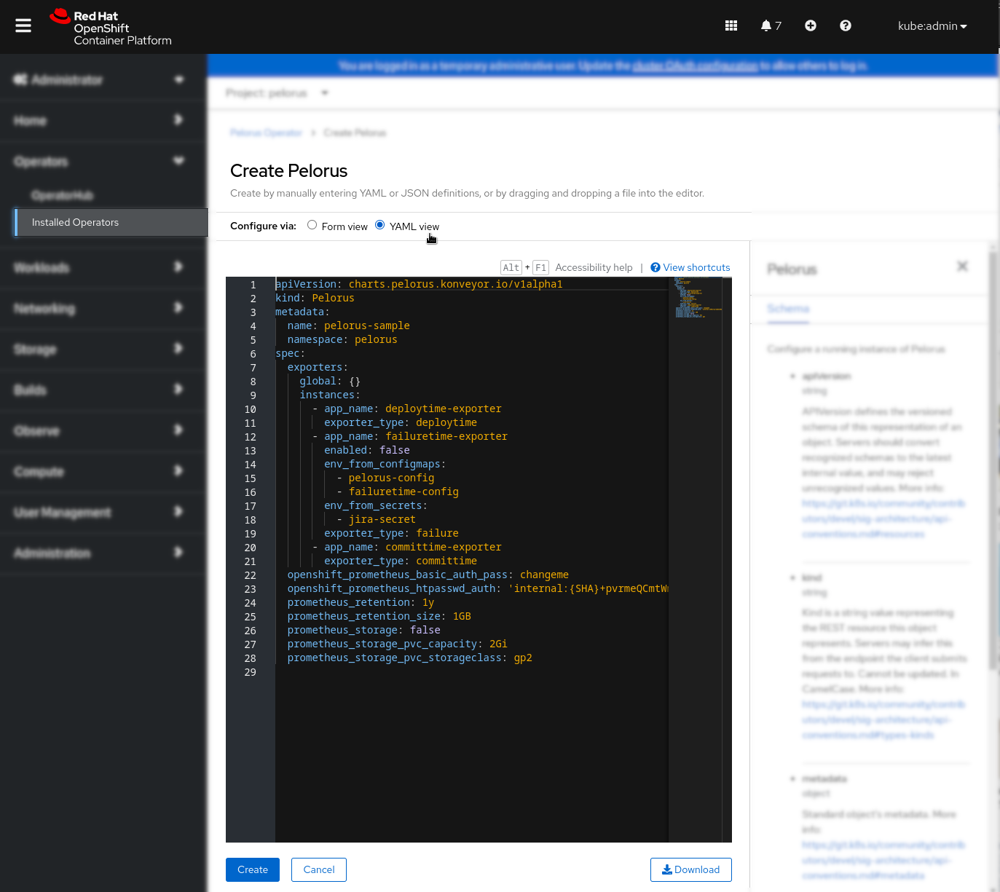
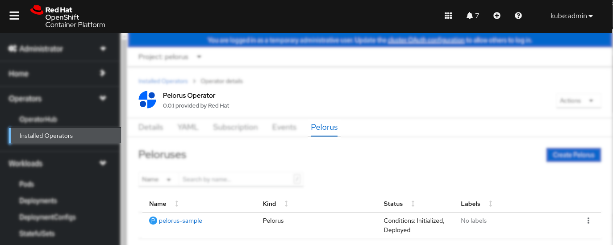

# Installation

There are three methods to deploy Pelorus:

First two are using Pelorus Operator that is available by default in the [Red Hat-provided community-operators catalog sources](https://docs.openshift.com/container-platform/4.11/operators/understanding/olm-rh-catalogs.html#olm-rh-catalogs_olm-rh-catalogs). This catalog is distributed as part of the OpenShift:

  * OpenShift [Web console](#openshift-web-console)
  * OpenShift [Command Line Tool](#openshift-command-line-tool)

(Deprecated) Helm3 charts method is used for development of Pelorus only:

  * [Helm charts](#helm-charts)

## Prerequisites

Before deploying Pelorus, the following tools are necessary

* Access to an OpenShift 4.7 or higher cluster via [Web console](#openshift-web-console) or [CLI](#openshift-command-line-tool).

* ***CLI*** access requires a machine from which to run the install with an [oc](https://docs.openshift.com/container-platform/4.8/cli_reference/openshift_cli/getting-started-cli.html#installing-openshift-cli) The OpenShift CLI**\***

* ***Helm charts*** requires additional tools on your system:
    * [git](https://git-scm.com/) CLI
    * [helm](https://helm.sh/) CLI 3 or higher**\***

>**Note:** It is possible to install `oc` and `helm` inside a Python virtual environment. To do so, change to Pelorus directory (after cloning its repository), and run
>```
>make dev-env
>source .venv/bin/activate
>```

## OpenShift Web console

### Installing Operator

After logging in to the OpenShift Web console select OperatorHub from the Operators menu and search for Pelorus Operator by typing DORA, Dora metrics or Pelorus in the search field:
  

Next click on Install in the left top corner:
  

You can select OpenShift namespace to which Pelorus will be installed, then click Install. We recommend using default one, which is **pelorus**. This creates Pelorus Subscription in the given namespace.
  

Verify that Pelorus, Grafana and Prometheus Operators are installed successfully by checking them under Installed Operators submenu:
  

### Creating Pelorus instance

>**Note:** Currently it is possible to create only one instance of Pelorus per cluster.

Click on the Pelorus Operator from the [Installing Operator](#installing-operator) last step and then on the "Create instance" link:
  


** Note:** See the [Pelorus Exporters Configuration Guide](../configuration/PelorusExporters/) for more information on exporters and the [Pelorus Core Configuration Guide](../configuration/PelorusCore/) to understand Pelorus core stack options before continuing.

Click on the `YAML view`, which will open sample Pelorus object YAML, that should be adopted to the application workflow configuration of exporters, which are placed under `instances:` section and eventually additional configuration for the Pelorus core stack under `spec:` and click on the Create button:
  

Verify Pelorus application deployment by selecting Pelorus tab from the Pelorus Operator view and ensuring the application has `Deployed` status. You may want to check more information about the Pelorus application deployment by clicking on the application name in the following picture `pelorus-sample`:
  

## OpenShift Command Line Tool

### Installing Operator

Installing Pelorus using CLI is equivalent to the [OpenShift Web console](#openshift-web-console) method.

Create pelorus namespace. You can use other namespace to which Pelorus will be installed, but remember to adapt other installation and configuration steps to use that namespace. We do recommend using the default one, which is **pelorus**.

  ```shell
  $ oc create namespace pelorus
  ```
Create [OperatorGroup](https://docs.openshift.com/container-platform/4.11/operators/understanding/olm/olm-understanding-operatorgroups.html) object YAML file that uses pelorus namespace:
  ```shell
  $ cat > pelorus-operatorgroup.yaml <<EOF
  apiVersion: operators.coreos.com/v1
  kind: OperatorGroup
  metadata:
    name: pelorus-operatorgroup
    namespace: pelorus
  spec:
    targetNamespaces:
    - pelorus
  EOF
  ```
And apply it:
  ```shell
  $ oc apply -f pelorus-operatorgroup.yaml
  ```
Verify the OperatorGroup (og) has been successfully created:
  ```shell
  $ oc get og -n pelorus
  NAME                    AGE
  pelorus-operatorgroup   0h1m
  ```
Create Pelorus Operator Subscription object YAML file that uses pelorus namespace:
  ```shell
  $ cat > pelorus-operator-subscription.yaml <<EOF
  apiVersion: operators.coreos.com/v1alpha1
  kind: Subscription
  metadata:
    name: pelorus-operator
    namespace: pelorus
  spec:
    channel: alpha
    name: pelorus-operator
    source: community-operators
    sourceNamespace: openshift-marketplace
  EOF
  ```
And apply it:
  ```shell
  $ oc apply -f pelorus-operator-subscription.yaml
  ```
Verify the pelorus-operator Subscription (sub) has been successfully created:
  ```
  $ oc get sub pelorus-operator -n pelorus
  NAME               PACKAGE            SOURCE                CHANNEL
  pelorus-operator   pelorus-operator   community-operators   alpha
  ```
Verify the ClusterServiceVersion (csv) for Pelorus Operator together with Grafana and Prometheus were succesfully created:
  ```shell
  $ oc get csv -n pelorus
  NAME                        DISPLAY               VERSION   REPLACES                    PHASE
  grafana-operator.v4.8.0     Grafana Operator      4.8.0     grafana-operator.v4.7.1     Succeeded
  pelorus-operator.v0.0.2     Pelorus Operator      0.0.2     pelorus-operator.v0.0.1     Succeeded
  prometheusoperator.0.47.0   Prometheus Operator   0.47.0    prometheusoperator.0.37.0   Succeeded
  ```

### Creating Pelorus instance

>**Note:** Currently it is possible to create only one instance of Pelorus per cluster.

The Pelorus object YAML file requires specific to the application workflow configuration of exporters that are placed under `instances:` section and eventually additional configuration for the Pelorus core stack under `spec:`.

See the [Pelorus Exporters Configuration Guide](../configuration/PelorusExporters/) for more information on exporters and the [Pelorus Core Configuration Guide](../configuration/PelorusCore/) to understand Pelorus core stack options.

*(Example)* Create Pelorus configuration object YAML file. In this example with two enabled exporters `committime-exporter` and `deploytime-exporter`, without prometheus persistent storage:
  ```shell
  $ cat > pelorus-sample-instance.yaml <<EOF
  kind: Pelorus
  apiVersion: charts.pelorus.konveyor.io/v1alpha1
  metadata:
    name: pelorus-sample
    namespace: pelorus
  spec:
    exporters:
      global: {}
      instances:
        - app_name: deploytime-exporter
          exporter_type: deploytime
        - app_name: failuretime-exporter
          enabled: false
          env_from_configmaps:
            - pelorus-config
            - failuretime-config
          env_from_secrets:
            - jira-secret
          exporter_type: failure
        - app_name: committime-exporter
          exporter_type: committime
    extra_prometheus_hosts: null
    openshift_prometheus_basic_auth_pass: changeme
    openshift_prometheus_htpasswd_auth: 'internal:{SHA}+pvrmeQCmtWmYVOZ57uuITVghrM='
    prometheus_retention: 1y
    prometheus_retention_size: 1GB
    prometheus_storage: false
    prometheus_storage_pvc_capacity: 2Gi
    prometheus_storage_pvc_storageclass: gp2
  EOF
  ```

Once Pelorus configuration file is created e.g. `pelorus-sample-instance.yaml` apply it using:
  ```shell
  $ oc apply -f pelorus-sample-instance.yaml
  ```

Verify the pelorus-sample has been successfully created:
  ```
  $ oc get pelorus -n pelorus
  NAME             AGE
  pelorus-sample   31s
  ```

Verbose command to list Pelorus objects with their statuses, presenting succesfull Deployment with the InstallationSuccessful status:
  ```
  $ oc get pelorus -n pelorus -o=jsonpath='{range .items[*]}{.metadata.name}{"\t"}{.status.conditions}{"\n"}{end}'
  pelorus-sample	[{"lastTransitionTime":"2023-01-10T14:12:56Z","status":"True","type":"Initialized"},{"lastTransitionTime":"2023-01-10T14:13:00Z","reason":"InstallSuccessful","status":"True","type":"Deployed"}]
  ```

## Helm Charts

It is possible to install Pelorus from the source code using Helm charts. To do so, you will need tools on your system listed in the [Prerequisites](#prerequisites) section.

When Pelorus gets installed via helm charts, the first deploys the operators on which Pelorus depends, the second deploys the core Pelorus stack and the third deploys the exporters that gather the data. By default, the below instructions install into a namespace called `pelorus`, but you can choose any name you wish.

### Initial Deployment

To begin, clone Pelorus repository. To do so, you can run
```
git clone https://github.com/konveyor/pelorus.git
```
which will download the latest code of Pelorus.

To download a stable version, run
```
git clone --depth 1 --branch <TAG> https://github.com/konveyor/pelorus.git
```
changing **TAG** by one of [Pelorus versions](https://github.com/konveyor/pelorus/tags).

Change the current directory to `pelorus`, by running
```
cd pelorus
```

Login to the OpenShift cluster as an admin, by running `oc login` command.

Create the namespace called `pelorus` that Pelorus will use, by running
```
oc create namespace pelorus
```
You can choose any name you wish, but remember to change to the same name in the following commands.

Pelorus gets installed via helm charts. First, deploy the operators on which Pelorus depends, by running
```
helm install operators charts/operators --namespace pelorus
```

Wait for the operators install to complete.
```
$ oc get pods --namespace pelorus
NAME                                                   READY     STATUS    RESTARTS   AGE
grafana-operator-controller-manager-................   2/2       Running   0          22s
prometheus-operator-................                   1/1       Running   0          10s
```

Then, deploy the core Pelorus stack, by running
```
helm install pelorus charts/pelorus --namespace pelorus
```

Wait for the Pelorus install to complete.
```
$ oc get pods --namespace pelorus
NAME                                                   READY   STATUS      RESTARTS      AGE
committime-exporter-1-deploy                           0/1     Completed   0             43s
committime-exporter-1-.....                            1/1     Running     0             40s
deploytime-exporter-1-.....                            1/1     Running     0             40s
deploytime-exporter-1-deploy                           0/1     Completed   0             43s
grafana-deployment-................                    2/2     Running     0             34s
grafana-operator-controller-manager-................   2/2     Running     0             2m5s
prometheus-operator-................                   1/1     Running     0             111s
prometheus-prometheus-pelorus-0                        3/3     Running     1 (40s ago)   44s
prometheus-prometheus-pelorus-1                        3/3     Running     1 (39s ago)   44s
```

In a few seconds, you will see a number of resourced get created. The above commands will result in the following being deployed:

* Prometheus and Grafana operators
* The core Pelorus stack, which includes:
    * A `Prometheus` instance
    * A `Grafana` instance
    * A `ServiceMonitor` instance for scraping the Pelorus exporters.
    * A `GrafanaDatasource` pointing to Prometheus.
    * A set of `GrafanaDashboards`. See the [Outcomes (Dashboards) documentation](../philosophy/outcomes/SoftwareDeliveryPerformance.md) for more details.
* The following exporters:
    * Deploy Time
    * Commit Time

To check this, run
```
oc get all --namespace pelorus
```

From here, some additional configuration is required in order to deploy other exporters. See the [Pelorus Exporters Configuration Guide](configuration/PelorusExporters.md) for more information on exporters.

You may also want to enabled other features for the core stack. See the [Pelorus Core Configuration Guide](configuration/PelorusCore.md) to understand those options.

To understand how to set up an application to Pelorus to watch, see [QuickStart tutorial](QuickstartTutorial.md).

### Uninstalling

Cleaning up Pelorus is very simple. Just run

```
helm uninstall pelorus --namespace pelorus
helm uninstall operators --namespace pelorus
```

If Pelorus was deployed with PVCs, you may want to delete them, because helm uninstall will not remove PVCs. To delete them, run
```
oc delete pvc --namespace pelorus $(oc get pvc --namespace pelorus -o name)
```
