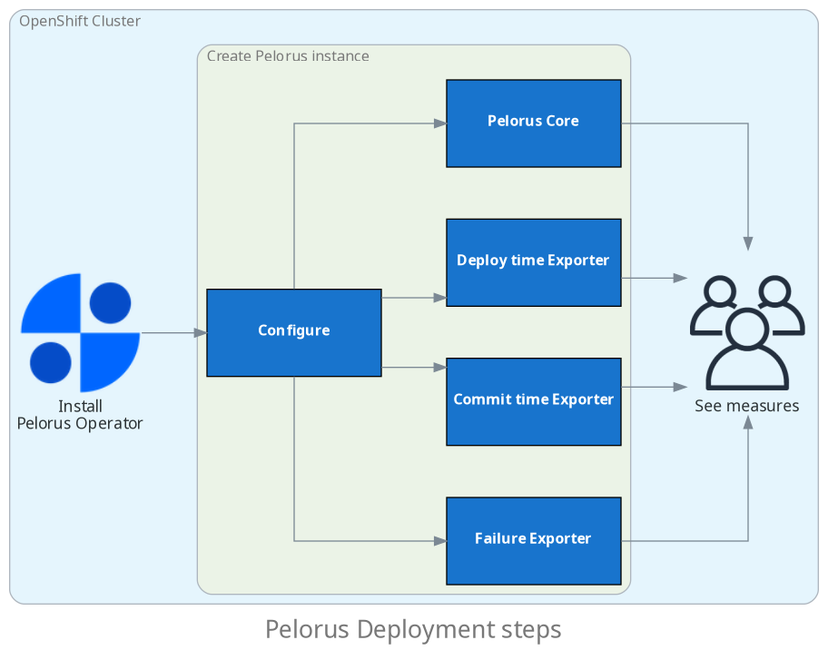

Pelorus is composed of Prometheus, Grafana and exporters. It can be easily deployed to an OpenShift cluster and provides an organizational-level view of critical measures.

[:material-arrow-right: Further knowledge on Pelorus architecture](../Architecture.md)

## Terminology

- **Instance**: The set of Pelorus Core and Exporters objects.
- **Pelorus Core**: The storage manager.
- **Pelorus Exporter**: The metrics collector.
- **Provider**: The tools from where Pelorus Exporters collect the metrics.
- **Metric**: The data that is used to generate a measure.
- **Measure**: The outcome to make better decisions based on it.

## Deployment Steps

To deploy Pelorus to monitor your application(s), the following information are needed:

* The OpenShift Namespace(s) your application(s) lives in.
* The Git Provider(s) your application(s) source code(s) is(are) hosted (and authentication credentials, if needed).
* The Issue Tracker(s) your application(s) uses (and authentication credentials, if needed).

For more information on each step, check [Installation](Installation.md), [Core's Configuration](configuration/PelorusCore.md) and [Exporters' Configuration](configuration/PelorusExporters.md) documentation.

## Supported Providers

List of providers supported by Pelorus.

### Deployment

- OpenShift :simple-redhatopenshift:

### Git Providers

- GitHub :simple-github:
- Bitbucket :simple-bitbucket:
- Gitea :simple-gitea:
- GitLab :simple-gitlab:
- Azure DevOps :simple-azuredevops:

### Issue Trackers

- Jira :simple-jirasoftware:
- GitHub :simple-github:
- Service Now

