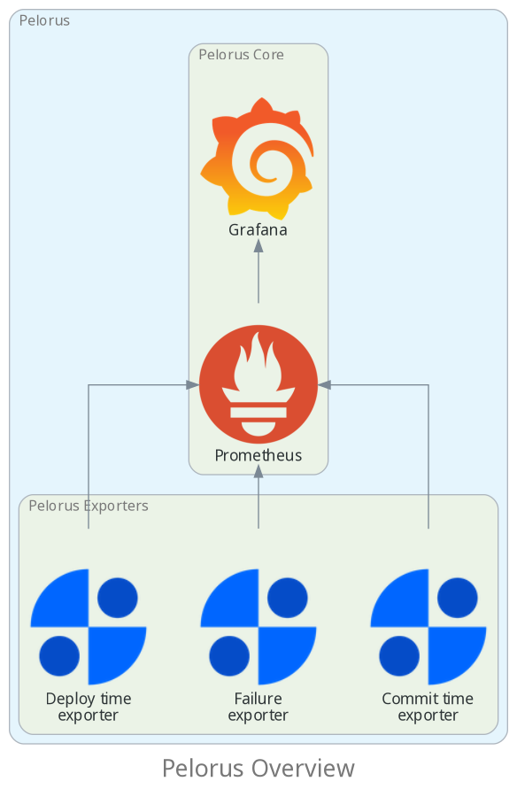

To deploy Pelorus to monitor your application(s), the following information are needed:

* The OpenShift Namespace(s) your application(s) is(are) deployed.
* The Git Provider(s) information (name, credentials, etc) your application(s) source code(s) is(are) hosted.
* The Issue Tracker(s) information (name, credentials, etc) your application(s) uses.

With this information gathered, Pelorus can be deployed following the steps.

For more information on each step, check [Installation](Installation.md), [Core's Configuration](configuration/PelorusCore.md) and [Exporters' Configuration](configuration/PelorusExporters.md) documentation.
## Visualization

Pelorus is composed of Prometheus, Grafana and exporters. It can be easily deployed to an OpenShift cluster and provides an organizational-level view of critical measures.

[:material-arrow-right: Further knowledge on Pelorus architecture](../Architecture.md)

## Terminology

- **Instance**: The set of Pelorus Core and Exporters objects.
- **Pelorus Core**: The integration layer between Prometheus, Grafana and exporters.
- **Pelorus Exporter**: The metrics collector.
- **Provider**: The tools from where Pelorus Exporters collect the metrics.
- **Metric**: The data that is used to generate a measure.
- **Measure**: The outcome to make better decisions based on it.

## Supported Providers

Pelorus' exporters support a variety of different providers. The Pelorus community is working to ensure an optimal experience for each provider supported by Pelorus. Providers with

- :fontawesome-solid-circle-check:{ .checked } means it is automatically tested by the project CI
- :fontawesome-solid-circle-xmark: means it is still not automatically tested by the project CI

Below is the list of providers supported by Pelorus.

TODO check contributing

Open an [issue](https://github.com/dora-metrics/pelorus/issues/new?assignees=&labels=kind%2Ffeature%2Cneeds-triage&template=feature.yml) or a pull request to add support for additional providers!

### Deployment

- OpenShift :simple-redhatopenshift: : [Known issues](https://github.com/dora-metrics/pelorus/labels/deploytime-exporter)

    - version 4.10 : Tested by project CI :fontawesome-solid-circle-check:{ .checked }
    - version 4.11 : Tested by project CI :fontawesome-solid-circle-check:{ .checked }
    - version 4.12 : Tested by project CI :fontawesome-solid-circle-check:{ .checked }
    - version 4.13 : Tested by project CI :fontawesome-solid-circle-check:{ .checked }

> **NOTE:** The Pelorus engineering team will provide **best-effort** level support for it on the currently latest and the latest 3 previous released stable minor versions of OpenShift version 4.

### Git Providers

- GitHub :simple-github: : Tested by project CI :fontawesome-solid-circle-check:{ .checked } | [Known issues](https://github.com/dora-metrics/pelorus/issues?q=is%3Aopen+label%3Acommittime-exporter+label%3Abackend-github)
- GitHub Enterprise :simple-github: : Tested by project CI :fontawesome-solid-circle-xmark: | [Known issues](https://github.com/dora-metrics/pelorus/issues?q=is%3Aopen+label%3Acommittime-exporter+label%3Abackend-github-enterprise+)
- Bitbucket :simple-bitbucket: : Tested by project CI :fontawesome-solid-circle-check:{ .checked } | [Known issues](https://github.com/dora-metrics/pelorus/issues?q=is%3Aopen+label%3Acommittime-exporter+label%3Abackend-bitbucket+)
- Gitea :simple-gitea: : Tested by project CI :fontawesome-solid-circle-check:{ .checked } | [Known issues](https://github.com/dora-metrics/pelorus/issues?q=is%3Aopen+label%3Acommittime-exporter+label%3Abackend-gitea)
- GitLab :simple-gitlab: : Tested by project CI :fontawesome-solid-circle-check:{ .checked } | [Known issues](https://github.com/dora-metrics/pelorus/issues?q=is%3Aopen+label%3Acommittime-exporter+label%3Abackend-gitlab)
- Azure DevOps :simple-azuredevops: : Tested by project CI :fontawesome-solid-circle-check:{ .checked } | [Known issues](https://github.com/dora-metrics/pelorus/issues?q=is%3Aopen+label%3Acommittime-exporter+label%3Abackend-azure-devops)

### Issue Trackers

- Jira :simple-jirasoftware: : Tested by project CI :fontawesome-solid-circle-check:{ .checked } | [Known issues](https://github.com/dora-metrics/pelorus/issues?q=is%3Aopen+label%3Afailure-exporter+label%3Abackend-jira+)
- GitHub :simple-github: : Tested by project CI :fontawesome-solid-circle-check:{ .checked } | [Known issues](https://github.com/dora-metrics/pelorus/issues?q=is%3Aopen+label%3Afailure-exporter+label%3Abackend-github+)
- ServiceNow : Tested by project CI :fontawesome-solid-circle-xmark: | [Known issues](https://github.com/dora-metrics/pelorus/issues?q=is%3Aopen+label%3Afailure-exporter+label%3Abackend-servicenow+)
- PagerDuty :simple-pagerduty: : Tested by project CI :fontawesome-solid-circle-check:{ .checked } | [Known issues](https://github.com/dora-metrics/pelorus/issues?q=is%3Aopen+label%3Afailure-exporter+label%3Abackend-pagerduty+)
- Azure DevOps :simple-azuredevops: : Tested by project CI :fontawesome-solid-circle-check:{ .checked } | [Known issues](https://github.com/dora-metrics/pelorus/issues?q=is%3Aopen+label%3Afailure-exporter+label%3Abackend-azure-devops+)

