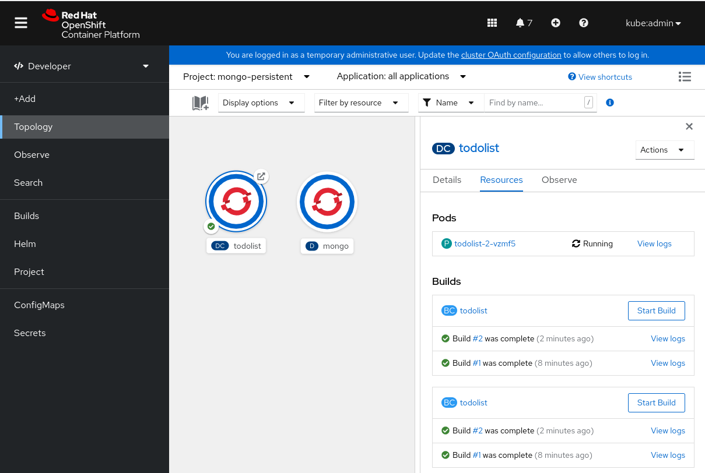
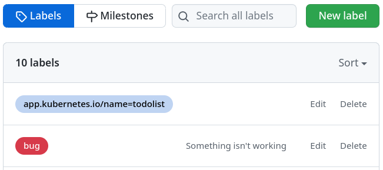
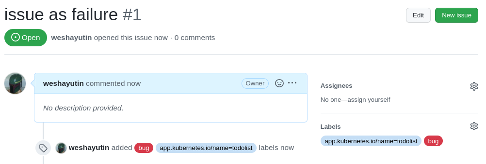

# Quickstart Tutorial

In this Quickstart you will:

* Get a taste of how Pelorus captures a change going through the application's delivery cycle.
* Understand that Pelorus should be used as a conversation tool to read the trends in metrics and react by making informed investments in the software delivery process.
* Use GitHub as the Hosting Service for Version Control System (used by commit time exporter) and as the Issue Tracker System (used by failure exporter).

To do so, you will

* Install Pelorus Operator in an OpenShift cluster
* Create Pelorus instance to monitor a sample application
* Install a sample application that Pelorus will measure
* Create new commits and issues for the sample application
* Watch as the metrics and trends change as new versions roll out

> **Note:** More information about the four key DORA metrics can be found in our [Outcomes documentation](../philosophy/outcomes/Overview.md)

> **Note:** We recommend reading our [Pelorus Overview](../GettingStarted/Overview.md) to get familiar with some basic concepts and terminology.

## Prerequisites

### Tools and access

To succesfully go through this demo you will need:

* [GitHub](https://github.com) account with a [Personal access token](https://docs.github.com/en/authentication/keeping-your-account-and-data-secure/creating-a-personal-access-token) generated.

* Access to an OpenShift 4.7 or higher cluster via OpenShift web console and shell.

* Shell with the following CLI:
    * [oc](https://docs.openshift.com/container-platform/4.8/cli_reference/openshift_cli/getting-started-cli.html#installing-openshift-cli)
    * [git](https://git-scm.com/)

### GitHub project fork

The first step is to [Fork](https://docs.github.com/en/get-started/quickstart/fork-a-repo) our repository with sample application to your personal [GitHub](https://github.com) space. Use the link below that opens a "new Fork" page:

: [Create a fork: https://github.com/konveyor/mig-demo-apps](https://github.com/konveyor/mig-demo-apps/fork)

> **IMPORTANT**: From now on **`<your_org>`** used in this document will be your GitHub **`username`** where the **`mig-demo-apps`** was forked and should replace the **`konveyor`** part of the URL.

The [Mean Time to Restore and Change Failure Rate](#mean-time-to-restore-and-change-failure-rate) part of this demo uses GitHub Issues provider, so enable the **Issues** in the forked repo under the settings page:

: **https://github.com/`<your_org>`/mig-demo-apps/settings#features**

### Pelorus Operator

Deployment of the running Pelorus Operator instance consists of two steps:

 * [Installing Pelorus Operator](#installing-pelorus-operator)
 * [Creating Pelorus instance](#creating-pelorus-instance)
 : This step requires a [configuration file](#prepare-config-file), so let's start with this it first.

#### Prepare Config file

> **NOTE**: A comprehensive list of all configuration options is available in our [Pelorus Core](./configuration/PelorusCore.md) and [Pelorus Exportrs](./configuration/PelorusExporters.md) documentation.

For this demo we will need to prepare a configuration file that will be used in our deployment. For now it's enought to understand that our Pelorus Deployment will consist of:

* The pelorus instance:
    * is named **pelorus-quickstart**
* Pelorus will deploy three exporters:
    * **deploytime** to watch `mongo-persistent` namespace
    * **committime** to watch `mongo-persistent` namespace
    * **failure** to monitor our application failures logged in the [Forked GitHub project](#github-project-fork). For this step you need to adjust the configuration file to match the `<your_org>` and GitHub [Personal access token](https://docs.github.com/en/authentication/keeping-your-account-and-data-secure/creating-a-personal-access-token).

Let's create the Pelorus Configuration file and save it under the `pelorus-quickstart.yaml` file. Please adjust the `<your_github_api_token>` and `<your_org>`:

```yaml
apiVersion: charts.pelorus.konveyor.io/v1alpha1
kind: Pelorus
metadata:
  name: pelorus-quickstart
spec:
  exporters:
    instances:
    - app_name: deploytime-exporter
      exporter_type: deploytime
      extraEnv:
      - name: NAMESPACES
        value: mongo-persistent
    - app_name: committime-exporter
      exporter_type: committime
      extraEnv:
      - name: NAMESPACES
        value: mongo-persistent
    - app_name: failure-exporter
      exporter_type: failure
      extraEnv:
      - name: PROVIDER
        value: github
      - name: TOKEN
        value: <your_github_api_token>
      - name: PROJECTS
        value: <your_org>/mig-demo-apps
```

#### Installing Pelorus Operator

Please follow Pelorus Operator installation documentation available via two methods:

* (recommended) Using [OpenShift Command Line Tool](./Installation.md#installing-operator_1)
* Using [OpenShift web console](./Installation.md#installing-operator)

#### Creating Pelorus instance

Once the Pelorus Operator is installed now it's time to use our `pelorus-quickstart.yaml` file from the [Prepare Config file](#prepare-config-file) step to create Pelorus Instance that will monitor our sample application. Detailed instructions are outlined in one of two methods:

* (recommended) Using [OpenShift Command Line Tool](./Installation.md#creating-pelorus-instance_1)
* Using [OpenShift web console](./Installation.md#creating-pelorus-instance)

At this stage you should see number of pods running. Please confirm that all pods are healthy by running CLI command `$ oc get pods -n pelorus` to continue with this tutorial. If there is any pod in `Error` or `CrashLoopBackOff` state, this tutorial may fail at any further step:

```shell
$ oc get pods -n pelorus
NAME                                                   READY   STATUS      RESTARTS        AGE
committime-exporter-1-7zvmp                            1/1     Running     0               2m10s
committime-exporter-1-deploy                           0/1     Completed   0               2m13s
deploytime-exporter-1-deploy                           0/1     Completed   0               2m13s
deploytime-exporter-1-hrnqq                            1/1     Running     0               2m10s
failure-exporter-1-deploy                              0/1     Completed   0               2m13s
failure-exporter-1-r55lp                               1/1     Running     0               2m10s
grafana-deployment-65765d5594-9vmqx                    2/2     Running     0               2m14s
grafana-operator-controller-manager-bf759cf9b-4gxxl    2/2     Running     0               2m58s
pelorus-operator-controller-manager-8455c65d76-b5z7k   1/1     Running     0               2m45s
prometheus-operator-6fdc9c5494-ggwwk                   1/1     Running     0               2m49s
prometheus-prometheus-pelorus-0                        3/3     Running     1 (2m10s ago)   2m14s
prometheus-prometheus-pelorus-1                        3/3     Running     1 (2m9s ago)    2m14s
```

#### Accessing Pelorus dashboard

To view the Pelorus measurements we need to gain access to its' Grafana dasboard. To get the URL of the Grafana dashboard use the following command:
```shell
$ oc get route grafana-route --namespace pelorus -o=go-template='https://{{.spec.host | printf "%s\n" }}'
```

In the Grafana dasboard navigate to **search** and select **"pelorus ➔ Software Delivery Performance - By App"**. An empty dashboard without any measurements should be presented. That is expected, because we did not deploy our sample application yet!


#### Congratulations

Pelorus is now configured to measure the sample application.

It is time to deploy the sample application to view measurements from Pelorus' Grafana dashboard. Plase keep the Grafana page open.


## Sample Aplication Demo

### Lead Time for Change and Deployment Frequency

In this section you see how Pelorus measures two DORA metrics: **Lead time for change** and **Deployment frequency**.


#### Install the sample application

Clone **your** forked copy from the [GitHub project fork](#github-project-fork) step:

```shell
# Adjust <your_org> to your GitHub fork org:
$ export GITHUB_FORK_ORG=<your_org>

$ git clone git@github.com:${GITHUB_FORK_ORG}/mig-demo-apps.git
```

Install the `todolist-mongo-go` sample application in your OpenShift cluster:

```shell
# Adjust <your_org> to your GitHub fork org:
$ export GITHUB_FORK_ORG=<your_org>

$ cd mig-demo-apps/apps/todolist-mongo-go
$ sed -i "s/your_org/${GITHUB_FORK_ORG}/g" mongo-persistent.yaml
$ oc create -f mongo-persistent.yaml
```

The todolist application and mongo database should now build and deploy into the `mongo-persistent` namespace.

Wait for the application, by waiting for the ready state of the `pod` which is labeled `app=mongo`:
```shell
$ oc wait --for=condition=ready pod -l app=mongo --namespace mongo-persistent
```

Ensure that your BuildConfig points correctly to your **`URI value`** from your GitHub fork, by running:
```shell
$ oc get buildconfig.build.openshift.io/todolist --namespace mongo-persistent -o=go-template='URI value: {{.spec.source.git.uri | printf "%s\n"}}'
```

#### View the Pelorus measurements

After a couple of minutes you should see at least one measurement for **Lead Time for Change** and **Deployment Frequency** in the Grafana dasboard, like in the following image:

> **Note:** If the time elapsed from your `mongo-persistent` deployment is higher then **5 minutes**, you may want to adjust different relative time range <span style="color:red">⓵</span> e.g. **Last 3 hours**s.


#### Update application

In this section we will observe application continous delivery and analyze it with Pelorus. Few steps will guide us through this process:

- [Setting up GitHub Webhook](#github-webhook) that allows to automatically run new builds of your smaple applications when the commit to the source code happens
- Fixing an issue in the running application and [update the application source code](#update-the-application-source-code)
- Committing changes to source control
- Watching the application redeploy with the changes to be captured by Pelorus

##### Github Webhook

You can easily watch how Pelorus works by automatically building and deploying the todolist app when a commit is pushed to Github by utilizing Github's webhooks.

To get the build webhook URL you can navigate to the todolist BuildConfig details or by running
```shell
# Get the secret that is used by the Webhook
$ WEBHOOK_SECRET=$(oc get bc/todolist -o=jsonpath='{.spec.triggers..github.secret}' -n mongo-persistent)

# Verify the secret that is used by the Webhook
$ echo "${WEBHOOK_SECRET}"

# Get the Webhook URL that will be used in GitHub
$ oc describe buildconfig.build.openshift.io/todolist --namespace mongo-persistent | grep 'webhooks/<secret>/github' | sed "s/<secret>/${WEBHOOK_SECRET}/g"
```

To add the webhook to your forked GitHub repo:


* <span style="color:red">⓵</span> Navigate to **https://github.com/`<your_org>`/mig-demo-apps/settings/hooks**
* <span style="color:red">⓶</span> Click **Add webhook** in the right top corner


* <span style="color:red">⓷</span> Paste the Webhook URL from the previous `oc` command in the **Payload URL**
* <span style="color:red">⓸</span> Select content type **application/json**
* <span style="color:red">⓹</span> Toggle SSL as needed.
: For this quickstart tutorial consider **Disable**, as you may not have signed SSL Certificate in your testing OpenShift environment and the webhook will fail to deliver it's payload with the error: `We couldn’t deliver this payload: x509: certificate signed by unknown authority`.
* <span style="color:red">⓺</span> Click **Add webhook**

Now your webhook should be added and green success icon should appear left to your webhook's URL, which means it succesfully sent the first `ping` payload to your OpenShift URL endpoint:


For more information, consult [GitHub's documentation](https://docs.github.com/en/developers/webhooks-and-events/webhooks/about-webhooks).

##### Update the application source code

In your OpenShift `mongo-persistent` project page, open the link to the sample application or get the link, by running
```
$ oc get route todolist-route --namespace mongo-persistent -o=go-template='http://{{.spec.host | printf "%s\n" }}'
```

The application should look like in the following image:


The text **"Enter an activity"** does not seem clear, let's change that to **"Add a todo item"**, by running:

```shell
$ sed -i 's/Enter an activity/Add a todo item/g' index.html
```

If you are happy with the change, commit it and push to the default `master` branch:

```shell
$ git add index.html
$ git commit -m "Updated index.html activity text."
$ git push origin master
```

Once the commit is pushed to the repository, it will automatically rebuild because we have setup the [GitHub webhook](#github-webhook).

You will now see that the todolist application starts to rebuild, like in the following image:



Or by running the `oc get build` command and checking the new `todolist-2` build in the output:

```shell
$ oc get build -n mongo-persistent
NAME         TYPE     FROM          STATUS     STARTED         DURATION
todolist-1   Docker   Git@e27a21e   Complete   8 minutes ago     1m42s
todolist-2   Docker   Git@8c045a2   Complete   2 minutes ago     1m37s
```

After it finishes, you can refresh your todolist application web page and see the running instance of our sample application has updated **"Add a todo item"** text:


#### Understand the changes to the Grafana Dashboard

After few minutes navigate in the Grafana dashboard to **"pelorus ➔ Software Delivery Performance - By App"** and set the interval to `15 minutes`.
Pelorus will now read the updated commit and register a new deploytime.

You should see a total of **2** deployments, like in the following image:

> **Note:** The suggested interval range of `15 minutes` may vary as you may have committed your change in different time interval from the first sample application deployment.


The **Lead Time for Change** should initially go down as we just pushed a commit.  The time difference between changes to the original git repository and your personal forked repo will most likely cause this metric to go down.

There have been two deployments since this demonstration was started, the initial deployment and now the redeployment after pushing a change to the git repository. The **Deployment Frequency** should have gone up by 100% in the last 15 minutes.  Once your initial deployment time is longer than `15 minutes` in the past, you will find your interval has fallen by 50%.

### Mean Time to Restore and Change Failure Rate

In this section you see how Pelorus measures the last two DORA metrics: **Mean time to recovery** and **Change failure rate**.


#### Pelorus failure exporter

[Creating Pelorus instance](#creating-pelorus-instance) step should gave you a running instance of the `failure` exporter.

Check that no bugs are found by Pelorus in its' `failure` exporter, by ensuring no lines starting with the `failure_creation_timestamp` are present in the output of the following command:
```shell
$ curl $(oc get route failure-exporter --namespace pelorus -o=template='http://{{.spec.host | printf "%s\n"}}')
```

#### GitHub Issues

##### Prepare GitHub labels
Pelorus will utilize two labels to determine if a GitHub issue is associated with our `todolist` mongo application:

* `bug`
: We'll need the default `bug` label as explained in the [GITHUB_ISSUE_LABEL](./configuration/ExporterFailure.md#github_issue_label).
* `app.kubernetes.io/name=todolist`
: Additionally, by default Pelorus requires that all issues associated with a particular application be labeled with the `app.kubernetes.io/name=<app_name>` label. This works the same way as the deployment configuration and for `failure` exporter it's explained in the [APP_LABEL](./configuration/ExporterFailure.md#app_label) configuration option.

> **Note:** Only those GitHub issues which have **both** labels are recognized by Pelorus as a critical bugs in our "production" environment.

Ensure the above labels are present and create them in the event of their absence by navingating to the following URL, like in the following image:

: **https://github.com/`<your_org>`/mig-demo-apps/labels**



##### Create New GitHub issue

Create a Github issue and label it with `bug` and `app.kubernetes.io/name=todolist` to register a failure, like in the following image (our application name is set as `todolist`):



Refresh the Grafana dashboard and you should see the **Change Failure Rate** go up. We will discuss what it means in the [Understand the changes to the Grafana Dashboard](#understand-the-changes-to-the-grafana-dashboard_1) section.


##### Resolve GitHub issue

Now, let's resolve previously created GitHub issue by closing it and see how that impacts our `Failure Rate` and the `Mean Time to Restore`.

Ensure your issue is resolved by selecting **Closed** link in the GitHub's Issues page: 


You may also check the output from the failure exporter again, by running:
```shell
$ curl $(oc get route failure-exporter --namespace pelorus -o=template='http://{{.spec.host | printf "%s\n"}}')
```

At this time you should see lines startning with `failure_creation_timestamp` and `failure_resolution_timestamp`. They indicate the time the issue was created and when it was closed.

#### Understand the changes to the Grafana Dashboard

Now, we should also have data in the `Mean Time to Restore` metric in Grafana dashboard, like in the following image.


**Mean Time to Restore** measures how long it takes to restore the service when an incident occurs.

**Change Failure Rate** is a key quality metric that measures what percentage of changes fails in the production environment. It is crucial to have alignment on what constitutes a failure. The recommended definition is a change that either results in degraded service or subsequently requires remediation.

## Cleanup

### Uninstalling sample application

To uninstall the sample application, run:
```shell
$ oc delete -f mongo-persistent.yaml --namespace mongo-persistent
```

### Uninstalling Pelorus

#### Uninstalling Pelorus Instance

 To uninstall the Pelorus instance together with Prometheus and Grafana instances, run:
```shell
$ oc delete -f pelorus-quickstart.yaml --namespace pelorus
```

#### Uninstalling Operators

Uninstalling Pelorus Operator will not uninstall its' dependent operators such as Grafana Operator and Prometheus Operator from your cluster, so you need to remove those independently.

Depending on the installation method which you have used during [Installing Pelorus Operator](#installing-pelorus-operator) step, please remove all three of them by using OpenShift web console:

- Pelorus Operator
- Prometheus Operator
- Grafana Operator

Or using `oc delete` to delete `subscription` and `csv` objects: 
```shell
# Get the ClusterServiceVersion names to be deleted from the pelorus namespace
$ oc get csv --namespace pelorus
NAME                        DISPLAY               VERSION   REPLACES                    PHASE
grafana-operator.v4.8.0     Grafana Operator      4.8.0     grafana-operator.v4.7.1     Succeeded
pelorus-operator.v0.0.2     Pelorus Operator      0.0.2     pelorus-operator.v0.0.1     Succeeded
prometheusoperator.0.47.0   Prometheus Operator   0.47.0    prometheusoperator.0.37.0   Succeeded

# Delete the CSV with their versions from the pelorus namespace
$ oc delete csv --namespace pelorus grafana-operator.v4.8.0
$ oc delete csv --namespace pelorus pelorus-operator.v0.0.2
$ oc delete csv --namespace pelorus prometheusoperator.0.47.0

# Delete subscription objects from the pelorus namespace
$ oc delete subscription --namespace pelorus \
    grafana-operator-v4-community-operators-openshift-marketplace \
    pelorus-operator \
    prometheus-beta-community-operators-openshift-marketplace
```