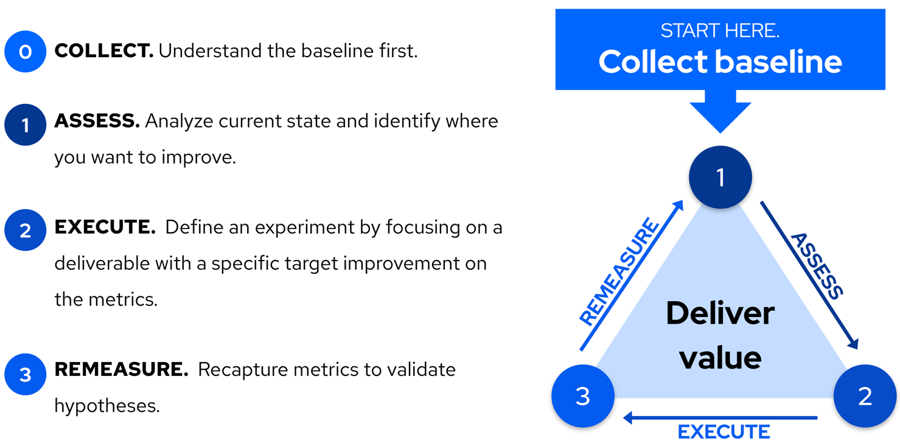

# Our Philosophy

Studies have shown that elite digital organizations tend to outperform their peers in software delivery and operational performance.

Having worked with organizations around the world, we've found that very few of them are actually measuring their software delivery and operational performance in a meaningful way, despite the evidence that shows how this performance leads to higher organizational performance.

Fewer still are using that information to learn and continuously improve their organization.

As software delivery and operational performance has a proven correlation to organizational performance, we believe that there are other similar bridge outcomes that organizations can build a shared focus on measuring and improving to impact the organization as a whole.

We believe that a shared focus on measuring and improving on a specific set of business outcomes within an IT organization will result in a notable positive impact on the organization as a whole.

The mission of Pelorus is to help IT organizations use business value-based metrics to understand how technology-related investments impact organizational performance and to provide specific tools and guidance to help improve those metrics.

## The Problem Today

Most of the context around work that happens in IT is easily hidden today.  At an implementation level, engineers are working towards code deployments, changes to server configuration, network and firewall updates--all of which are critically important to the success of an organization. Any specific implementation details are generalized through summary reporting to anyone outside the work.  Even if a Director or VP were to walk to an engineer's desk and ask to see the result of a task that was just delivered, the information would rarely be meaningful to them.  This gap exists across every vertical and horizontal relationship between business stakeholders, IT engineers, managers and leaders.

The goal is for everyone in an organization to be able to effectively communicate the value of their work by relating them to Bridge Outcomes.

The concepts of Lean Thinking have been changing the way that businesses think about value and about the customer. Agile and Kanban frameworks have provided teams with ways to apply Lean principles to plan and manage their work in ways that are more visible and impactful to business. Still, measuring the evolution of an organization, especially when there are many teams, remains a very difficult challenge.

This is the problem we want to solve.

The true complexity of this problem becomes more obvious when we realize that not only do we have to master the flow of work across multiple teams, but often, we have to either aggregate or break down the work with the right context so that it makes sense to different audiences within IT--all of whom think in varying scopes of time. To talk about this, we leverage the 5 Elements model below.

**This is the problem we want to help solve.**

The true complexity of this problem becomes more obvious when we realize that not only do we have to master passing invisible work across multiple teams, but often, we have to either aggregate or break down the work so that it makes sense to different audiences within IT--all of whom think in varying scopes of time. To talk about this, we leverage the _5 Elements_ model below.

### The 5 Elements of IT

The 5 Elements of IT is a conceptual model that hypothesizes that any given IT organization is made up of, at a minimum, five very distinct functions. These Five Elements need to work together in balance to deliver the organization's needs. It also theorizes that many common areas of pain or dysfunction can be traced back to communication gaps or breakdowns between at least 2 of the 5 elements.

| Element 	| Capability 	| What failure looks like 	| For what time frame [element] has context|
|----------------------------	| -----------	| -------------------------	| ---------- |
| Leadership | Provides executive sponsorship | Teams are afraid to try something new | 1-5 Years |
| Architecture | Makes the right thing easy |  Teams are repeatedly solving the same problem | 3-12 Months |
| Product Management | Creates strategic requirements | Software does not support the need | 2-3 Months |
| Development | Delivers the features | Software does not meet defined need requirements| 2-3 Weeks |
| Operations  | Keeps the systems running | Ongoing outages and incidents | 1-5 Days |

The Pelorus philosophy proposes that a common language of measurable outcomes can be used to bridge the gaps that often arise across these 5 elements. **We refer to these as _Bridge Outcomes_.**

## Finding the right Bridge Outcomes

The term _Outcome_ refers to an measurable change in human, team, or organizational behavior that achieves a desired business result. A _business result_ typically falls into one of the following categories:

* an Increase in Value (e.g. Revenue)
* a Decrease in Cost
* an Increase in Quality
* an Increase in Happiness

> **NOTE** 
> For more information about outcomes, read [Outcomes over Outputs](https://www.amazon.com/Outcomes-Over-Output-customer-behavior/dp/1091173265) by Josh Seiden.

> **NOTE** 
> For our definition of Business Results, read [Project to Product](https://projecttoproduct.org/the-book/) by Mik Kirsten.

### Searching for communication gaps

Over time, communication gaps arise between the Five Elements naturally. Each function cares about different types of work and thinks in varying scopes of time. These simple differences can grow into organizational silos if organizations lack shared outcomes.

While alignment may seem to call for major trade-offs between the five functions, shared measurable outcomes can help bridge these communication gaps.

### How we’ve picked our outcomes

* Focus on Outcomes over Outputs
* Aim to improve relationships between the five elements to prevent failures
* Use systems-level thinking to improve as an organization, not individual departments
* Making sure data analysis(?) is actionable (SMART)

### Exploring Bridge Outcomes

These are some organizational outcomes that satisfy the good metric criteria and correlate to organizational performance. Organizations should choose which specific outcomes reflect their vision of success that they want to invest in regularly measuring. This is intended to be an iterative list of Bridge outcomes. Each outcome has a Dashboard Detail page that describes the outcome, each measure, and the data points required for calculation. Note: Software Delivery Performance is the only outcome readily available in Pelorus.

| Outcome 	| Definition 	| Measures(KPIs) 	| Why it matters |
|----------	| -----------	| ---------------	| -------------- |
| [**Software Delivery Performance**](Dashboard_SDP.md) | The ability of the organization to effectively deliver software | Lead Time for Change  Deployment Frequency   Mean Time to Restore   Change Failure Rate | Per the research in Accelerate, the ability of an organization to effectively deliver software to customers is a key leading indicator of organizational performance. |
| **Supported Technology Adoption** (Dashboard page coming soon) | A measure of an organization’s ability to become more efficient through reuse of common patterns and platforms. | Adoption Lead Time  Adoption Rate  Operational Efficiency  Developer NPS | As organizations adopt more lean IT practices and build autonomy in development teams, the role of "centralized IT" evolves from actively provisioning and supporting infrastructure and middleware to providing self-service platforms, tools, and sample patterns that take common needs across development teams and make shared solutions convenient and consumable. This outcome measures the success of that mode of working, called _Open Platforming_.

## How Pelorus can help?

Pelorus aims to provide a tooling framework that helps to automate the collection of KPIs related to these Bridge Outcomes and present them as a set of easily consumable [dashboards](Dashboards.md) to visualize trends.

### Creating Conversations around Pelorus

The true value of Pelorus comes from the conversations that follow the data collection.  Continually look at trends to see how technology investments and work produced is affecting the Bridge Outcomes.

For each outcome, use the following to guide a series of conversations to:

* **Collect.** Start by understanding the baseline first.
* **Assess.** Analyze current state and identify where you want to improve.
* **Execute.** Define an experiment by focusing on a deliverable with a specific target improvement on the metrics.
* **Remeasure.** Recapture metrics to validate hypotheses.
