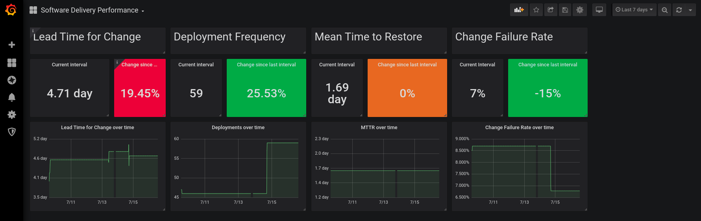

# Measure things that matter

Pelorus is a tool that helps IT organizations measure their impact on the overall performance of their organization. It does this by gathering metrics about team and organizational behaviors over time in some key areas of IT that have been shown to impact the value they deliver to the organization as a whole. 

Some of the key outcomes we'd like Pelorus help us measure are:

-   :material-truck-delivery:{ .middle } Software Delivery Performance :material-check-circle:{ .checked .middle }
-   :fontawesome-solid-person-circle-plus: Supported Technology Adoption :material-check-circle:{ .unchecked }
-   :fontawesome-solid-money-bill-trend-up: Value Flow :material-check-circle:{ .unchecked }
-   :material-monitor-dashboard: Availability :material-check-circle:{ .unchecked }
-   :material-account-heart: Employee Satisfaction :material-check-circle:{ .unchecked }
-   :material-emoticon-happy-outline: Customer Experience :material-check-circle:{ .unchecked }
-   :material-leaf: Quality and Sustainability :material-check-circle:{ .unchecked }

[:material-arrow-right: Read more about our Outcomes](philosophy/outcomes/index.md)

To understand the motivation, see [Our Philosophy](philosophy/index.md).

For more background on the project you can read [@trevorquinn](https://github.com/trevorquinn)'s blog post on [Metrics Driven Transformation](https://www.openshift.com/blog/exploring-a-metrics-driven-approach-to-transformation).

## Pull metrics from your existing tools

Pelorus works by integrating with your application platforms, developer tools, and ticketing systems to track the flow of work across your value streams.

-   # :simple-kubernetes:
-   # :simple-redhatopenshift:
-   # :simple-github:
-   # :simple-gitlab:
-   # :simple-bitbucket:
-   # :simple-jirasoftware:
-   # :simple-azuredevops:
-   # :simple-trello:
-   # :simple-docker:

## Software Delivery Performance as an outcome

Currently, Pelorus functionality can capture proven metrics that measure Software Delivery Performance -- a significant outcome that IT organizations aim to deliver.

Pelorus is a Grafana dashboard that can easily be deployed to an OpenShift cluster, and provides an organizational-level view of the [four critical measures of software delivery performance](https://blog.openshift.com/exploring-a-metrics-driven-approach-to-transformation/).

You can see [a short video describing each of these metrics](https://www.youtube.com/watch?v=7-iB_KhUaQg), and you can learn more about each dashboard per the [outcomes](philosophy/outcomes/) they represent.

## Prior Knowledge

In order to be successful deploying, managing and consuming Pelorus, the following prior knowledge is required:

* Understanding of Software Development Life Cycle.
* Understanding of [Kubernetes Operators](https://www.redhat.com/en/topics/containers/what-is-a-kubernetes-operator).
* Understanding of [helm](https://helm.sh/).
* Understanding of source version control systems: [Git](https://git-scm.com/).
* Understanding of [OpenShift Builds](https://docs.openshift.com/container-platform/4.6/builds/understanding-image-builds.html) and [Pipelines](https://www.openshift.com/blog/jenkins-pipelines).
* OpenShift administrator knowledge & permissions.
* Understanding of Cloud Native monitoring tools: [Prometheus & Prometheus Exporters](https://prometheus.io/), [Thanos](https://thanos.io/) and [Grafana](https://grafana.com/).
* Understanding of software development project tracking tools: [Jira](https://www.atlassian.com/software/jira).

## The Name

A _Pelorus_ is a navigation device on a ship that indicates relative direction.  So, instead of telling you where North is, like what a compass would do, a pelorus tells you where you are heading by relating it to the direction you originally set off.

A transformation journey is unique for every organization, every team, and every individual. This is because no two transformation journeys begin at the same point. Even across varying teams within the same organization, there are variances in skillset, experience and context that impact what the journey will look like. Additionally, transformation isn't about reaching a destination. It's about continually solving problems that are impeding improvements. As organizations align on improving certain outcomes and setting goals, you can use Pelorus to help identify what goals to focus on and watch trends change as you continue to invest in improvements.

With this in mind, we hope that you use Pelorus to guide your transformation journey in a way that's best for you.

## Logo & Branding

Abstract rectangles and circles represent the various pieces of data collected in the Pelorus dashboard, open for interpretation by the user.

In situations where there is limited space to include a visual, the Pelorus icon could be used represent the tool.
