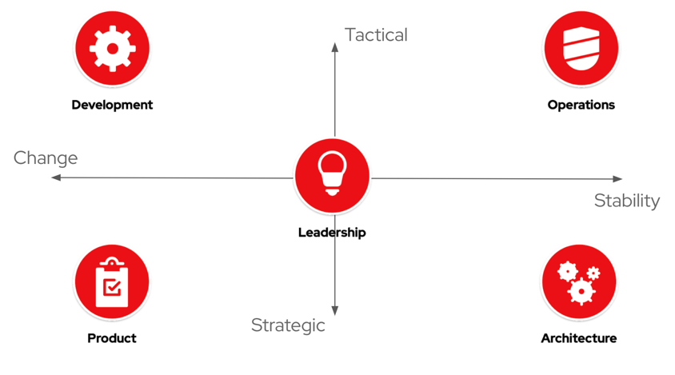

# Finding the right Bridge Outcomes

The term _Outcome_ refers to an measurable change in human, team, or organizational behavior that achieves a desired business result. A _business result_ typically falls into one of the following categories:

* an Increase in Value (e.g. Revenue)
* a Decrease in Cost
* an Increase in Quality
* an Increase in Happiness

!!! further-reading "Further Reading"

    For more information about outcomes, read [Outcomes over Outputs](https://www.amazon.com/Outcomes-Over-Output-customer-behavior/dp/1091173265) by Josh Seiden.

!!! abstract
    
    For our definition of Business Results, read [Project to Product](https://projecttoproduct.org/the-book/) by Mik Kirsten.

## Searching for communication gaps

Over time, communication gaps arise between the Five Elements naturally. Each function cares about different types of work and thinks in varying scopes of time. These simple differences can grow into organizational silos if organizations lack shared outcomes.

While alignment may seem to call for major trade-offs between the five functions, shared measurable outcomes can help bridge these communication gaps.

## How we’ve picked our outcomes

* Focus on Outcomes over Outputs
* Aim to improve relationships between the five elements to prevent failures
* Use systems-level thinking to improve as an organization, not individual departments
* Making sure data analysis(?) is actionable (SMART)

## Exploring Bridge Outcomes

These are some organizational outcomes that satisfy the good metric criteria and correlate to organizational performance. Organizations should choose which specific outcomes reflect their vision of success that they want to invest in regularly measuring. This is intended to be an iterative list of Bridge outcomes. Each outcome has a Dashboard Detail page that describes the outcome, each measure, and the data points required for calculation. Note: Software Delivery Performance is the only outcome readily available in Pelorus.

| Outcome 	| Definition 	| Measures(KPIs) 	| Why it matters |
|----------	| -----------	| ---------------	| -------------- |
| [**Software Delivery Performance**](outcomes/SoftwareDeliveryPerformance.md) | The ability of the organization to effectively deliver software | Lead Time for Change  Deployment Frequency   Mean Time to Restore   Change Failure Rate | Per the research in Accelerate, the ability of an organization to effectively deliver software to customers is a key leading indicator of organizational performance. |
| **Supported Technology Adoption** (Dashboard page coming soon) | A measure of an organization’s ability to become more efficient through reuse of common patterns and platforms. | Adoption Lead Time  Adoption Rate  Operational Efficiency  Developer NPS | As organizations adopt more lean IT practices and build autonomy in development teams, the role of "centralized IT" evolves from actively provisioning and supporting infrastructure and middleware to providing self-service platforms, tools, and sample patterns that take common needs across development teams and make shared solutions convenient and consumable. This outcome measures the success of that mode of working, called _Open Platforming_.
