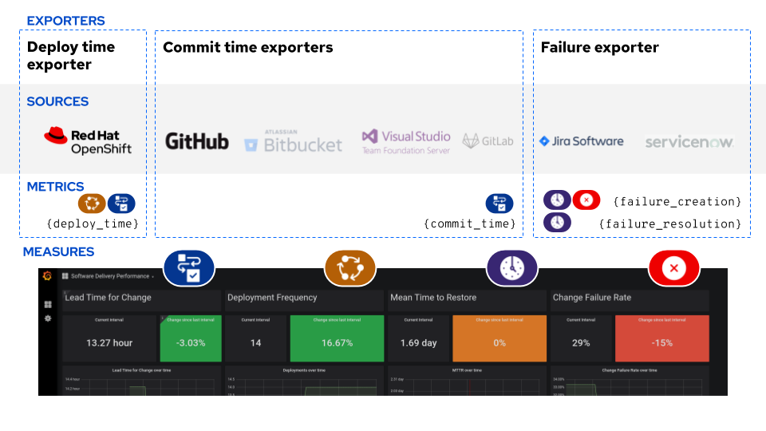

# Outcome: Software Delivery Performance

_Software Delivery Performance_ is a measure of an organization's ability to effectively deliver software-based products they have built to their customers. It is comprised of 4 _measures_ that provide a balanced perspective, taking both speed to market and stability measures into account. Tracking _Software Delivery Performance_ over time provides IT organizations with data they can use to make smarter investments in their internal tools and processes to optimize their delivery processes based on the types of products they are delivering. This outcomes provides a bridge between development, operations and leadership, allowing them to better communicate about whether proposed work on infrastructure imrovements or process developments are in line with the overall vision and financial goals of the organization at large.

The Pelorus _Software Delivery Performance_ dashboard tracks the four primary measures of software delivery:

* [Lead Time for Change](#lead-time-for-change)
* [Deployment Frequency](#deployment-frequency)
* [Mean Time to Restore](#mean-time-to-restore)
* [Change Failure Rate](#change-failure-rate)

For more information about Software Delivery Performance, check out the book [Accelerate](https://itrevolution.com/book/accelerate/) by Forsgren, Kim and Humble.

## Measures

### Lead Time for Change

#### Description
Product delivery lead time to change is the time it takes to go from code committed to code successfully running in production.  Shorter lead times enable faster feedback on what we are building, and encourages smaller batch sizes to increase flow.

#### Formula
`{deploy time} - {commit time}`

For an organization-level measurement, aggregate by averaging the lead time for change for each product.

#### Required Exporters

The following exporters are required to calculate _Lead Time for Change_:

* The [commit time exporter](https://github.com/konveyor/pelorus/blob/master/exporters/committime) provides the `commit_time` metric, which is the timestamp that a commit was made to source control.
* The [deploy time exporter](https://github.com/konveyor/pelorus/blob/master/exporters/deploytime) provides the `deploy_time` metric, which is a timestamp that a production deployment was rolled out.

The exporters are only responsible for gathering data about individual events. Before the dashboard consumes them, we perform some aggregation calculations in a set of [PrometheusRules](https://github.com/konveyor/pelorus/blob/master/charts/pelorus/templates/prometheus-rules.yaml). This converts individual `commit_time` and `deploy_time` data points into the following metrics:

* `sdp:lead_time:by_app` - Calculated lead times by application (`deploy_time - commit_time`)
* `sdp:lead_time:global` - A Global average of `sdp:lead_time:by_app`

The dashboard then displays these metrics over the given time ranges, and provides comparisons between the current and previous time range.

### Deployment Frequency

#### Description

Deployment frequency is how often the organization deploys code to production.  This measure serves as a proxy for measuring batch size, which can be difficult to directly measure and compare across different contexts.

#### Formula

`{number of deploys in a defined time frame}`

For an organization-level measurement, take the sum across product-level deployment frequencies.

#### Required Exporters

The following exporters are required to calculate _Deployment Frequency_:

* The [deploy time exporter](https://github.com/konveyor/pelorus/blob/master/exporters/deploytime) provides the `deploy_time` metric, which is a timestamp that a production deployment was rolled out.

The dashboard then just tracks a `count_over_time()` of the individual `deploy_time` metrics for the time range selected in the dashboard. It also provides a comparison to the previous time range.

### Mean Time to Restore

#### Description

Mean time to restore is how long it takes to restore service when a service incident occurs.

#### Formula

`Average( {failure_resolution_timestamp} - {failure_creation_timestamp} )`

For an organizational-level measurement, average MTTR data across products.

#### Required Exporters

The following exporters are required to calculate _Mean Time to Restore_:

* The [failure exporter](https://github.com/konveyor/pelorus/blob/master/exporters/failure) provides the `failure_creation_timestamp` and `failure_resolution_timestamp` metrics, which attempt to capture the beginning and end of individual failure or degredation events in customer-facing systems. This data is typically collected from a ticketing system, though automated approaches of failure detection and tracking could be added in the future.

The exporters are only responsible for gathering data about individual events. Before the dashboard consumes them, we perform some aggregation calculations in a set of [PrometheusRules](https://github.com/konveyor/pelorus/blob/master/charts/deploy/templates/prometheus-rules.yaml). This converts individual `failure_creation_timestamp` and `failure_resolution_timestamp` data points into the following metrics:

* `sdp:time_to_restore` - A calculated time to restore for each failure event (`failure_resolution_timestamp - failure_creation_timestamp`)
* `sdp:time_to_restore:global` - A global average of all `sdp:time_to_restore` calculations.

The dashboard then displays this information for a given time range, and compares that number to the previous time range.

### Change Failure Rate

#### Description

Change failure rate is a key quality metric that measures what percentage of changes to production fail. It is crucial to have alignment on what constitutes a failure.  The recommended definition is a change that either results in degraded service or subsequently requires remediation.

#### Formula

`{number of failed changes} / {total number of changes to the system}`

For an organizational-level measurement, expand the scope of the failures captured to include multiple product statistics.

#### Required Exporters

The following exporters are require to calculate _Change Failure Rate_:

* The [failure exporter](https://github.com/konveyor/pelorus/blob/master/exporters/failure) provides the `failure_creation_timestamp` metrics, which attempt to capture the beginning of individual failure or degredation events in customer-facing systems. This data is typically collected from a ticketing system, though automated approaches of failure detection and tracking could be added in the future.
* The [deploy time exporter](https://github.com/konveyor/pelorus/blob/master/exporters/deploytime) provides the `deploy_time` metric, which is a timestamp that a production deployment was rolled out.

The exporters are only responsible for gathering data about individual events. Before the dashboard consumes them, we perform some aggregation calculations in a set of [PrometheusRules](https://github.com/konveyor/pelorus/blob/master/charts/deploy/templates/prometheus-rules.yaml). This converts individual `failure_creation_timestamp` and `deploy_time` data points into the following metric:

* `sdp:change_failure_rate` - A ratio of the number of failed changes to the total number of changes to the system.

The dashboard then displays this metric over the selected time range, as well as a compares it to the previous time range.
