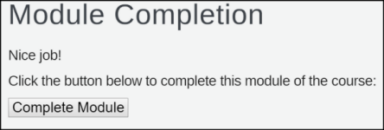

ifdef::revealjs_slideshow[]

[#cover,data-background-image="image/1156524-bg_redhat.png" data-background-color="#cc0000"]
== &nbsp;

[#cover-h1]
Advanced Red Hat OpenShift Deployment and Management

[#cover-h2]
Introduction to Course and Learning Environment

[#cover-logo]
image::{revealjs_cover_image}[logo,211,82]

endif::[]

== Course Navigation Tips

* To receive credit for completing a module, you must click the *Complete Module* button on the Module Completion slide:
+

** To confirm that you received credit for completing a module, look for a check mark next to the module name on the left side of the screen
* After exiting the course, close the course's tab in your browser 
** If your course session expires before closing the course's browser tab, your progress in the course will be lost
* To display the audio transcript, press `S`
** If the transcript does not display, click the slide and press `S` again

ifdef::showscript[]

Transcript:

Here are a few tips to help you navigate through this course:

To receive credit for completing a module, you must click the *Module Complete* button on the Module Completion slide. Once you receive credit for completing a module, the x next to the module name on the left side of the screen  changes to a check mark.

After exiting the course, you must close the course's tab in your browser. If your course session expires before you close the course's browser tab, then your progress in the course will be lost.

To display the audio transcript, press the "S" key.
endif::showscript[]

== Module Topics

* Course Goals
* Course Overview
* Course Activities
* Assumptions
* Class Environment
* Resources

ifdef::showscript[]
Transcript:

This module provides an overview of the Advanced Red Hat OpenShift Deployment and Management  course. It explains the course goals, lists the activities you will be able to perform after finishing the course, and describes the modules that make up the course.
endif::showscript[]

== Course Overview

.Course Modules
. Course Introduction
. Architecture and Operators
. Installation (Disconnected)
. Machine Management
. Authentication and Security
. Operator Hub
. Networking
. Resource Management
. Scheduler
. Logging
. Assignment

== Assumptions

* You want to learn how to use Red Hat OpenShift Container Platform
* You can read and modify some form of code
* You have a workstation available for this training
* You have an SSH client installed on your workstation

ifdef::showscript[]
Transcript:

If you are taking this course, the assumption is that you want to learn how to use and demonstrate the use Red Hat OpenShift Container Platform.

It is also assumed that you can write some form of code and that you have a workstation with an SSH client installed.
endif::showscript[]

== Class Environment

.OpenShift Disconnected Installation Lab
- 1 x Administration Server (bastion.$GUID.blue.osp.opentlc.com, bastion.opentlc.internal)
- 1 x Utility Server (utilityvm.$GUID.blue.osp.opentlc.com, utilityvm.opentlc.internal)

ifdef::showscript[]
Transcript:

This class uses a shared Openstack environment. After you provision the environment, you will receive connection details via email.

Instructions for provisioning the environment(s) required for this course is covered in the lab(s) for this module.
endif::showscript[]

== Resources
:linkattrs:

* Main OpenShift Community of Practice site:
** link:http://uncontained.io[http://uncontained.io^]
* Topics Covered:
** Custom certificate management
** Disconnected installs
** Define team composition
** Refine RACI chart
** Define role changes
** Monitoring application level performance

== Resources
:linkattrs:

.Online Training

* Courses available on:
**  Red Hat Employees: link:https://learning.redhat.com[https://learning.redhat.com^]
**  Partners:  link:https://www.redhat.com/en/partners/course_catalog[OPEN Course Catalog^]

.Suggested Courses
* *Introduction to Red Hat OpenShift Container Platform Operators*
** link:https://learning.redhat.com/course/view.php?id=1436[Introduction to Red Hat OpenShift Container Platform Operators^]
** What is an operator
** How to deploy and operator
** How to write an operator using the Operator SDK

* *OpenShift Operations* 
** link:https://learning.redhat.com/course/view.php?id=1791[Red Hat OpenShift Container Platform Operations OCP 3.11^]
** Certificate Management
** Monitoring OpenShift Container Platform
** Upgrading OpenShift Container Platform

* *Red Hat OpenShift Storage Implementation*
link:https://learning.redhat.com/course/view.php?id=1256[Red Hat OpenShift Storage Implementation OCP 3.11^]
** Use of storage in many aspects of Red Hat OpenShift Container Platform 
** Storage plug-ins for pods
** Persistent storage objects in the OpenShift API
** Volume security
** Docker infrastructure storage

== Resources (Red Hat Internal)
:linkattrs:

** A demo of Microservices is available on *RHPDS* (Catalogs -> Multiproduct demos -> Microservices demo)

* link:https://github.com/redhat-cop/openshift-image-signing-scanning[Image scanning for security^]
* link:https://docs.google.com/document/d/1_Rg3R86fILZDUofZkLhL-zsYNVbOz1b8LH5j6NAW6Pc[Health checks and performance tuning^]
* link:https://docs.google.com/document/d/1GdZdUFLOY3VJC6SZFL0EePn856r3ZIIHJQvp7jNwGIQ[Enterprise security policies^]

== Summary

* Course Goals
* Course Overview
* Course Activities
* Assumptions
* Class Environment
* Resources

ifdef::showscript[]
Transcript:

This module provided an overview of the Advanced Red Hat OpenShift Deployment and Management  course. It explained the course goals, listed the activities you will be able to perform after finishing the course, and described the modules that make up the course.
endif::showscript[]
