ifdef::revealjs_slideshow[]

[#cover,data-background-image="image/1156524-bg_redhat.png" data-background-color="#cc0000"]
== &nbsp;

[#cover-h1]
Advanced Red Hat OpenShift Deployment and Management

[#cover-h2]
Architecture and Operators

[#cover-logo]
image::{revealjs_cover_image}[]

endif::[]

== Module Topics
:linkattrs:

* Logical Architecture
* OpenShift 4 Design
* Operator Driven Platform
* Installation Methods
* RHCOS
* CRI-O
* Storage
* Subscription Management
* Upgrades
* Lifecycle

// == Logical Architecture

// image::./images/ocp_marketecture.png[width=100%]

// ifdef::showscript[]

// Infrastrucuture layer: "Anywhere RHEL runs" with two caveats:
// . Masters must be RHCOS
// . See supported providers for details on install experiences

// Masters do the things listed here. You have 3 of them. Don't argue with this if you want support.

// Nodes run Pods.

// Services provide east-west communications inside the cluster using names (not IPs)

// Routers are ingress controllers and allow north-south traffic to cluster

// Persistent storage enables stateful workloads.

// Registry ships with OpenShift to store container images. It is not required to use.

// endif::showscript[]

== Logical Architecture

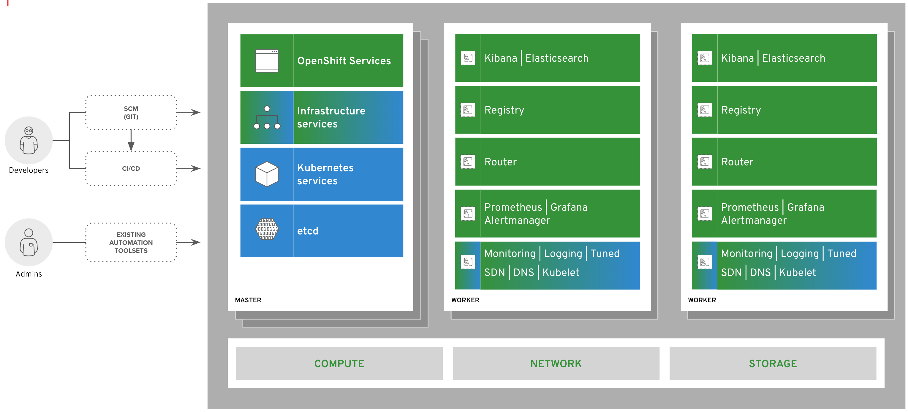

ifdef::showscript[]

OpenShift runs on a variety of infrastructure platforms, from bare metal to private cloud to public cloud. 

For compute:
While we used to say "wherever RHEL runs", it is a little more nuanced now since RHCOS has to be available for the masters at minimum.
You still have the option of bare metal, VM, IPI, UPI, etc. to create the resources, but the OS requirements are more strict.

For network:
While not shown specificaly in the diagram there are still 2 network "layers".
First is the service layer, which can be thought of as the east-west network inside the cluster.
It is essentially how Pods talk to one another.
The second is the routing layer, which is the north-south into the cluster.
It is how users access the applications running inside of an OpenShift cluster

For storage:
All of the persistent volume capabilities that have been there since OpenShift 3.0 are there plus more.
the different types of storage providers are covered later in the module.

Types of hosts:

* Master
* Worker

Worker: 

* Workers are where user workload and various OpenShift components will land. 
* Workers can be easily scaled and, on cloud providers, even scaled automatically based on cluster capacity.
* Workers can run RHCOS (preferred) or RHEL.

Master: 

* OpenShift uses 3 masters for high availability and etcd quorum. 
* User workloads do not run on the masters.

Remember: Everything runs as a container in OpenShift 4 - there are no packages that must be installed on worker or master.

On the masters:

* etcd is used to keep track of the state of everything in the cluster, from which users are logged in to where workload lives and more.
* OpenShift is built on Kubernetes, and its core components are still there and directly accessible via Kubernetes’ APIs.
In this example, Kubernetes services would be things such as Kube API, Scheduler, and Controller Manager.
* OpenShift services extend the capabilities of the platform beyond.
OpenShift brings its own web console with special features for both administrators and developers. 
OpenShift makes its features available through its own API endpoints which follow the same standard as other Kubernetes APIs using Custom Resource Definitions. 
Examples of these services are the OpenShift API server, web console, and OLM.
* OpenShift includes a number of internal and support infrastructure services that make containers easier to use at scale.
This includes:

** DNS
** Tuned
** SDN/OVS
** Fluentd
** node exporter

On the workers:

* All of those support and infrastructure services can run on workers too.
They can be orchestrated like any other workload and made to run across all hosts in the environment.
* OpenShift includes an integrated container image registry. 
This registry is tied into OpenShift’s own role-based access control, providing multi-tenancy benefits. 
Images that are built inside the platform using OpenShift’s native build features automatically land in this image registry. 
Being a fully OCI-compliant registry, images created outside of the environment can also be placed into the integrated registry as part of a larger software devleopment lifecycle (SDLC) process.
* OpenShift includes a cluster monitoring solution informed by the best practices of Red Hat’s own site reliability engineers (SREs). 
This preconfigured stack, based on Prometheus, Grafana, and Alertmanager helps platform administrators understand the health and capacity of the OpenShift cluster.
* OpenShift also includes a log aggregation solution based on Fluentd, Elasticsearch, and Kibana. 
This integrated solution makes it easy to visualize and corroborate log events for applications that are scaled to many instances, and, it, too, is tied into OpenShift’s role-based access control (RBAC) ensuring that only the right people see the logs they are supposed to.
* OpenShift extends Kubernetes ingress capabilities with an integrated router that bridges traffic from outside the cluster into the software defined network (SDN). 
This routing solution makes it easy for workload to be exposed and made accessible to consumers that are not inside the cluster.

endif::showscript[]

== OpenShift 4 Design
.Design Principles

* Self-managing, self-updating, & self-monitoring platform
* Easy to install, easy to configure, safe to extend
* Address full spectrum use case:
** CaaS-style "raw" Kubernetes
** Developer focused with simplified day-to-day iteration of applications
* Over-the-air upgrades that are easy and reliable
* Easy to build, run, and distribute operators on top of platform

ifdef::showscript[]

Some additional insight below, but these bullets should be easy to talk through with practical examples and reasoning for why.

From Clayton Coleman's Blog Post on OCP 4 Design Guidelines:
https://blog.openshift.com/openshift-4-a-noops-platform[https://blog.openshift.com/openshift-4-a-noops-platform^]

* Make clusters self-describing – don’t just run on a cloud, tell it what to do.
** Machines and the operating system that run them exist to serve the cluster.
** Control the host state from the cluster, and minimize the drift hosts may have.
* Every important part of the system needs a babysitter reconciling and fixing problems.
** Make failure and recovery an expected part of *every* aspect of the system.
* Everything must be configured via an API.
* Use Kubernetes to run Kubernetes.
* Updates have to be no big deal – if an update isn’t pushing a button, it’s wrong
* Every component has to be easy to monitor and debug, and conversely summarizing and monitoring everything has to also be easy.

See also here (Red Hat internal) for more insight:
https://docs.google.com/document/d/16JwTljY3lD3J7j-BHJByu117dRyCx03hY5exPfKMKJE/edit#heading=h.pgdnfdwca2dh

endif::showscript[]

== OpenShift 4 Design
.OpenShift 4.1 Themes

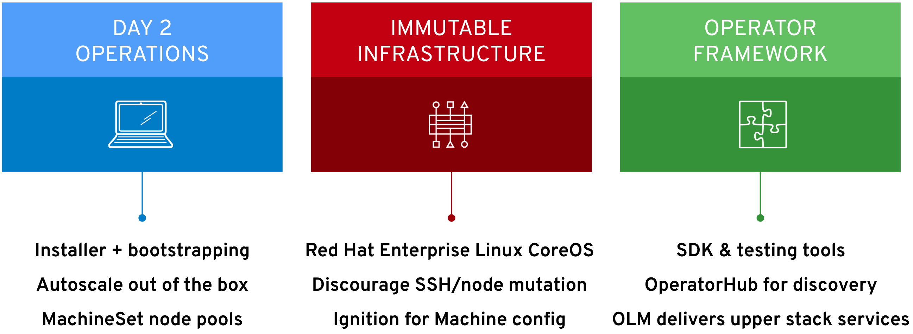

ifdef::showscript[]

With the launch of OpenShift 4, these were the main focuses.

endif::showscript[]

== OpenShift 4 Design
.OpenShift 4.2 Themes

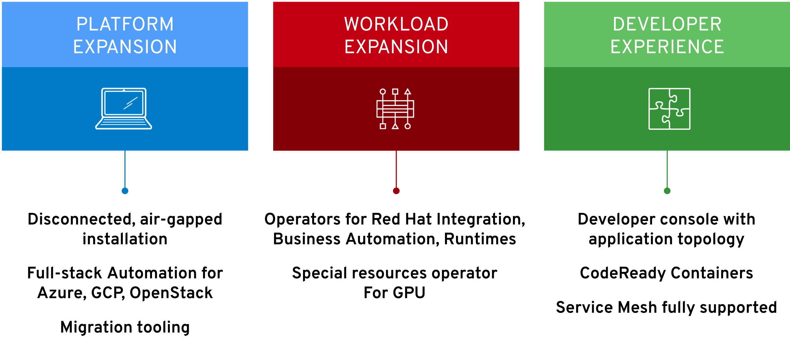

ifdef::showscript[]

As the targets in OpenShift 4.1 were achieved or maturing, OpenShift 4.2 introduced these as the main themes in this release.

These do not replace the previous themes, but add to them.

endif::showscript[]

== OpenShift 4 Design
.OpenShift 4.3 Themes

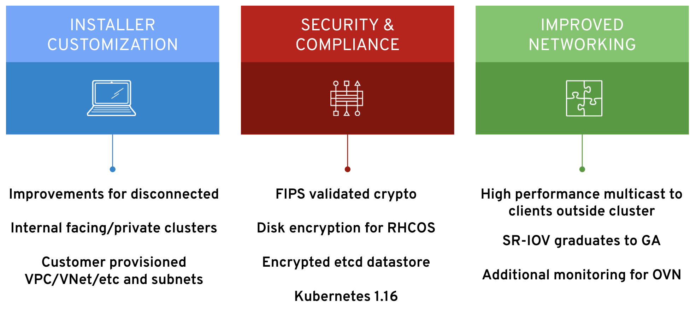

ifdef::showscript[]

endif::showscript[]

== OpenShift 4 Design
.OpenShift 4.4 Themes

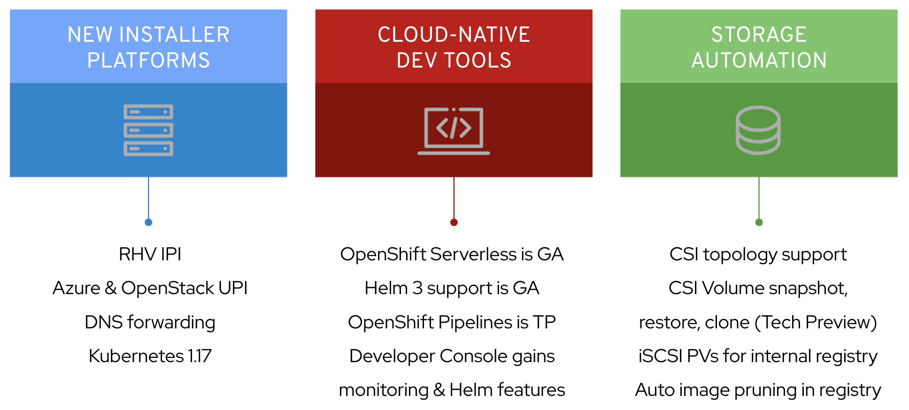

ifdef::showscript[]

endif::showscript[]

== OpenShift 4 Design
.OpenShift 4.5 Themes

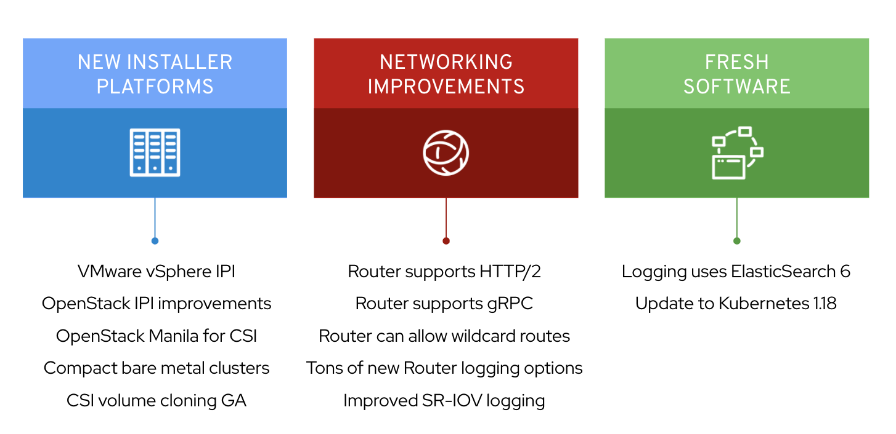

ifdef::showscript[]

endif::showscript[]

== Operator Driven Platform
[.text-center]
An Operator is just a *Pod* that does *something* in a *reliable*, *repeatable*, and *observable* way.

ifdef::showscript[]

This is a playful definition to introduce the concept of Operators. Everyone that is reading this is an Operator. We all do things, such as creating and maintaing workloads. We don't always do those things in a reliable, repeatable, and observable way. 

An Operator in Kubernetes can do this. This can be anything that can be any task or activity that be coded using Ansible, Go, or Helm Charts. And, actually, you can use *any* language - those three are the ones that are easiest to use with the Operator SDK.

endif::showscript[]

== Operator Driven Platform
.Operator Overview

* Non-terminating Pods that run in a never-ending reconcile loop
** *Observe* > *Analyse* > *Act*
* Operators can be written using Ansible, Go, or Helm Charts using the *Operator SDK*
* Operators take advantage of _custom resource definitions_ (CRDs)
** CRDs allow _extension_ of Kubernetes API
** CRDs allow creation of _custom resources_ (CRs)
** CRs can be managed just like stock OpenShift objects

ifdef::showscript[]

endif::showscript[]

== Operator Driven Platform
.Custom Resource Definition Example

[source,texinfo]
----
apiVersion: apiextensions.k8s.io/v1beta1
kind: CustomResourceDefinition
metadata:
  name: nexus.gpte.opentlc.com
spec:
  group: gpte.opentlc.com
  names:
    kind: Nexus
    listKind: NexusList
    plural: nexus
    shortNames:
    - nx
    singular: nexus
  scope: Namespaced
  subresources:
    status: {}
  version: v1alpha1
----

== Operator Driven Platform
.Custom Resource Example

[source,texinfo]
----
apiVersion: gpte.opentlc.com/v1alpha1
kind: Nexus
metadata:
  name: nexus-repository
spec:
  nexusVolumeSize: 5Gi
  nexusSsl: True
----

== Operator Driven Platform
.Cluster Version Operator (CVO)

* The top level Operator of OpenShift Container Platform 4
* Contains the definition of all other _Cluster Operators_
* Provides an ordered creation of necessary resources (CRD, namespace, Deployment, etc.)
* An upgrade to the cluster starts with an update of CVO
+
.CVO Manifests
[source,texinfo]
----
0000_07_cluster-network-operator_00_namespace.yaml
0000_07_cluster-network-operator_01_crd.yaml
0000_07_cluster-network-operator_02_rbac.yaml
0000_07_cluster-network-operator_03_daemonset.yaml
0000_08_cluster-dns-operator_00-cluster-role.yaml
0000_08_cluster-dns-operator_00-custom-resource-definition.yaml
0000_08_cluster-dns-operator_00-namespace.yaml
0000_08_cluster-dns-operator_01-cluster-role-binding.yaml
0000_08_cluster-dns-operator_01-role-binding.yaml
0000_08_cluster-dns-operator_01-role.yaml
0000_08_cluster-dns-operator_01-service-account.yaml
0000_08_cluster-dns-operator_02-deployment.yaml
[...]
----

ifdef::showscript[]

To get the above output, you would need to look inside the CVO operator:
`oc exec -n openshift-cluster-version -ti cluster-version-operator-6cdd79d47d-4lr77 ls /release-manifests`

endif::showscript[]

== Operator Driven Platform
.Cluster Operators

* The CVO orchestrates the deployment all of the Cluster Operators
* The Cluster Operators configure and manage the cluster
+
.Cluster Operator List
[source,textinfo]
----
NAME                                       VERSION   AVAILABLE   PROGRESSING   DEGRADED   SINCE
authentication                             4.2.7     True        False         False      23h
cloud-credential                           4.2.7     True        False         False      23h
cluster-autoscaler                         4.2.7     True        False         False      23h
console                                    4.2.7     True        False         False      21h
dns                                        4.2.7     True        False         False      23h
image-registry                             4.2.7     True        False         False      21h
ingress                                    4.2.7     True        False         False      23h
insights                                   4.2.7     True        False         False      23h
kube-apiserver                             4.2.7     True        False         False      23h
kube-controller-manager                    4.2.7     True        False         False      23h
kube-scheduler                             4.2.7     True        False         False      23h
...
operator-lifecycle-manager-packageserver   4.2.7     True        False         False      4h28m
service-ca                                 4.2.7     True        False         False      23h
service-catalog-apiserver                  4.2.7     True        False         False      23h
service-catalog-controller-manager         4.2.7     True        False         False      23h
storage                                    4.2.7     True        False         False      21h
----

== Installation Methods

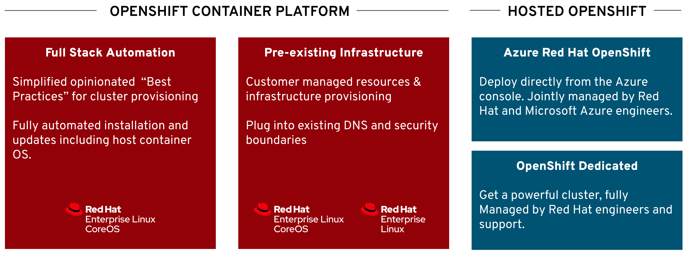

ifdef::showscript[]

There are multiple ways to install OpenShift 4 to multiple providers. This is covered in much more detail in the next module.For now, the focus is on the high level options. 

With OpenShift 4, you can use a completely automated method. Simply provide credentials to your cloud provider to the OpenShift installer and it will provision everything necessary.

For environments that need to use pre-existing infrastructure or need RHEL workers, you can use the UPI method.

And, if you don't want to install anything, you can look at OpenShift Dedicated or ARO. OpenShift Dedicated is OpenShift 4. ARO is OpenShift 3.11.

endif::showscript[]

== Red Hat Enterprise Linux CoreOS

image::./images/rhel_vs_rhcos.png[width=100%]

ifdef::showscript[]

Similar to how openshift-install can be used for full-stack automation or to install OpenShift on pre-existing infrastructure, Red Hat Enterprise Linux provides a single operating system with two deployment options.  

RHEL can be used for worker nodes and provides parity for existing operational practices throughout the datacenter (and OCP v3). 

With RHEL CoreOS we’re providing an embedded RHEL container host that brings a new operational paradigm where the host & infrastructure are fully managed and operationalized by the cluster. 

Regardless of which option customers choose, they’ll get the benefits of RHEL plus the integration and stability from the kernel to the highest-level operator in OpenShift.

endif::showscript[]

== Red Hat Enterprise Linux CoreOS

[.noredheader,cols="2,2",caption=""]
|===

^s|Ideal Container Host
^s|Reality

^|Minimal
^|Only what’s needed to run containers

^|Secure & Immutable
^|Small footprint, image based deployments

^|Always up-to-date
^|OS updates are automated and transparent

^|Updates never break my apps
^|Isolates all applications as containers

^|Updates never break my cluster
^|OS components are compatible with the cluster 

^|Supported on my infra of choice
^|Inherits majority of the RHEL ecosystem

^|Simple to configure
^|Installer generated configuration

^|Effortless to manage
^|Managed by Kubernetes Operators

|===

// == Red Hat Enterprise Linux CoreOS
// .RHEL 7 Option

// [.noredheader,cols="2,2",caption=""]
// |===

// ^s|RHEL 7 Features and Requirements
// ^s|RHEL 7 Admin Responibility

// a|* Add RHEL 7 machines with Ansible
// ** openshift-ansible to prepare and join your RHEL 7 nodes
// * Mixed clusters of RHEL 7 and RHCOS are allowed
// ** RHCOS is mandatory for the control plane
// * RHEL 8 is not yet supported for worker/infra nodes
// a|* Keeping Ansible host inventory up to date
// * Run playbooks that will cordon/uncordon machines + any pre/post upgrade actions
// * Deploying RHEL security and other OS updates
// * Configure, maintain and health check your disks
// * Configure, secure, and maintain network interfaces

// |===

// ifdef::showscript[]

// Control plane must be online before you can join RHEL nodes.

// endif::showscript[]

== Red Hat Enterprise Linux CoreOS
.RHCOS Option

[.noredheader,cols="2,2",caption=""]
|===

^s|RHEL CoreOS Features and Requirements
^s|RHEL CoreOS Admin Responibility

.2+a|* RHCOS is versioned and shipped with OpenShift
* Red Hat runs thousands of tests against these configurations.
* RHCOS is managed as part of the cluster, using the Machine Config Operator for:
** CRI-O config
** Kubelet config
** Authorized registries
** SSH config
^a|*_Nothing!_*
a|image::./images/rhcos_responsibility_v2.png[width=100%]

|===

== CRI-O
.CRI-O Version Cadence

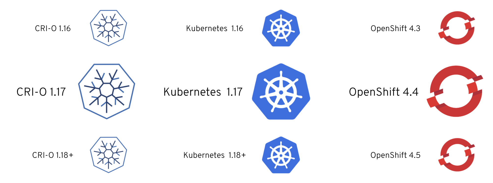

ifdef::showscript[]

A lightweight, OCI-compliant container runtime.

* CRI-O is the best kubernetes specific container engine. Adoption is trivial since all existing Docker and OCI containers are supported and run great with CRI-O. 
* CRI-O is a light weight, kubernetes-native, OCI compatible container runtime that is life-cycled and managed by OpenShift. Customers no longer need to worry about which container runtime is in use - with OCP v4, it’s always the right one and it provide a complete implementation of the Kubernetes Container Runtime Interface, or CRI. 
* Also, gone are the days of separately managing the container engine. CRI-O is completely hands-free to run in production. The handful of tuneables that provide control and security for CRI-O are easy to configure via a CRD, and the settings will be propagated across the cluster.

endif::showscript[]

== Storage
.Overview

* Some applications need persistent storage for Pods
* Cluster Storage Operator creates `storage class` based on cloud provider
* Storage class is used for dynamic provisioning of persistent volumes

ifdef::showscript[]

Applications needing persistent storage is okay. OpenShift provides this capability.

The cluster storage operator will interogate the cloud provider for available storage options and create a storage class for those that are supported in OpenShift.

Storage class is used mainly for dynamic PV creation.

endif::showscript[]

== Storage

[.noredheader,cols="^2,^2",caption=""]
|===

2+s|Supported Storage Types

|AWS EBS
|Azure File & Disk

|GCP PD
|OpenStack Cinder

|VMware vSphere Disk
|NFS

|Fibre Channel
|Host Path

|Local Volume
|Raw Block

|===

ifdef::showscript[]

Cluster Storage Operator
Sets up the default storage class
Looks through cloud provider and sets up the correct storage class
Drivers themselves remain in-tree for now, CSI versions to follow later
New GA storage in 4.2
Local Volume
Raw Block
Cloud providers (AWS, GCP, Azure, vSphere)
Local Volume

endif::showscript[]

== Storage
.Basic Storage Provisioning

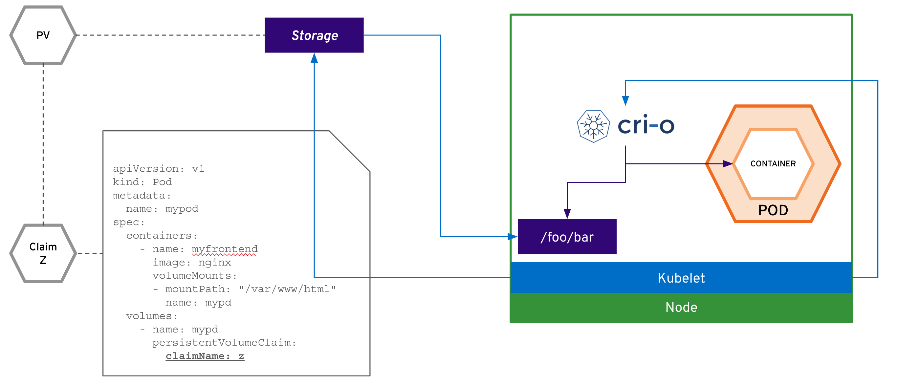

ifdef::showscript[]

A PersistentVolumeClaim (PVC) is bound to a PersistentVolume (PV), and a PersistentVolume maps to real-world storage

A user defines a workload that instructs OpenShift to attach the PVC’s storage to a mount point inside the container

When the kubelet is told by the master to run the pod, it first tells the host to mount the real-world storage into the OS securely for the container

Then kubelet launches the containers and tells CRI-O to attach the OS mountpoint as a volume inside the container

endif::showscript[]

== Storage
.OpenShift Container Storage (OCS)

* Complete Data Services: RWO, RWX, S3
* Platform support: AWS and VMware
* Converged Mode support: Run as a service on OpenShift cluster
* Consistent S3 across hybrid cloud
* Operator managed and uses Ceph, Rook, & Nooba

ifdef::showscript[]

Provides block, file, and object storage

Targeted for 4.3:
* Additional Platform: Bare Metal, Azure Cloud
* Independent Mode : Run OCS outside  of  OCP Cluster

endif::showscript[]

== Subscription Management
.Overview

* Subscriptions managed at cluster level in OpenShift 4
* All OpenShift 4 clusters must be registered into OpenShift Cluster Manager:
** Automatically through outbound telemetry by default
** Manually using online registration process for clusters with telemetry disabled
* How to entitle depends on your worker node host operating system:
** RHEL: Red Hat Subscription Manager is installed on and used to entitle the host systems
** RHCOS: Subscriptions are managed using OpenShift Cluster Manager’s integration with Red Hat Subscription Manager portal to entitle clusters

NOTE: Masters and Infra are still "free" as long as they are RHCOS.

ifdef::showscript[]

endif::showscript[]

== Subscription Management
.OpenShift Cluster Manager (OCM)

[.noredheader,cols="2,2",caption=""]
|====
a|* Centralized set of services required for Red Hat to distribute, manage, and support OpenShift 4
** UI at cloud.redhat.com 
** API at api.openshift.com
* Automatic registration of OpenShift clusters and integrated with RHSM
* Bi-directional navigation to and from the OpenShift web console for cluster administrators.
a|* Self-service cluster provisioning, scaling, and basic management for OpenShift Dedicated (4.1+)
* Link to your cluster's settings page when updates are available for your cluster
* Cluster monitoring to help identify critical issues
* Hosted in the United States
** Opt-out, if necessary, by link:https://docs.openshift.com/container-platform/4.2/support/remote_health_monitoring/opting-out-of-remote-health-reporting.html[disabling telemetry^]
|====

== Subscription Management
.Process

* OpenShift 4 clusters register to OpenShift Cluster Manager through telemetry or manually
** Your OpenShift pull secret is tied to your Red Hat account
* Red Hat Subscription Watch (RHSW) pulls and refreshes cluster data every 24 hours
* Subscriptions are automatically attached by *Subscription Watch*
* OCM will show you if there is a problem with your subscriptions
* One cluster in OCM is equivalent to one virtual machine in RHSM

ifdef::showscript[]

. User goes to the OpenShift Cluster Manager (OCM or cloud.redhat.com/openshift) to get their pull secret and various downloads
.. The pull secret contains tokens mapped back to the logged in user providing access to various registries and identifying them with OCM
. The user installs OpenShift and provides their pull secret during installation
. The cluster registers to OCM via telemetry
.. telemetry-client running on the cluster starts up and starts sending data to our hosted telemetry-server endpoint at infogw.api.openshift.com:443
.. telemetry data includes the cluster's generated UUID, the user's cloud.redhat.com auth token, and total compute capacity on the cluster broken down by node role and operating system (vCPU/memory)
.. telemetry-server makes call to OCM's account management service /cluster_registration endpoint
.. OCM's account management service adds the cluster to it's registry mapped back to the RH user and user's RH Account/org
. Periodically (currently every 15 minutes for new and 2 hours for existing clusters) a service running alongside OCM registers your cluster into Candlepin as a single VM
. Users can then attach subscriptions to their cluster record in RHSM in the Customer Portal

There are two important things here: 1) We have a record of your cluster in OCM, which is tied to OpenShift's over the air update system; 2) We have a record of your cluster in Candlepin/RHSM so the customer can attach subscriptions. 

endif::showscript[]

== Subscription Management

*From Cluster Telemetry Data:*

* Master_Node_vCPU = ( Not Applicable )
* Infra_Node_vCPU = ( Not Applicable )
* RHEL_Worker_Node_vCPU = ( Not Applicable )
* RHCOS_Worker_Node_vCPU = 50

*From Subscription Manager attachments:*

* Subscription: 16 Cores or 32 vCPUs
* Attached Quantity: 2
* Entitled_vCPU = 32 vCPU * 2 qty = 64

*Compliance Check:*

* Cluster_is_Compliant = (Entitled_vCPU >= RHCOS_Worker_Node_vCPU)
* Cluster_is_Compliant = (64 >= 50)
* Cluster_is_Compliant = TRUE

== Upgrades

* OpenShift 4 includes three upgrade channels: 
** candidate-4.5
*** Should be used to test features coming up in new releases
*** Ideal for test environment
** fast-4.5
*** This channel will be updated with new patch versions as soon as GA.
** stable-4.5
*** This channel will be updated with new patch versions on a time delay by design. 
This allows Red Hat’s SREs to receive feedback from connected environments. 
* If issues are found, then upgrades to it are blocked in both stable and fast channels.

== Lifecycle

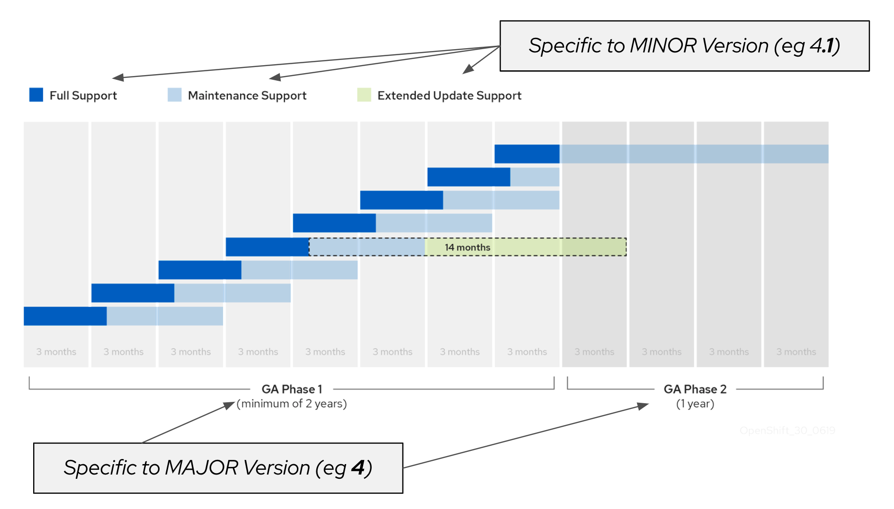

ifdef::showscript[]

* Release based, not date based. Rolling three release window for support.
* The overall 4 series will be supported for at least three years 
** Minimum two years full support (likely more)
** One year maintenance past the end of full support

endif::showscript[]

== Lifecycle

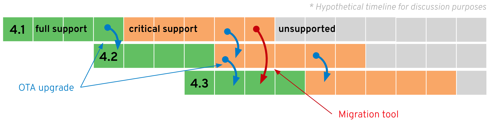

ifdef::showscript[]

* OTA Upgrades
** Works between two minor releases in a serial manner.
* Happy path = migrate through each version
** On a regular cadence, migrate to the next supported version.
* Optional path = migration tooling
** If you fall more than two releases behind, you must use the application migration tooling to move to a new cluster.
* Current minor release
** Full support for all bugs and security issues
** 1 month full support overlap with next release to aid migrations
* Previous minor release
** Fixes for critical bugs and security issues for 5 months

endif::showscript[]

== Summary

* Logical Architecture
* OpenShift 4 Design
* Operator Driven Platform
* Installation Methods
* RHCOS
* CRI-O
* Storage
* Subscription Management
* Lifecycle

ifdef::showscript[]

endif::showscript[]
