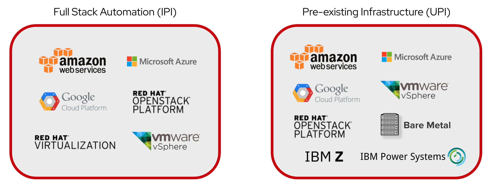
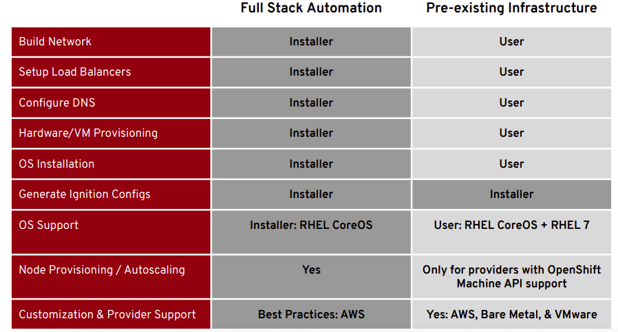
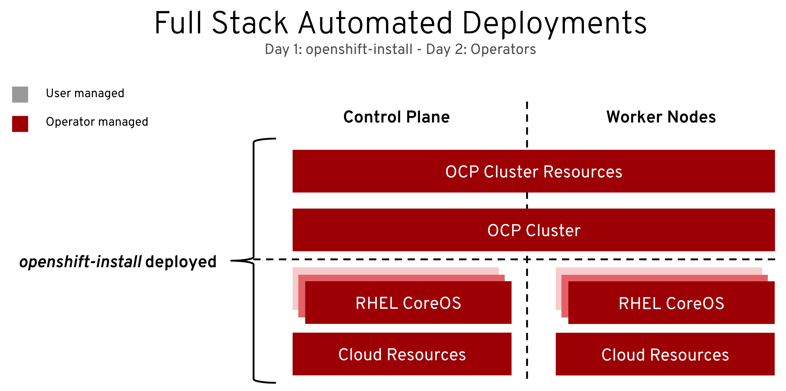
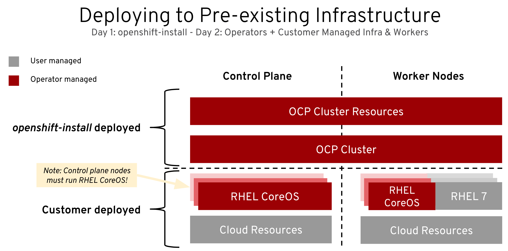
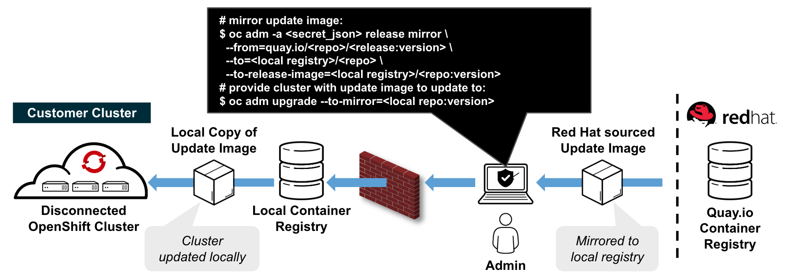
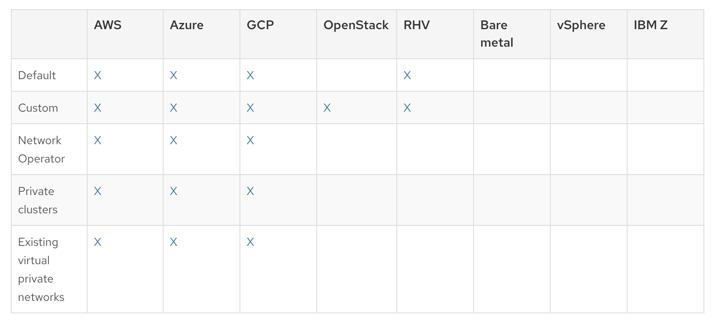
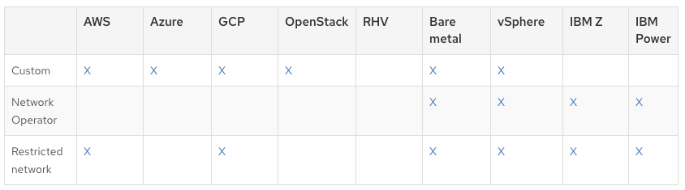
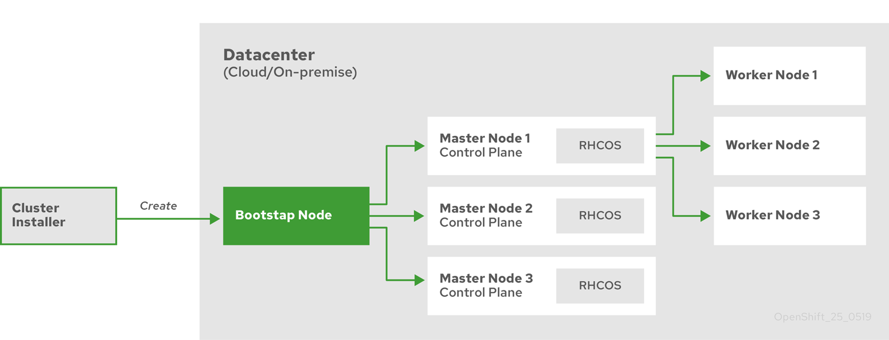

ifdef::revealjs_slideshow[]

[#cover,data-background-image="image/1156524-bg_redhat.png" data-background-color="#cc0000"]
== &nbsp;

[#cover-h1]
Advanced Red Hat OpenShift Deployment and Management

[#cover-h2]
Installation

[#cover-logo]
image::{revealjs_cover_image}[]

endif::[]

:linkattrs:
== Module Topics

* Installation Overview
* The Installer
* Installation Methods: IPI vs UPI
* Installer Provided Infrastructure
* User Provided Infrastructure
* Restricted Network (Disconnected Installation)
* Installation methods for different platforms
* Installation process details

== Installation Overview

* Single installer called `openshift-install`
** No external dependencies
* Flexible deployment model
** Installer Provided Infrastructure (IPI)
** User Provided Infrastructure (UPI)
* Installs OpenShift to multiple cloud or IaaS providers

ifdef::showscript[]

* it's just a binary. 
* the same installer can do any kind of installation (UPI - IPI).
* It has no external dependencies, so you can download it, make it executable, and run it.

* The OpenShift 4 installer is flexible in that you can deploy using an IPI or UPI method. 

endif::showscript[]

== The Installer

* The OpenShift Installer is designed to help users create OpenShift clusters in various environments
** The installer acts as an installation wizard, prompting the user for values that it cannot determine on its own and providing reasonable defaults for everything else
** For more advanced users, the installer provides facilities for varying levels of customisation.
* No complex Ansible playbooks
** Simple playbooks available to help add RHEL nodes
* Available from link:https://cloud.redhat.com[https://cloud.redhat.com^]

ifdef::showscript[]

With OpenShift 4, the OpenShift installer has no external dependencies and is meant to be usable by both new and existing users with equal ease.

For an opinionated install based on Red Hat best practices, it is a wizard that will ask you several questions and then go and build a cluster for you.

For a more flexible and customized installation, it will still ask you the same questions, but will then give you the artifacts and resources you will need to continue building the cluster.

While there is no Ansible playbook required, if you choose to add RHEL nodes to your cluster as workers, you will need to use the simple `scaleup` Ansible playbooks to join those nodes to the cluster once you have built and configured them.

The installer is available to download from cloud.redhat.com.
Feel free to talk about https://docs.openshift.com/container-platform/4.4/architecture/architecture-installation.html
endif::showscript[]

== Installation Methods: IPI vs UPI

ifdef::showscript[]
Flexibility: 

* deploy a cluster to pre-existing infrastructure 
or
* install to provision the infrastructure for you. 

As of OpenShift 4.4, these are the supported providers for each installation method.

Show options and IPI vs UPI:
link:https://cloud.redhat.com/openshift/install[^]

endif::showscript[]

== Comparison between deployments methods

ifdef::showscript[]
https://www.openshift-anwender.de/wp-content/uploads/2020/02/OpenShift_Installation_Deep_Dive_Robert_Bohne.pdf

endif::showscript[]

== The OpenShift Installer - IPI
.Installer Provided Infrastructure

ifdef::showscript[]

With the IPI method, the installer provisions everything.

All nodes, both master and worker, and RHCOS.

Control plane and compute machines
By default, the OpenShift Container Platform installation program stands up three control plane (by default) and compute machines.

Example, each machine requires- for Openstack:

* An instance from the RHOSP quota

* A port from the RHOSP quota

* A flavor with at least 16 GB memory, 4 vCPUs, and 25 GB storage space

endif::showscript[]

== The OpenShift Installer - IPI
.Installer Provided Infrastructure

* Easily provision a "best-practice" cluster on mutliple cloud providers
* Installer provisions the underlying infrastructure 
* All RHEL CoreOS (RHCOS)
* Minimal user input needed; All non-essential install config options handled by component operator

ifdef::showscript[]

The IPI method is recommended for new users and users that don't need to fit into a very customized environment. The configuration it deploys comes from Red Hat engineering and should be considered the "best practice" or the equivelent of a reference architecture at this time.

endif::showscript[]

== The OpenShift Installer - IPI
.Installer Provided Infrastructure

[source,textinfo]
----
$ openshift-install create cluster

? SSH Public Key /home/nstephan-redhat.com/.ssh/cluster-d26c-key.pub <1>
? Platform aws <2>
? Region us-west-1 <3>
? Base Domain sandbox1911.opentlc.com <4>
? Cluster Name cluster-d26c <5>
? Pull Secret [? for help] ********* <6>
INFO Creating infrastructure resources...
INFO Waiting up to 30m0s for the Kubernetes API at https://api.cluster-d26c.sandbox1911.opentlc.com:6443...
INFO API v1.14.6+76aeb0c up
INFO Waiting up to 30m0s for bootstrapping to complete...
INFO Destroying the bootstrap resources...
INFO Waiting up to 30m0s for the cluster at https://api.cluster-d26c.sandbox1911.opentlc.com:6443 to initialize...
INFO Waiting up to 10m0s for the openshift-console route to be created...
INFO Install complete!
INFO To access the cluster as the system:admin user when using 'oc', run 'export KUBECONFIG=/home/nstephan-redhat.com/new-cluster/auth/kubeconfig'
INFO Access the OpenShift web-console here: https://console-openshift-console.apps.cluster-d26c.sandbox1911.opentlc.com
INFO Login to the console with user: kubeadmin, password: bTAyP-MVuiA-ethFS-JUVuM
----
<1> This SSH public key will be injected, via Ignition, to all nodes provisioned for the OpenShift cluster. It is optional.
<2> The platform chosen will influence the remaining questions and resulting cluster. Other options are `azure`, `gcp`, `openstack`.
<3> The region list will depend on the platform selected.
<4> The base domain is where the `api` and `*.apps` entries will be created.
<5> The cluster name should be called something descriptive.
<6> The pull secret can be downloaded from link:https://cloud.redhat.com[^].

ifdef::showscript[]

Answer the questions presented by the `openshift-install`. An IPI install can take anywhere from 15-60 minutes, depending on the cloud provider you select.

endif::showscript[]

== The OpenShift Installer - UPI
.User Provided Infrastructure

ifdef::showscript[]

With the UPI method, users must provision and configure infrastructure resources, such as:

* networks
* DNS
* load balancers
* Virtual Machines or servers
* host operating system

Master nodes *must* be RHCOS.

Worker nodes can be RHCOS or RHEL, although RHCOS is always recommended.

endif::showscript[]

== The OpenShift Installer - UPI
.User Provided Infrastructure

* Enables OpenShift to be deployed to user managed resources and pre-existing infrastructure.
** Use UPI when a high degree of infrastructure customization is required
* Users are responsible for provisioning all infrastructure objects
* Deployments can be performed both on-premise and to the public cloud
* OpenShift installer handles generating cluster assets (such as node ignition configs and kubeconfig) and aids with cluster bring-up by monitoring for bootstrap-complete and cluster-ready events
* While RHEL CoreOS is mandatory for the control plane, either RHEL CoreOS or RHEL 7 can be used for the worker/infra nodes

ifdef::showscript[]

The recommendation is to use IPI whenever possible, but the UPI method is fully supported on different platformas as discussed earlier.

endif::showscript[]

== The OpenShift Installer - UPI
.User Provided Infrastructure

[source,textinfo]
----
$ openshift-install create install-config
$ cat install-config.yaml

apiVersion: v1
baseDomain: blue.osp.opentlc.com
compute:
- hyperthreading: Enabled
  name: worker <1>
  platform: {} <3>
  replicas: 3
controlPlane:
  hyperthreading: Enabled
  name: master <2>
  platform: {} <3>
  replicas: 3
metadata:
  creationTimestamp: null
  name: cluster-ded1 <4>
networking:
  clusterNetwork:
  - cidr: 10.128.0.0/14 <5>
    hostPrefix: 23
  machineCIDR: 192.168.47.0/24 <6>
  networkType: OpenShiftSDN <7>
  serviceNetwork:
  - 172.30.0.0/16 <8>
platform: <9>
  openstack:
    cloud: ded1-project
    computeFlavor: 4c16g30d
    externalNetwork: external
    lbFloatingIP: 169.47.183.70
    octaviaSupport: "1"
    region: ""
    trunkSupport: "1"
pullSecret: 'XXXX' <10>
sshKey: |
  ssh-rsa XXXXX
----
<1> The details for the worker machines that would be provisioned.
<2> The details for the master machines that would be provisioned.
<3> The platform details, which is empty for these machine types. When empty, it will default to the platform section.
<4> The cluster name.
<5> The subnet range for each host to pull IPs from for Pods.
<6> The subnet to be used for the machines. These would be the IP addresses for the VMs or servers.
<7> The SDN provider. OpenShift provides `openshiftOVN` as tech preview in OpenShift 4.4.
<8> The subnet to be used for services.
<9> The details of the `openstack` platform for this cluster. This section will be different depending on the cloud provider.
<10> The pull secret you will use to install the cluster. This determines what account the cluster will be registered with.

ifdef::showscript[]

This is the same `install-config.yaml` that is created with IPI `create-cluster`. However, with IPI that file is immediately consumed immediately. You can create this file with IPI as well to make small changes prior to continuing with the `create-cluster` phase of the IPI installer.

You can customize the install-config.yaml, depending on the infrastracture. For ex. 
https://docs.openshift.com/container-platform/4.4/installing/installing_openstack/installing-openstack-installer-custom.html#installation-osp-config-yaml_installing-openstack-installer-custom

endif::showscript[]

== The OpenShift Installer - UPI
.User Provided Infrastructure

[source,texinfo]
----
$ openshift-install create manifests --dir $HOME/openstack-upi
INFO Consuming "Install Config" from target directory

$ openshift-install create ignition-config
INFO Consuming "Install Config" from target directory

$ openshift-install wait-for bootstrap-complete
INFO Waiting up to 30m0s for the Kubernetes API at https://api.demo.example.com:6443...
INFO API v1.11.0+c69f926354 up
INFO Waiting up to 30m0s for the bootstrap-complete event...

$ openshift-install wait-for cluster-ready
INFO Waiting up to 30m0s for the cluster at https://api.demo.example.com:6443 to initialize...
INFO Install complete! 
----

ifdef::showscript[]

When performing a UPI install, it is done in phases.

. Create the install-config.yaml
. Make any necessary changes to install-config.yaml
. Create the manifests (optional)
. Create the ignition-config
. Deploy the infrastructure resources, including VMs or servers
. Wait for the bootstrapping to complete
. Remove bootstrap node and add workers
. Wait for installation to complete

endif::showscript[]

== The OpenShift Installer - Restricted Network 
.Restricted Network (Disconnected Installation)

ifdef::showscript[]

* Mirror OpenShift content to local container registry in the disconnected environment
* Generate install-config.yaml: $ ./openshift-install create install-config --dir <dir>
* Edit and add pull secret (PullSecret), CA certificate (additionalTrustBundle), and image content sources (ImageContentSources) to install-config.yaml
* Set the OPENSHIFT_INSTALL_RELEASE_IMAGE_OVERRIDE environment variable during the creation of the ignition configs
* Generate the ignition configuration: $ ./openshift-install create ignition-configs --dir <dir>
* Use the resulting ignition files to bootstrap the cluster deployment

endif::showscript[]

== The OpenShift Installer - Restricted Network
.Restricted Network (Disconnected Installation)

* Disconnected installation requires mirroring images to local container registry
** Exact versions of images are provided in payload (by digest)
** You must still have access to the Internet to pull images that will be used by cluster
* Disconnected only works with UPI installation method

ifdef::showscript[]

OpenShift 4.2 introduces the first disconnected installation for OpenShift 4. Rather than provide a long and often outdated list of container images, the payload knows all of the images it wants by digest (not tag). Openshift 4.4 is supporting disconnected installation - see restricted network install, but only for some IAAS as discussed earlier. For network and machine requeriments see documentation. For ex. AWS: https://docs.openshift.com/container-platform/4.4/installing/installing_aws/installing-restricted-networks-aws.html

There are Knowledgebase artices that endeavour to track these, such as link:https://access.redhat.com/solutions/4605561[^].

endif::showscript[]

== The OpenShift Installer - Restricted Network 
.Restricted Network (Disconnected Installation)

[source,textinfo]
----
$ cat backup/install-config.yaml

apiVersion: v1
baseDomain: blue.osp.opentlc.com
...
imageContentSources: <1>
- mirrors:
  - utilityvm.opentlc.internal:5000/ocp4/openshift4
  source: quay.io/openshift-release-dev/ocp-release
- mirrors:
  - utilityvm.opentlc.internal:5000/ocp4/openshift4
  source: quay.io/openshift-release-dev/ocp-v4.0-art-dev
additionalTrustBundle: | <2>
  -----BEGIN CERTIFICATE-----
  MIIGFzCCA/+gAwIBAgIJAKa3ukmt8/xfMA0GCSqGSIb3DQEBCwUAMIGhMQswCQYD
  VQQGEwJVUzETMBEGA1UECAwKV2FzaGluZ3RvbjEQMA4GA1UEBwwHU2VhdHRsZTET
  ...
  Ktttwcm9MIUpDEJGBaMzp0yeKB4Awfsq8cxfeWHb57zh15+rAU3qY458R7mztFT4
  B1PLwKJXmKG9+y08Xihw/omWjPFuF1XWKmu7
  -----END CERTIFICATE-----
----
<1> These sources will be used to modify `/etc/containers/registries.conf` on all nodes in the cluster. Any images requested _by digest_ from `quay.io/openshift-release-dev/ocp-release` or `quay.io/openshift-release-dev/ocp-v4.0-art-dev` will be pulled from `utilityvm.opentlc.internal` instead.
<2> If the local registry is secured with an untrusted certificate, this must be added so images can be securely pulled.

ifdef::showscript[]

In addition to these, you must also amend the pull secret in the install-config to provide credentials to the local registry you have mirrored images to.

Mirroring is handled at the container engine layer. When an an `imageContentSources` is added, the `/etc/containers/registries.conf` is updated with the mirror information. This will be covered in more detail in the lab.

The `additionalTrustBundle` is important when using a certificate for the local registry that is not trusted by all nodes and needs to be injected.

endif::showscript[]

== Installation methods for different platforms
.Installer-provisioned infrastructure options

ifdef::showscript[]
Not all installation options are currently available for all platforms, as shown in the following tables.

* Default: the default install that it'll be provisioning the infrastructure for you following best practices.
* Custom: customizations can vary depending on the infrastructure. Customizations can be applied to the cluster, nodes. 
* Network operator: install based on networking customizations.
Some of the tasks you can do (Bare metal and GCP):

. Network configuration parameters
. Modifying advanced network configuration parameters
. Cluster Network Operator configuration
. Configuration parameters for the OpenShift SDN default CNI network provider
. Configuration parameters for the OVN-Kubernetes default CNI network provider (only GCP)
. Cluster Network Operator example configuration

*  Private clusters: If your environment does not require an external internet connection, you can deploy a private OCP cluster that does not expose external endpoints. 
https://docs.openshift.com/container-platform/4.4/installing/install_config/configuring-private-cluster.html

* more resources
https://docs.openshift.com/container-platform/4.4/installing/install_config/installing-customizing.html

* Cluster customizations: https://docs.openshift.com/container-platform/4.4/installing/install_config/customizations.html

endif::showscript[]

== Installation methods for different platforms
.User-provisioned infrastructure options

ifdef::showscript[]

* Custom: customizations can vary depending on the infrastructure. Customizations can be applied to the cluster, nodes. 
* Network operator: install based on networking customizations.
Some of the tasks you can do (Bare metal and GCP):

. Network configuration parameters
. Modifying advanced network configuration parameters
. Cluster Network Operator configuration
. Configuration parameters for the OpenShift SDN default CNI network provider
. Configuration parameters for the OVN-Kubernetes default CNI network provider (only GCP)
. Cluster Network Operator example configuration

* Restricted Network: is a disconnected install:
you can perform an installation that does not require an active connection to the internet to obtain software components. You complete an installation in a restricted network on only infrastructure that you provision, not infrastructure that the installation program provisions, so your platform selection is limited.

endif::showscript[]

== Installation process detail
.The Bootstrap Process

. The bootstrap machine boots and starts hosting the remote resources required for the master machines to boot.

. The master machines fetch the remote resources from the bootstrap machine and finish booting.

. The master machines use the bootstrap machine to form an etcd cluster.

. The bootstrap machine starts a temporary Kubernetes control plane using the new etcd cluster.

. The temporary control plane schedules the production control plane to the master machines.

. The temporary control plane shuts down and passes control to the production control plane.

. The bootstrap machine injects OpenShift Container Platform components into the production control plane.

. The installation program shuts down the bootstrap machine. 

. The control plane sets up the worker nodes.

. The control plane installs additional services in the form of a set of Operators.

ifdef::showscript[]
The main assets generated by the installation program are :

* Ignition config files for the bootstrap
* master
* worker machines. 

This slide walks through the steps that Openshift 4 goes through to create a cluster. 
It is complimented by the diagram on the following slide.

With these three configurations and correctly configured infrastructure, you can start an OpenShift Container Platform cluster.
Here's the process:

* the installer creates the boostrap machine. 
* the boostrap node will download all the images. 
* It'll talk to the image registry, get the ignition config. that tells this master how to configure themself (certificates).
* It creates at etcd cluster. 
* It start a temporary openshift to install openshift.
* The boostrap node will create the masters. 
* The master deploys workers, as many as you required.

It is worth noting that this changes slightly in 4.4 with the `etcd` operator.
The bootstrap node forms the first etcd node and uses two of the masters for the rest of the cluster.
During the build and pivot, it swaps out the bootstrap for the 3rd master etcd node.

endif::showscript[]

== The Bootstrap Process

ifdef::showscript[]

Bootstrapping process step by step:

* Bootstrap machine boots and starts hosting the remote resources required for master machines to boot.(Requires manual intervention if you provision the infrastructure)
* Master machines fetch the remote resources from the bootstrap machine and finish booting. (Requires manual intervention if you provision the infrastructure)
* The master machines use the bootstrap machine to form an etcd cluster.
* The bootstrap machine starts a temporary Kubernetes control plane using the newly-created etcd cluster.
* The temporary control plane schedules the production control plane to the master machines.
* The temporary control plane shuts down, yielding to the production control plane.
* The bootstrap machine injects OpenShift-specific components into the production control plane.
* The installer then tears down the bootstrap machine or if user-provisioned, this needs to be performed by the administrator.
* The control plane sets up the worker nodes.
* The control plane installs additional services in the form of a set of Operators.

https://docs.openshift.com/container-platform/4.4/architecture/architecture-installation.html
endif::showscript[]

== Summary

* Installation Overview
* The Installer
* Installation Methods: IPI vs UPI
* Installer Provided Infrastructure
* User Provided Infrastructure
* Restricted Network (Disconnected Installation)
* Installation methods for different platforms
* Installation process details