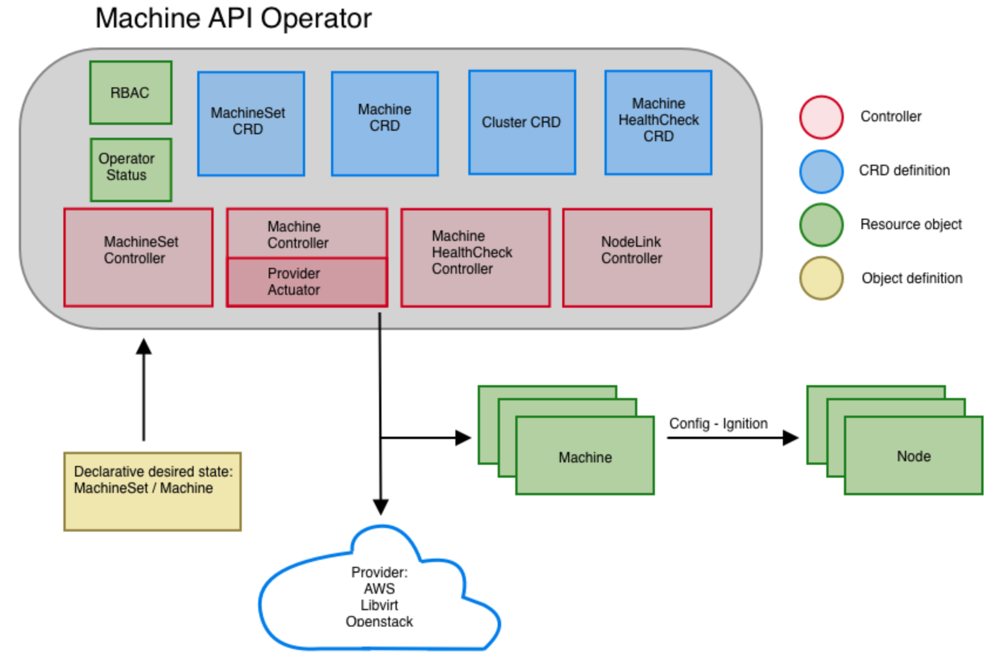
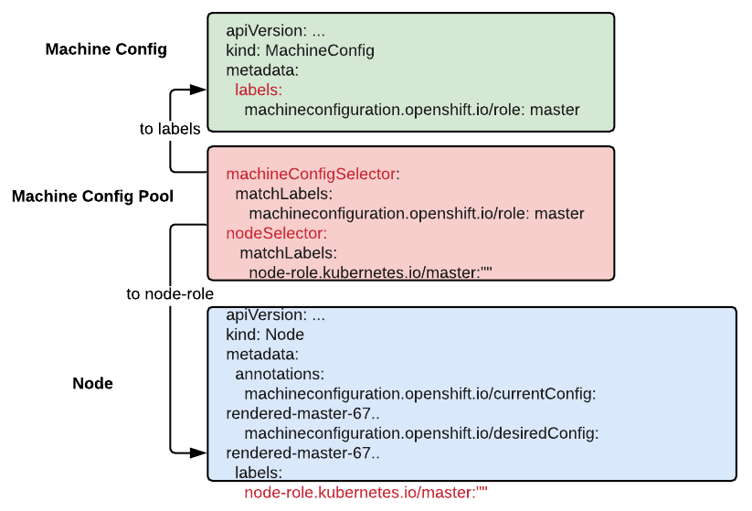
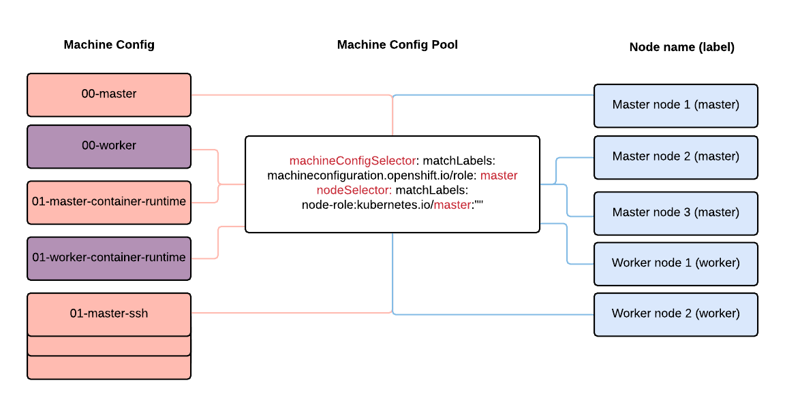

ifdef::revealjs_slideshow[]

[#cover,data-background-image="image/1156524-bg_redhat.png" data-background-color="#cc0000"]
== &nbsp;

[#cover-h1]
Advanced Red Hat OpenShift Deployment and Management

[#cover-h2]
Machine Management

[#cover-logo]
image::{revealjs_cover_image}[]

endif::[]

:linkattrs:

== Module Topics

* Overview
* Machine API
* Nodes
* Machines
* MachineSets
* Machine Config
* Machine Config Pool
* Machine Health Checks
* RHEL as workers
* Cluster Autoscaler

== Overview

[.text-center]
*Machine Management*

[.text-center]
How OpenShift 4 manages the lifecycle of it's machine, or node, resources. 

ifdef::showscript[]

This includes the provisioning and deprovisioning of servers as well as the configuration and version of the Operating System. 

Machine Management can be 100% automated or you can choose a hybrid approach where you manage part of your nodes manually, such as you'd have to do with RHEL.

endif::showscript[]

== Machine API

[.text-center]
*Machine API Operator*
[.text-center]
Manages the lifecycle of specific purpose CRDs, controllers and RBAC objects that extend the Kubernetes API. This allows to convey desired state of machines in a cluster in a declarative fashion.

== Machine API

* Based on the upstream Cluster API project and custom OpenShift Container Platform resources
* Performs all node host provisioning management actions after the control plane is installed
* Machine API Operator deploys and configures:
** Controllers
** CRDs
* Machine controllers provision and deprovision Machines and Nodes
* Machine API resources all reside in `openshift-machine-api` namespace. They are not cluster scoped.

ifdef::showscript[]
Talk more in detail:
https://docs.openshift.com/container-platform/4.4/machine_management/creating_machinesets/creating-machineset-aws.html

The Machine API is a combination of primary resources that are based on the upstream Cluster API project and custom OpenShift Container Platform resources.

The two primary resources are: machines (A fundamental unit that describes the host for a Node) and machineSet (Groups of machines. MachineSets are to machines as ReplicaSets are to Pods. If you need more machines or must scale them down, you change the replicas field on the MachineSet to meet your compute need.).

endif::showscript[]

== Machine Management Overview

ifdef::showscript[]

All of these pieces make up the overall Machine API Operator.

The Machine API Operator manages the lifecycle of 
specific purpose CRDs, controllers and RBAC objects that 
extend the Kubernetes API. This allows to convey desired 
state of machines in a cluster in a declarative fashion.
https://github.com/openshift/machine-api-operator

endif::showscript[]

== Nodes

[.text-center]
Nodes run Pods.

ifdef::showscript[]

The only job a node really has is to run Pods. There are things that can be done to nodes, such as labeling or tainting, that will influence _what_ Pods it runs. In the end, the job of a node is still to run Pods.

endif::showscript[]

== Nodes

* Core Kubernetes object
* Can be RHCOS (preferred) or RHEL for workers
* CRI-O used to run containers
* Managed as part of the OpenShift platform

ifdef::showscript[]
Kubernetes runs your workload by placing containers into Pods to run on Nodes. A node may be a virtual or physical machine, depending on the cluster. Each node contains the services necessary to run Pods, managed by the control plane.

Typically you have several nodes in a cluster; in a learning or resource-limited environment, you might have just one.

endif::showscript[]

== Nodes
.Example

[source,subs="{markup-in-source}"]
----
$ oc get nodes

NAME                       STATUS   ROLES                AGE     VERSION
ded1-xjbw8-master-0        Ready    master               4d18h   v1.14.6+c7d2111b9
ded1-xjbw8-master-1        Ready    master               4d18h   v1.14.6+c7d2111b9
ded1-xjbw8-master-2        Ready    master               4d18h   v1.14.6+c7d2111b9
general-purpose-1a-rdn75   Ready    general-use,worker   3d2h    v1.14.6+c7d2111b9
general-purpose-1b-z42t2   Ready    general-use,worker   3d1h    v1.14.6+c7d2111b9
infra-1a-rtsht             Ready    infra,worker         2d19h   v1.14.6+c7d2111b9
----

ifdef::showscript[]

In this example, there are a total of 6 nodes.

Three of the nodes are masters and should not be used to run an user workloads.

Three of the nodes have the worker and another role. The worker role is a default role that is assigned to anything not a master. The other role assigned to these is arbitrary.

Roles are determined by the `node-role.kubernetes.io/<role-name>: ""` label.

endif::showscript[]

== Nodes
.Example

[source,subs="{markup-in-source}"]
----
$ oc describe node general-purpose-1a-rdn75

Name:               general-purpose-1a-rdn75
Roles:              general-use,worker
Labels:             beta.kubernetes.io/arch=amd64
                    beta.kubernetes.io/instance-type=4c12g30d
                    beta.kubernetes.io/os=linux
                    failure-domain.beta.kubernetes.io/region=regionOne
                    failure-domain.beta.kubernetes.io/zone=nova
                    kubernetes.io/arch=amd64
                    kubernetes.io/hostname=general-purpose-1a-rdn75
                    kubernetes.io/os=linux
                    node-role.kubernetes.io/general-use=
                    node-role.kubernetes.io/worker=
                    node.openshift.io/os_id=rhcos
Annotations:        machine.openshift.io/machine: openshift-machine-api/general-purpose-1a-rdn75
                    machineconfiguration.openshift.io/currentConfig: rendered-worker-05fe3c36d91ba4851bf83e2c9840fe41
                    machineconfiguration.openshift.io/desiredConfig: rendered-worker-05fe3c36d91ba4851bf83e2c9840fe41
                    machineconfiguration.openshift.io/state: Done
                    volumes.kubernetes.io/controller-managed-attach-detach: true
CreationTimestamp:  Fri, 22 Nov 2019 14:46:22 -0500
Taints:             <none>
Unschedulable:      false
Conditions:
  Type             Status  LastHeartbeatTime                 LastTransitionTime                Reason                       Message
  ----             ------  -----------------                 ------------------                ------                       -------
  MemoryPressure   False   Mon, 25 Nov 2019 17:09:47 -0500   Fri, 22 Nov 2019 14:46:22 -0500   KubeletHasSufficientMemory   kubelet has sufficient memory available
  DiskPressure     False   Mon, 25 Nov 2019 17:09:47 -0500   Fri, 22 Nov 2019 14:46:22 -0500   KubeletHasNoDiskPressure     kubelet has no disk pressure
  PIDPressure      False   Mon, 25 Nov 2019 17:09:47 -0500   Fri, 22 Nov 2019 14:46:22 -0500   KubeletHasSufficientPID      kubelet has sufficient PID available
  Ready            True    Mon, 25 Nov 2019 17:09:47 -0500   Fri, 22 Nov 2019 14:46:42 -0500   KubeletReady                 kubelet is posting ready status
Addresses:
  Hostname:    general-purpose-1a-rdn75
  InternalIP:  192.168.47.54
Capacity:
 attachable-volumes-cinder:  256
 cpu:                        4
 hugepages-1Gi:              0
 hugepages-2Mi:              0
 memory:                     12292548Ki
 pods:                       250
Allocatable:
 attachable-volumes-cinder:  256
 cpu:                        3500m
 hugepages-1Gi:              0
 hugepages-2Mi:              0
 memory:                     11678148Ki
 pods:                       250
System Info:
 Machine ID:                              b4c779df637344e6ba5ca8fb56ba0f27
 System UUID:                             b4c779df-6373-44e6-ba5c-a8fb56ba0f27
 Boot ID:                                 49495485-979e-4272-a7b4-a430103b1903
 Kernel Version:                          4.18.0-147.el8.x86_64
 OS Image:                                Red Hat Enterprise Linux CoreOS 42.81.20191107.0 (Ootpa)
 Operating System:                        linux
 Architecture:                            amd64
 Container Runtime Version:               cri-o://1.14.11-0.23.dev.rhaos4.2.gitc41de67.el8
 Kubelet Version:                         v1.14.6+c7d2111b9
 Kube-Proxy Version:                      v1.14.6+c7d2111b9
ProviderID:                               openstack://b4c779df-6373-44e6-ba5c-a8fb56ba0f27
Non-terminated Pods:                      (18 in total)
  Namespace                               Name                                       CPU Requests  CPU Limits  Memory Requests  Memory Limits  AGE
  ---------                               ----                                       ------------  ----------  ---------------  -------------  ---
  atest                                   django-psql-example-1-r5h7w                0 (0%)        0 (0%)      512Mi (4%)       512Mi (4%)     2d19h
  openshift-cluster-node-tuning-operator  tuned-kmz8p                                10m (0%)      0 (0%)      50Mi (0%)        0 (0%)         3d2h
  openshift-dns                           dns-default-jgc2n                          110m (3%)     0 (0%)      70Mi (0%)        512Mi (4%)     3d2h
  openshift-image-registry                node-ca-bh5nm                              10m (0%)      0 (0%)      10Mi (0%)        0 (0%)         3d2h
  openshift-ingress                       router-default-5c6d557d75-d84qt            100m (2%)     0 (0%)      256Mi (2%)       0 (0%)         3d1h
  openshift-machine-config-operator       machine-config-daemon-lxkwh                20m (0%)      0 (0%)      50Mi (0%)        0 (0%)         3d2h
  openshift-monitoring                    alertmanager-main-1                        100m (2%)     100m (2%)   225Mi (1%)       25Mi (0%)      3d1h
  openshift-monitoring                    kube-state-metrics-f55c697ff-fg4z9         30m (0%)      0 (0%)      120Mi (1%)       0 (0%)         3d1h
  openshift-monitoring                    node-exporter-q487f                        10m (0%)      0 (0%)      20Mi (0%)        0 (0%)         3d2h
  openshift-monitoring                    prometheus-adapter-6d57cddb4b-rlmx4        10m (0%)      0 (0%)      20Mi (0%)        0 (0%)         3d
  openshift-monitoring                    prometheus-k8s-1                           430m (12%)    200m (5%)   1134Mi (9%)      50Mi (0%)      3d1h
  openshift-monitoring                    telemeter-client-744f688585-fs7kl          10m (0%)      0 (0%)      20Mi (0%)        0 (0%)         3d1h
  openshift-multus                        multus-4sh8j                               10m (0%)      0 (0%)      150Mi (1%)       0 (0%)         3d2h
  openshift-openstack-infra               coredns-general-purpose-1a-rdn75           150m (4%)     0 (0%)      1Gi (8%)         0 (0%)         3d2h
  openshift-openstack-infra               keepalived-general-purpose-1a-rdn75        150m (4%)     0 (0%)      1Gi (8%)         0 (0%)         3d2h
  openshift-openstack-infra               mdns-publisher-general-purpose-1a-rdn75    150m (4%)     0 (0%)      1Gi (8%)         0 (0%)         3d2h
  openshift-sdn                           ovs-vr628                                  200m (5%)     0 (0%)      400Mi (3%)       0 (0%)         3d2h
  openshift-sdn                           sdn-rs2mk                                  100m (2%)     0 (0%)      200Mi (1%)       0 (0%)         3d2h
Allocated resources:
  (Total limits may be over 100 percent, i.e., overcommitted.)
  Resource                   Requests      Limits
  --------                   --------      ------
  cpu                        1600m (45%)   300m (8%)
  memory                     6309Mi (55%)  1099Mi (9%)
  ephemeral-storage          0 (0%)        0 (0%)
  attachable-volumes-cinder  0             0
Events:                      <none>
----

== Machines

[.text-center]
*Machine*

[.text-center]
A representation and description of a host for a node.

ifdef::showscript[]
A fundamental unit that describes the host for a Node. It's an abstraction of the underlying "hardware" that makes it easier to work with the IaaS or cloud provider by just interacting with the Machine API and it's objects.

A machine has a providerSpec, which describes the types of compute nodes that are offered for different cloud platforms. For example, a machine type for a worker node on Amazon Web Services (AWS) might define a specific machine type and required metadata.

endif::showscript[]

== Machines

* OpenShift objects based on CRD
* Represent underlying "hardware"
** Details provided in the `providerSpec`
* Machines do NOT run Pods
* Created by `MachineSet` or manually

ifdef::showscript[]

Machines are not core Kubernetes objects, but are created through the use of a CRD which extends the Kubernetes API and makes them native. Their only purpose is to act as a representation of the underlying instance, which will include details about that instance which can be use to manage the lifecycle of the instance.

Machines are very closely related to nodes, but they are *NOT* nodes. Only nodes run pods. The Kubernetes scheduler does not know what a Machine is and doesn't schedule Pods to run on a Machine.

Machines can be created manually or automatically from a MachineSet as more replicas are added.

endif::showscript[]

== Machines
.OpenStack Example

[source,subs="{markup-in-source}"]
----
$ oc get machine

NAME                       STATE    TYPE       REGION      ZONE   AGE
general-purpose-1a-rdn75   ACTIVE   4c12g30d   regionOne   nova   3d2h
general-purpose-1b-z42t2   ACTIVE   4c12g30d   regionOne   nova   3d1h
infra-1a-rtsht             ACTIVE   4c12g30d   regionOne   nova   2d20h
----

ifdef::showscript[]

Here, there are 3 Machines deployed. Each of these Machines is directly related to one of the nodes that you saw in the earlier example.

endif::showscript[]

== Machines
.AWS Example

[source,subs="{markup-in-source}"]
----
$ oc get machine

NAME                                         STATE     TYPE         REGION      ZONE         AGE
cluster-cb6d-hqbs5-master-0                  running   m4.xlarge    us-east-1   us-east-1a   35m
cluster-cb6d-hqbs5-master-1                  running   m4.xlarge    us-east-1   us-east-1b   35m
cluster-cb6d-hqbs5-master-2                  running   m4.xlarge    us-east-1   us-east-1c   35m
cluster-cb6d-hqbs5-worker-us-east-1a-fzpj4   running   m4.4xlarge   us-east-1   us-east-1a   35m
cluster-cb6d-hqbs5-worker-us-east-1b-brrxz   running   m4.4xlarge   us-east-1   us-east-1b   35m
----

ifdef::showscript[]

Similar to the previous example, these are machines deployed in AWS. This was from an IPI install, so all of the nodes in this cluster are represented by Machines.

Here, you see the main difference is the different types, regions, and zones - which corresponde to AWS specifics.

If this were an Azure or GCP cluster, you'd see similar differences.

endif::showscript[]

== Machines
.OpenStack Example

[source,subs="{markup-in-source}"]
----
$ oc get machine general-purpose-1a-rdn75 -o yaml

apiVersion: machine.openshift.io/v1beta1
kind: Machine
metadata:
  annotations:
    machine.openshift.io/instance-state: ACTIVE
    openstack-ip-address: 192.168.47.54
    openstack-resourceId: b4c779df-6373-44e6-ba5c-a8fb56ba0f27
  finalizers:
  - machine.machine.openshift.io
  generateName: general-purpose-1a-
  labels:
    machine.openshift.io/cluster-api-cluster: ded1-xjbw8
    machine.openshift.io/cluster-api-machine-role: worker
    machine.openshift.io/cluster-api-machine-type: worker
    machine.openshift.io/cluster-api-machineset: general-purpose-1a
    machine.openshift.io/instance-type: 4c12g30d
    machine.openshift.io/region: regionOne
    machine.openshift.io/zone: nova
  name: general-purpose-1a-rdn75
  namespace: openshift-machine-api
  ownerReferences:
  - apiVersion: machine.openshift.io/v1beta1
    blockOwnerDeletion: true
    controller: true
    kind: MachineSet
    name: general-purpose-1a
spec:
  metadata:
    creationTimestamp: null
    labels:
      failure-domain.beta.kubernetes.io/region: regionOne
      failure-domain.beta.kubernetes.io/zone: nova
      node-role.kubernetes.io/general-use: ""
  providerSpec:
    value:
      apiVersion: openstackproviderconfig.openshift.io/v1alpha1
      cloudName: openstack
      cloudsSecret:
        name: openstack-cloud-credentials
        namespace: openshift-machine-api
      flavor: 4c12g30d
      image: rhcos-ocp42
      kind: OpenstackProviderSpec
      metadata:
        creationTimestamp: null
      networks:
      - filter: {}
        subnets:
        - filter:
            name: ded1-ocp-subnet
      securityGroups:
      - filter: {}
        name: ded1-worker_sg
      serverMetadata:
        Name: ded1-xjbw8-worker
        openshiftClusterID: ded1-xjbw8
      tags:
      - openshiftClusterID=ded1-xjbw8
      trunk: true
      userDataSecret:
        name: worker-user-data
status:
  addresses:
  - address: 192.168.47.54
    type: InternalIP
  - address: general-purpose-1a-rdn75
    type: Hostname
  - address: general-purpose-1a-rdn75
    type: InternalDNS
  nodeRef:
    kind: Node
    name: general-purpose-1a-rdn75
    uid: c2e2b609-0d60-11ea-8e79-fa163e4c4e0c
----

== Machines
.AWS Example

[source,subs="{markup-in-source}"]
----
$ oc get machine cluster-cb6d-hqbs5-worker-us-east-1a-fzpj4 -o yaml

apiVersion: machine.openshift.io/v1beta1
kind: Machine
metadata:
  annotations:
    machine.openshift.io/instance-state: running
  finalizers:
  - machine.machine.openshift.io
  generateName: cluster-cb6d-hqbs5-worker-us-east-1a-
  generation: 2
  labels:
    machine.openshift.io/cluster-api-cluster: cluster-cb6d-hqbs5
    machine.openshift.io/cluster-api-machine-role: worker
    machine.openshift.io/cluster-api-machine-type: worker
    machine.openshift.io/cluster-api-machineset: cluster-cb6d-hqbs5-worker-us-east-1a
    machine.openshift.io/instance-type: m4.4xlarge
    machine.openshift.io/region: us-east-1
    machine.openshift.io/zone: us-east-1a
  name: cluster-cb6d-hqbs5-worker-us-east-1a-fzpj4
  namespace: openshift-machine-api
  ownerReferences:
  - apiVersion: machine.openshift.io/v1beta1
    blockOwnerDeletion: true
    controller: true
    kind: MachineSet
    name: cluster-cb6d-hqbs5-worker-us-east-1a
spec:
  metadata:
    creationTimestamp: null
  providerID: aws:///us-east-1a/i-0641a231f534e281e
  providerSpec:
    value:
      ami:
        id: ami-01e7fdcb66157b224
      apiVersion: awsproviderconfig.openshift.io/v1beta1
      blockDevices:
      - ebs:
          iops: 0
          volumeSize: 120
          volumeType: gp2
      credentialsSecret:
        name: aws-cloud-credentials
      deviceIndex: 0
      iamInstanceProfile:
        id: cluster-cb6d-hqbs5-worker-profile
      instanceType: m4.4xlarge
      kind: AWSMachineProviderConfig
      metadata:
        creationTimestamp: null
      placement:
        availabilityZone: us-east-1a
        region: us-east-1
      publicIp: null
      securityGroups:
      - filters:
        - name: tag:Name
          values:
          - cluster-cb6d-hqbs5-worker-sg
      subnet:
        filters:
        - name: tag:Name
          values:
          - cluster-cb6d-hqbs5-private-us-east-1a
      tags:
      - name: kubernetes.io/cluster/cluster-cb6d-hqbs5
        value: owned
      userDataSecret:
        name: worker-user-data
status:
  addresses:
  - address: 10.0.128.240
    type: InternalIP
  - address: ""
    type: ExternalDNS
  - address: ip-10-0-128-240.ec2.internal
    type: InternalDNS
  nodeRef:
    kind: Node
    name: ip-10-0-128-240.ec2.internal
    uid: 5a0a6e71-0fd5-11ea-98c6-0a6cf12d4883
----

== MachineSet

[.text-center]
Groups of machines. MachineSets are to Machines as ReplicaSets are to Pods.

ifdef::showscript[]

MachineSets are the next layer up from Machines. MachineSets are separate objects and define a type of Machine they are responsible for as well as the number of replicas that should be deployed.

MachineSets contain the entire defition of the Machine as a template. 
This means that a MachineSet can create many copies of a specific Machine, but you would need multiple MachineSets if you have multiple types of Machines. 

For instance, if you have a MachineSet that provisions Machines with GPUs in them, you’d have to create a different MachineSet if you wanted to provision Machines without GPUs.

endif::showscript[]

== MachineSet

* OpenShift objects based on CRD
* Similar to a `Deployment` or `ReplicaSet`
* They create `Machines`
* Can be scaled using `replicas`
** Includes a `template` section, which describes how the `Machine` should be deployed
* When using IPI, `MachineSets` are created automatically for workers

TIP: It is a best practice to make changes at the `MachineSet` layer and let new `Machines` and `Nodes` be deployed with these changes.

ifdef::showscript[]

Like Machines, these are not core Kubernetes objects, but through the use of CRDs, they can be used natively via the Kubernetes API.

If you compare a MachineSet to a ReplicaSet, there are obviously differences in the details. But the overall structure is very similar in that you have a `spec` with a `template` that has a `spec` for the objects to be created, Machines in this case.

endif::showscript[]

== MachineSet

[source,subs="{markup-in-source}"]
----
$ oc get machineset

NAME                 DESIRED   CURRENT   READY   AVAILABLE   AGE
ded1-xjbw8-worker    0         0                             4d18h
general-purpose-1a   1         1         1       1           4d17h
general-purpose-1b   1         1         1       1           4d17h
infra-1a             1         1         1       1           4d17h
----

ifdef::showscript[]

In this example, there are 4 MachineSets listed, but only 3 of them have Machines deployed. This corresponds to the number of Machines you saw in the previous example.

When you scale a MachineSet up, a sequence of events happens
. The _DESIRED_ count increases
. When the new Machine object is created, the _CURRENT_ count increases
. When the Node finishes bootstrapping, the _READY_ count increases
. When the Node is available to run Pods, the _AVAILABLE_ count increases

endif::showscript[]

== MachineSet
.OpenStack Example

[source,subs="{markup-in-source}"]
----
$ oc get machineset general-purpose-1a -o yaml

apiVersion: machine.openshift.io/v1beta1
kind: MachineSet
metadata:
  labels:
    machine.openshift.io/cluster-api-cluster: ded1-xjbw8
    machine.openshift.io/cluster-api-machine-role: worker
    machine.openshift.io/cluster-api-machine-type: worker
  name: general-purpose-1a
  namespace: openshift-machine-api
spec:
  replicas: 1
  selector:
    matchLabels:
      machine.openshift.io/cluster-api-cluster: ded1-xjbw8
      machine.openshift.io/cluster-api-machineset: general-purpose-1a
  template:
    metadata:
      labels:
        machine.openshift.io/cluster-api-cluster: ded1-xjbw8
        machine.openshift.io/cluster-api-machine-role: worker
        machine.openshift.io/cluster-api-machine-type: worker
        machine.openshift.io/cluster-api-machineset: general-purpose-1a
    spec:
      metadata:
        labels:
          failure-domain.beta.kubernetes.io/region: regionOne
          failure-domain.beta.kubernetes.io/zone: nova
          node-role.kubernetes.io/general-use: ""
      providerSpec:
        value:
          apiVersion: openstackproviderconfig.openshift.io/v1alpha1
          cloudName: openstack
          cloudsSecret:
            name: openstack-cloud-credentials
            namespace: openshift-machine-api
          flavor: 4c12g30d
          image: rhcos-ocp42
          kind: OpenstackProviderSpec
          metadata:
            creationTimestamp: null
          networks:
          - filter: {}
            subnets:
            - filter:
                name: ded1-ocp-subnet
          securityGroups:
          - filter: {}
            name: ded1-worker_sg
          serverMetadata:
            Name: ded1-xjbw8-worker
            openshiftClusterID: ded1-xjbw8
          tags:
          - openshiftClusterID=ded1-xjbw8
          trunk: true
          userDataSecret:
            name: worker-user-data
----

== MachineSet
.AWS Example

[source,subs="{markup-in-source}"]
----
apiVersion: machine.openshift.io/v1beta1
kind: MachineSet
metadata:
  labels:
    machine.openshift.io/cluster-api-cluster: cluster-cb6d-hqbs5
  name: cluster-cb6d-hqbs5-worker-us-east-1a
  namespace: openshift-machine-api
spec:
  replicas: 1
  selector:
    matchLabels:
      machine.openshift.io/cluster-api-cluster: cluster-cb6d-hqbs5
      machine.openshift.io/cluster-api-machineset: cluster-cb6d-hqbs5-worker-us-east-1a
  template:
    metadata:
      labels:
        machine.openshift.io/cluster-api-cluster: cluster-cb6d-hqbs5
        machine.openshift.io/cluster-api-machine-role: worker
        machine.openshift.io/cluster-api-machine-type: worker
        machine.openshift.io/cluster-api-machineset: cluster-cb6d-hqbs5-worker-us-east-1a
    spec:
      metadata:
        labels:
          somekey: somevalue
      providerSpec:
        value:
          ami:
            id: ami-01e7fdcb66157b224
          apiVersion: awsproviderconfig.openshift.io/v1beta1
          blockDevices:
          - ebs:
              iops: 0
              volumeSize: 120
              volumeType: gp2
          credentialsSecret:
            name: aws-cloud-credentials
          deviceIndex: 0
          iamInstanceProfile:
            id: cluster-cb6d-hqbs5-worker-profile
          instanceType: m4.4xlarge
          kind: AWSMachineProviderConfig
          placement:
            availabilityZone: us-east-1a
            region: us-east-1
          publicIp: null
          securityGroups:
          - filters:
            - name: tag:Name
              values:
              - cluster-cb6d-hqbs5-worker-sg
          subnet:
            filters:
            - name: tag:Name
              values:
              - cluster-cb6d-hqbs5-private-us-east-1a
          tags:
          - name: kubernetes.io/cluster/cluster-cb6d-hqbs5
            value: owned
          userDataSecret:
            name: worker-user-data
----
ifdef::showscript[]
In addition to the ones created by the installation program, you can create your own MachineSets to dynamically manage the machine compute resources for specific workloads of your choice.
https://docs.openshift.com/container-platform/4.4/machine_management/creating_machinesets/creating-machineset-aws.html

endif::showscript[]

== Machine Config - Overview

 * It manages the operating system and keeps the cluster up to date and configured.
 ** Updates and configuration changes to essentially everything between the kernel and kubelet.
* If the status is success that means that the operating system is up to date and configured. 
* To inspect the status: `oc describe clusteroperator/machine-config`

ifdef::showscript[]
https://github.com/openshift/machine-config-operator

https://www.redhat.com/en/blog/openshift-container-platform-4-how-does-machine-config-pool-work
endif::showscript[]

== Machine Config vs Machine API
[cols="2,2",caption=""]
|====
a|*Machine Config*
a|*Machine API*

|Manages code and configuration inside the OS.
|Manages machine objects which represent underlying IaaS virtual machines.
|It will drain a node when it is making changes.
|It will drain a node when a machine object is deleted and has an associated node.
|It is not a derivative of Kubernetes.
|It is a derivative of a Kubernetes upstream project cluster API.
|It interacts closely with both the installer as well as Red Hat CoreOS. It will take care of configuring it the machine.
|It handles provisioning of new machines, once the machine-api-operator provisions a machine.
|====

ifdef::showscript[]
https://github.com/openshift/machine-config-operator/blob/master/docs/FAQ.md
endif::showscript[]

== Machine Config - Overview
[source,yaml]
----
# oc get machineconfigs -o yaml 50-examplecorp-chrony
apiVersion: machineconfiguration.openshift.io/v1
kind: MachineConfig
metadata:
  labels:
    machineconfiguration.openshift.io/role: worker
  name: 50-examplecorp-chrony
spec:
  config:
    ignition:
      version: 2.2.0
    storage:
      files:
      - contents:
          source: data:text/plain;charset=utf-8;base64,c2VydmVyIGZvby5leGFtcGxlLm5ldCBtYXhkZWxheSAwLjQgb2ZmbGluZQpzZXJ2ZXIgYmFyLmV4YW1wbGUubmV0IG1heGRlbGF5IDAuNCBvZmZsaW5lCnNlcnZlciBiYXouZXhhbXBsZS5uZXQgbWF4ZGVsYXkgMC40IG9mZmxpbmUK
        filesystem: root
        mode: 420
        path: /etc/chrony.conf
----

ifdef::showscript[]
This example MachineConfig object replaces /etc/chrony.conf with some custom NTP time servers; see the chrony docs.
https://github.com/openshift/machine-config-operator

endif::showscript[]

== Machine Config Operator
.Components

* MachineConfigServer
**  Provide Ignition config to new machines joining the cluster.
* MachineConfigController
** Coordinates upgrade of machines to desired configurations defined by a MachineConfig object.
** Provides options to control upgrade for sets of machines individually.
* MachineConfigDaemon
**   Is scheduled on the machines in a cluster as a DaemonSet.
**   Is responsible for performing machine updates in OpenShift. 

ifdef::showscript[]
* machine-config-server:
All the machines joining the cluster must receive configuration from component running inside the cluster. MachineConfigServer provides the Ignition endpoint that all the new machines can point to receive their machine configuration.

* machineConfigController:
It generates Machine Configs for pre-defined roles (master and worker) and monitors whether an existing Machine Config CR (custom resource) is modified or new Machine Config CRs are created. When the controller detects any of those events, it will generate a new rendered Machine Config object that contains all of the Machine Configs based on MachineConfigSelector from each MachineConfigPool.

* machine-config-daemon:
The MachineConfigDaemon updates a machine to configuration defined by MachineConfig as instructed by the MachineConfigController.

The MachineConfigDaemon is also responsible for annotating a node with machineconfiguration.openshift.io/ssh=accessed when it detects an SSH access to the machine.
https://github.com/openshift/machine-config-operator/blob/master/docs/MachineConfigServer.md
https://github.com/openshift/machine-config-operator/blob/master/docs/MachineConfigController.md
https://github.com/openshift/machine-config-operator/blob/master/docs/MachineConfigDaemon.md
endif::showscript[]

== Machine Config Pool - Overview
.The relationship among Machine Config Pool/Machine Configs and Worker Nodes

ifdef::showscript[]
The Machine Config Pool maps between nodes and Machine Configs. The Machine Config Pool has two selectors, and each selector matches machine configs with nodes.
* The Machine Config Pool associates nodes with Machine Configs
* The machineconfigpool objects track updates to a group of nodes: `oc describe machineconfigpool`
endif::showscript[]

== Machine Config Pool
.How Machine Config Pool selects Machine Configs and Worker

ifdef::showscript[]
* The Render controller in the Machine Config Controller monitors the Machine Config Pool and generates static machine config objects named rendered-master-XXXX and rendered-worker-xxx. These objects can include multiple machine configs. 

* The Render controller then checks whether the nodes in the pool have applied the latest rendered-xxxx machine config. If the machine config pool changes, then the render controller creates a new rendered-xxx and applies it.
endif::showscript[]

== Machine Health Checks

* MachineHealthChecks automatically repairs unhealthy Machines in a particular MachinePool.

* The controller that observes a MachineHealthCheck resource checks for the status that you defined.

* If a machine fails the health check, it is automatically deleted and a new one is created to take its place.

* The controller drains and deletes only one node at a time.

* This process is not applicable to clusters where you manually provisioned the machines yourself.

ifdef::showscript[]
* You can configure and deploy a machine health check to automatically repair damaged machines in a machine pool.

* You can use the advanced machine management and scaling capabilities only in clusters where the machine API is operational.

* When a machine is deleted, you see a machine deleted event. To limit disruptive impact of the machine deletion, the controller drains and deletes only one node at a time. If there are more unhealthy machines than the maxUnhealthy threshold allows for in the targeted pool of machines, remediation stops so that manual intervention can take place.

https://docs.openshift.com/container-platform/4.4/machine_management/deploying-machine-health-checks.html

https://access.redhat.com/documentation/en-us/openshift_container_platform/4.4/html/machine_management/deploying-machine-health-checks

https://github.com/openshift/machine-api-operator/blob/master/pkg/controller/machinehealthcheck/machinehealthcheck_controller.go

endif::showscript[]

== Machine Health Checks

[source,yaml]
----
apiVersion: machine.openshift.io/v1beta1
kind: MachineHealthCheck
metadata:
  name: example 
  namespace: openshift-machine-api
spec:
  selector:
    matchLabels:
      machine.openshift.io/cluster-api-machine-role: <role> 
      machine.openshift.io/cluster-api-machine-type: <role> 
      machine.openshift.io/cluster-api-machineset: <cluster_name>-<label>-<zone> 
  unhealthyConditions:
  - type:    "Ready"
    timeout: "300s"
    status: "False"
  - type:    "Ready"
    timeout: "300s"
    status: "Unknown"
  maxUnhealthy: "40%"
----

ifdef::showscript[]
* Create a healthcheck.yml file that contains the definition of your MachineHealthCheck:

** Specify the name of the MachineHealthCheck to deploy.
** Specify a label for the machine pool that you want to check.
** Specify the MachineSet to track in <cluster_name>-<label>-<zone> format. For example, prod-node-us-east-1a.
** Specify the amount of unhealthy machines allowed in the targeted pool of machines. This can be set as a percentage or an integer.

https://docs.openshift.com/container-platform/4.4/machine_management/deploying-machine-health-checks.html
endif::showscript[]

== RHEL Workers

* RHEL nodes can be a worker, but not a master
** Only RHCOS nodes can be a master
* Only deployed using UPI method
* NOT controlled by Machine API - You take responsibility for all operating system life cycle management and maintenance
** Performing system updates
** Applying patches
* Ansible playbooks used to add RHEL workers
* Subscription entitlement required for each node - not part of cluster-wide entitlement
* See link:https://docs.openshift.com/container-platform/4.4/machine_management/adding-rhel-compute.html#rhel-compute-requirements_adding-rhel-compute[list of system requirements^]

ifdef::showscript[]
* While RHCOS is the default operating system for all cluster machines, you can create compute machines, which are also known as worker machines, that use RHEL as their operating system.
https://docs.openshift.com/container-platform/4.4/architecture/architecture-rhcos.html

* In OpenShift Container Platform, you can add Red Hat Enterprise Linux (RHEL) compute, or worker, machines to a user-provisioned infrastructure cluster. You can use RHEL as the operating system on only compute machines.
https://docs.openshift.com/container-platform/4.4/machine_management/adding-rhel-compute.html#rhel-compute-requirements_adding-rhel-compute

endif::showscript[]

== Cluster Autoscaler

* Based on upstream `ClusterAutoscaler` project and integrated with Machine API in OpenShift
* Controlled by the cluster autoscaler operator
* Adds Machines/Nodes to a cluster automatically
* Node and resource limits can be set so your cluster doesn't grow out of control
* Scale down policies are available
* Scaling is based on `Pending` pods that have exceeded the _Pod Priority Threshold_
* Requires `MachineAutoscalers` to function

ifdef::showscript[]

It scales the cluster automatically.

* The cluster autoscaler Operator manages this component. There can only be *one* cluster autoscaler deployed in a cluster. It is cluster scoped and itmust be named _*default*_.

* The cluster autoscaler is invoked when there are Pods in Pending state. This means that the scheduler can't find a node to run those Pods on. The cluster autoscaler will look for a type of node that is needed and, if possible, scale a MachineSet to add more of that type of node.

* The Pod priority threshold can be set so that the cluster autoscaler is not invoked for Pods that don't meet the threshold. For example, you can make it so that _BestEffort_ Pods don't meet this threshold and will not cause the cluster to scale up, but _Burstable_ and _Guaranteed_ pods would.

* Ensure that the maxNodesTotal value in the ClusterAutoscaler definition that you create is large enough to account for the total possible number of machines in your cluster. This value must encompass the number of control plane machines and the possible number of compute machines that you might scale to.

https://docs.openshift.com/container-platform/4.4/machine_management/applying-autoscaling.html

endif::showscript[]

== Cluster Autoscaler
.Machine Autoscaler

* Minimum and maximum number of nodes for a `MachineSet`
* Must be assigned to each `MachineSet` that needs to participate in cluster autoscaling
* Does not actually invoke any scale up or scale down activities

ifdef::showscript[]

* You can set limits on the maximum number of nodes as well as the min/max of CPU & memory.

* A cluster autoscaler cannot directly increase the number of replicas of, or scale up, a MachineSet. It needs an intermediate resource called a MachineAutoscaler.

* The MachineAutoscaler adjusts the number of Machines in the MachineSets that you deploy in an OpenShift Container Platform cluster. 

* Machine Autoscalers must be applied to every MachineSet that you want to participate in cluster autoscaling. 

https://docs.openshift.com/container-platform/4.4/machine_management/manually-scaling-machineset.html
endif::showscript[]

== Cluster Autoscaler
.Machine Autoscaler Example

[source,yaml]
----
apiVersion: autoscaling.openshift.io/v1beta1
kind: MachineAutoscaler
metadata:
  name: ma-general-purpose-1a
  namespace: openshift-machine-api
spec:
  minReplicas: 1
  maxReplicas: 8
  scaleTargetRef:
    apiVersion: machine.openshift.io/v1beta1
    kind: MachineSet
    name: general-purpose-1a
----

ifdef::showscript[]
=== Transcript
Here is an example of a Machine Autoscaler

endif::showscript[]

== Cluster Autoscaler
.Cluster Autoscaler Example

[source,yaml]
----
apiVersion: autoscaling.openshift.io/v1
kind: ClusterAutoscaler
metadata:
  name: default
spec:
  balanceSimilarNodeGroups: true
  podPriorityThreshold: -10
  resourceLimits:
    maxNodesTotal: 12
    cores:
      min: 20
      max: 48
    memory:
      min: 80
      max: 156
  scaleDown:
    enabled: true
    delayAfterAdd: 5m
    delayAfterDelete: 5m
    delayAfterFailure: 5m
    unneededTime: 60s
----

ifdef::showscript[]

Specifically call out that for the "balanceSimilarNodeGroups" to work, the _only_ label on a node that can be different is the `failure-domain.kubernetes.io/zone` label. Otherwise, the cluster autoscaler will see them as different types of nodes and not spread the scaling evenly across them when determining how much to scale up.

For more detail information about the fields:
https://docs.openshift.com/container-platform/4.4/machine_management/applying-autoscaling.html

endif::showscript[]

== Summary

* Overview
* Machine API
* Nodes
* Machines
* MachineSets
* Machine Config
* Machine Config Pool
* Machine Health Checks
* RHEL as workers
* Cluster Autoscaler