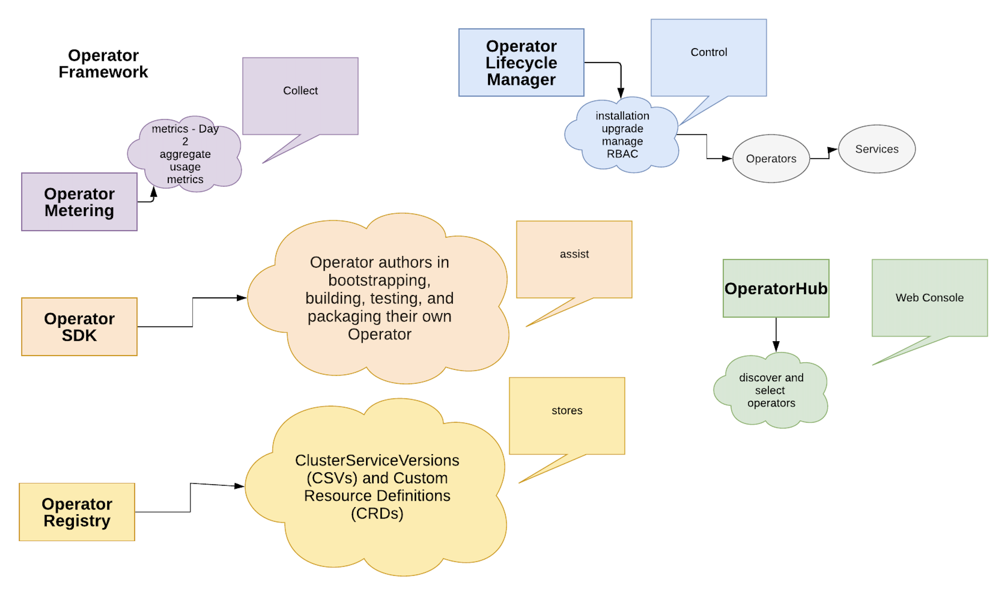
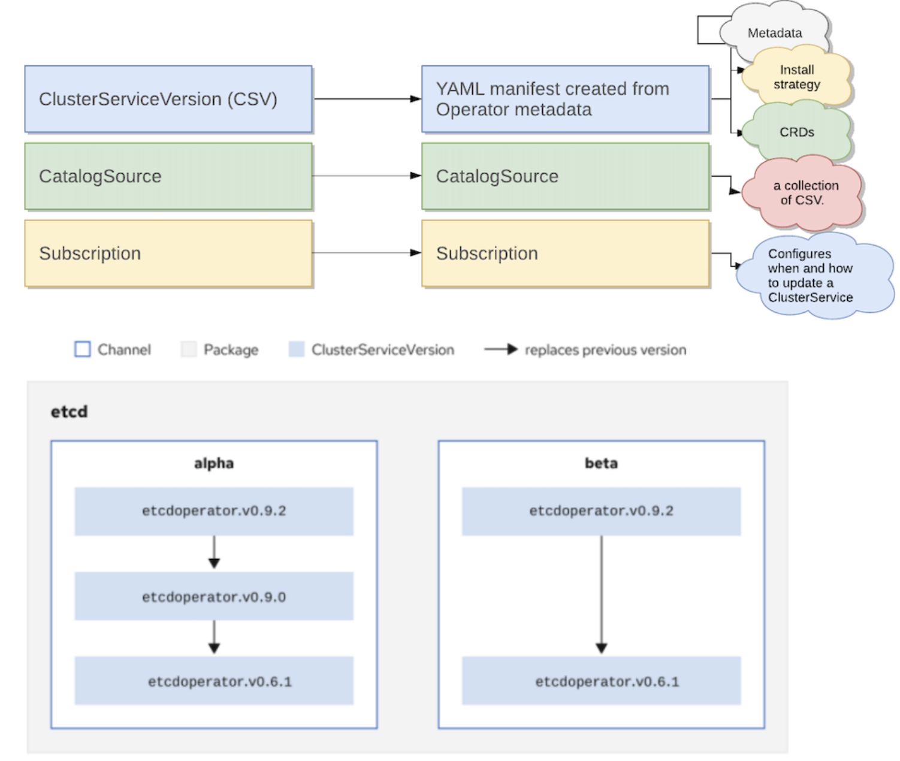
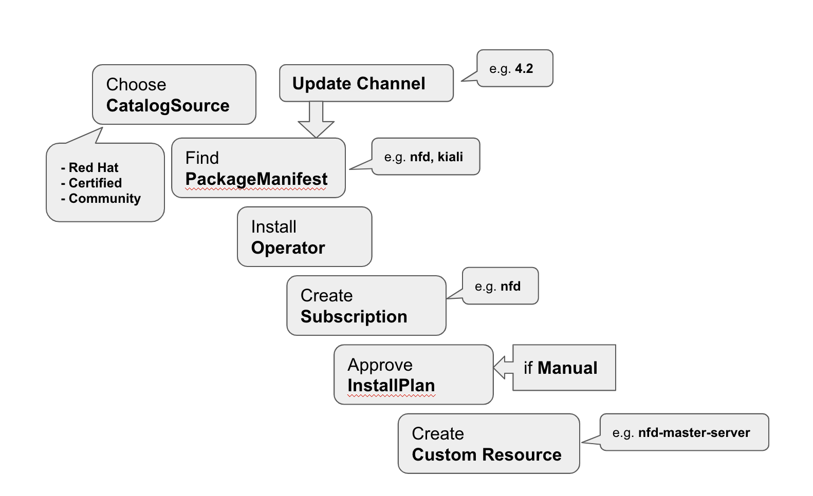
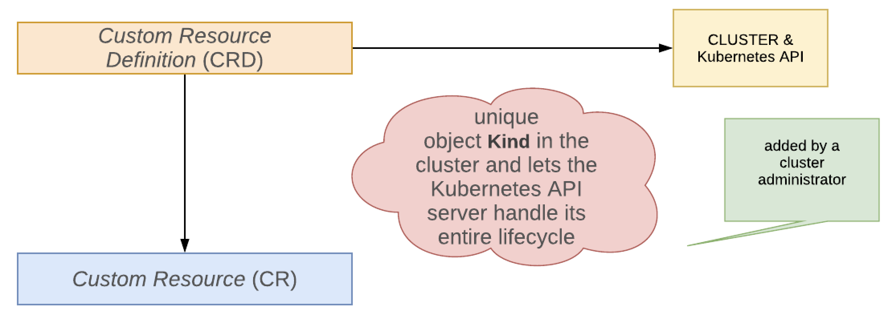
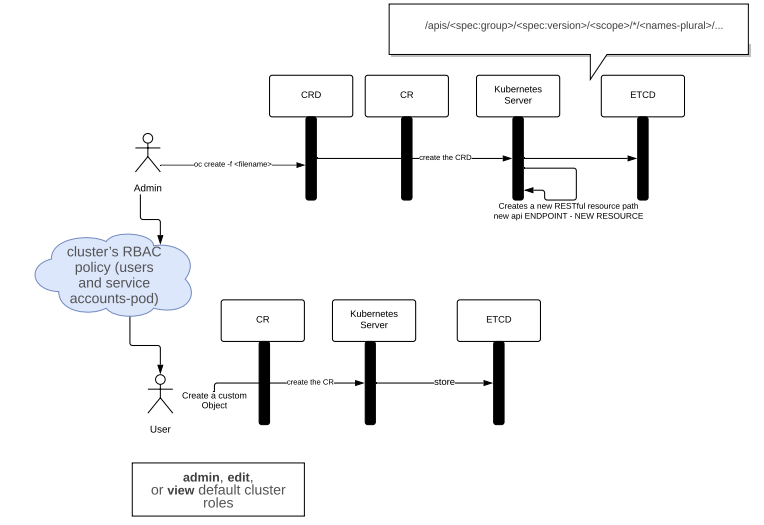
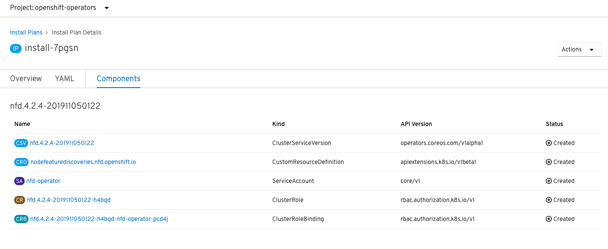
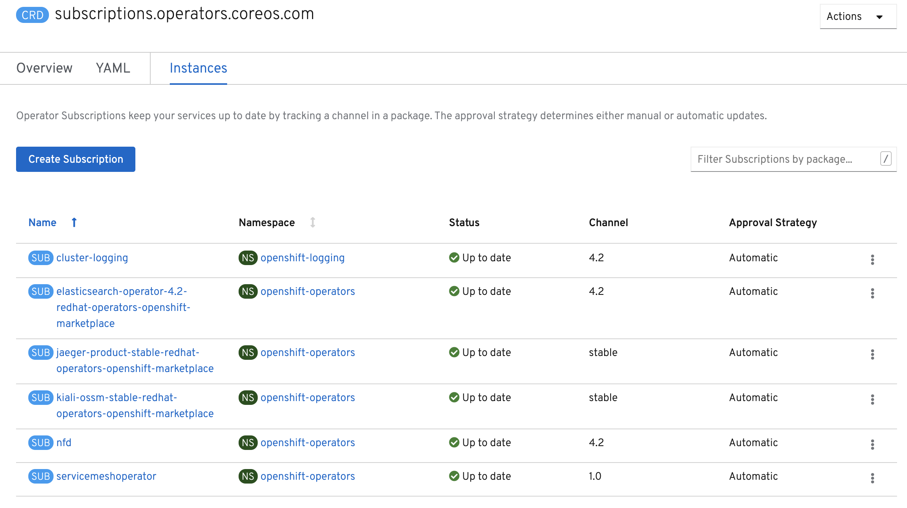
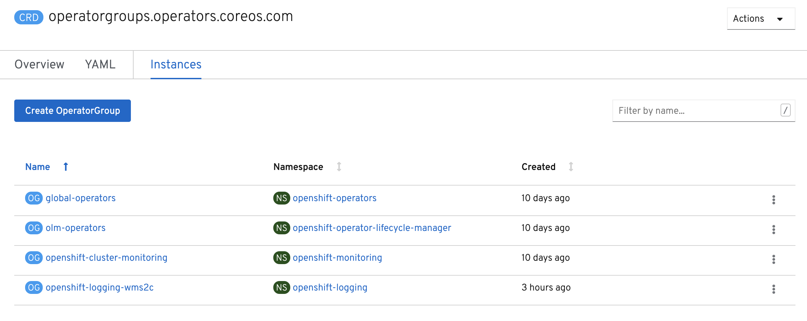

ifdef::revealjs_slideshow[]

[#cover,data-background-image="image/1156524-bg_redhat.png" data-background-color="#cc0000"]
== &nbsp;

[#cover-h1]
Advanced Red Hat OpenShift Deployment and Management

[#cover-h2]
OperatorHub

[#cover-logo]
image::{revealjs_cover_image}[]

endif::[]

== Module Topics

* What is an Operator? (review)
* Operator Framework
* Operator Lifecycle Manager
* Installation Process
* Dependency Resolution
* OperatorHub
//* Installing and Removing Operators

ifdef::showscript[]
In this module we will discuss Operator installation and management in OpenShift.
We will cover the following topics:
* Operator Lifecycle Manager, or OLM which manages Operators in the cluster
* OperatorHub which stores information about Operators which can be installed in the cluster
* We will learn how to install and remove Operators
endif::showscript[]

== User Story

* A cluster admin wants to install some operators from the OperatorHub collection on the cluster. 

* For one-off installs the admin wants to use the cluster's web console. 

* To scale up and automate this process the admin wants to use the CLI and YAML manifests. 

* The admin also wants to store these automation artifacts (YAMLs, scripts, playbooks) in a repo to use GitOps approach in the future.

ifdef::showscript[]
Why use Operators?
Operators provide:

Repeatability of installation and upgrade.

Constant health checks of every system component.

Over-the-air (OTA) updates for OpenShift components and ISV content.

A place to encapsulate knowledge from field engineers and spread it to all users, not just one or two.

endif::showscript[]

== Operator Framework - Overview

ifdef::showscript[]
https://docs.openshift.com/container-platform/4.4/operators/olm-what-operators-are.html
endif::showscript[]
== Operator Lifecycle Manager: Why?

* Packaging
** Distribution, dependencies, installation
* Discovery
** What is installed? What do they provide? What is available for installation?
* Lifecycle
** Upgrades for operators
* Interaction
** Via CLI and OpenShift web console
* More: https://github.com/operator-framework/operator-lifecycle-manager/blob/master/doc/design/philosophy.md

ifdef::showscript[]

Why do we need Operator Lifecycle Manager?
Think of Operators as a way to package applications for Kubernetes / Openshift clusters.
Try to make an analogy with other application packaging systems you already know:

RPM, Apple App Store, Google Play.

What do they do?

* They help you to find applications using some search criteria:
vendor, category (games, productivity, reference), keywords.
* They give you information about the application's functionality, package content,
application's version, etc.
* They help you to install it _properly_.
* They know about the application's dependencies and they install them if necessary.
* They can be configured to update your installed applications automatically or manually.

All of this can be applied to Operator Lifecycle Manager.

Think of it as App Store for Operators.  

endif::showscript[]

== Operator Lifecycle Manager: How?

* Operator's information - in `ClusterServiceVersion`
* Interaction with the Operator via Custom Resources
* Separation of Concerns
** Operator's Dependencies

ifdef::showscript[]
About dependency resolution
OLM manages the dependency resolution and upgrade lifecycle of running Operators. In many ways, the problems OLM faces are similar to other operating system package managers like yum and rpm.

However, there is one constraint that similar systems do not generally have that OLM does: because Operators are always running, OLM attempts to ensure that you are never left with a set of Operators that do not work with each other.

This means that OLM must never:

install a set of Operators that require APIs that cannot be provided, or

update an Operator in a way that breaks another that depends upon it.
https://docs.openshift.com/container-platform/4.2/operators/understanding_olm/olm-understanding-dependency-resolution.html
--

All this functionality is delivered by OLM by the following design features.

Operator packaging information is stored in ClusterServiceVersions.
This information includes versions, dependencies, operator description, etc.

Cluster administrator interacts with Operators using Custom Resources.
Creating, deleting, or changing a Custom Resource triggers the Operator's actions.

Separation of concerns principle is used to make sure Operators don't become too "fat"
and keep doing just one thing, but doing it well.
This is why Operators use other Operators to work with their respective resources.
In that case those Operators become dependencies.
endif::showscript[]

== Operator Installation Components

== Operator Installation Process

ifdef::showscript[]
Review:
OLM has the concept of catalogs, which are repositories of application definitions and CRDs.

Catalogs contain a set of Packages, which map “channels” to a particular application definition. Channels allow package authors to write different upgrade paths for different users (e.g. alpha vs. stable).

Go to the webconsole- operators
endif::showscript[]
== Operator Lifecycle Manager: What?

* ClusterServiceVersion
* InstallPlan
* CatalogSource
* Subscription
* OperatorGroup
* Operators:
** OLM Operator
** Catalog Operator

ifdef::showscript[]
Operator Lifecycle Manager works with several cluster resources. 
We will cover the most important of them.

We have already mentioned ClusterServiceVersion which defines the Operator's package content.

When we install an Operator in the cluster we create a `Subscription`.
The Subscription defines how and when the Operator will be updated:
automatically or manually, from which channel.

After that OLM uses an `InstallPlan` to make sure all necessary resources are installed in the cluster.

We will cover these components in the following slides.
endif::showscript[]

== ClusterServiceVersion
.What's inside?

* Metadata: name, description, version, icon, labels, etc.
* Install strategy (type: Deployment, ServiceAccounts, permissions)
* CRDs:
** Owned: what it provides 
** Required: dependencies (will be installed)

Example: `oc get csv`, then `oc describe csv kiali-operator.v1.9.1`

--------------------------------------------------------------------------------
apiVersion: operators.coreos.com/v1alpha1
kind: ClusterServiceVersion
metadata:
  name: mongodboperator.v0.3
  namespace: placeholder
--------------------------------------------------------------------------------
ifdef::showscript[]

More: https://github.com/operator-framework/operator-lifecycle-manager/blob/master/doc/design/building-your-csv.md

More: https://docs.openshift.com/container-platform/4.2/operators/operator_sdk/osdk-generating-csvs.html

The ClusterServiceVersion resource includes the Operator's package metadata:
name, description, versions, labels, and also its icon.

The CSV also describes the Custom Resources provided by this Operator,
as well as its dependencies -- what's required to be present in the cluster 
for this Operator to function properly.

For example, the Service Mesh operator requires Kiali and Jaeger operators to be installed.
They are this Operator's dependencies.

Also the CSV defines the install strategy: the Deployment configuration, 
Service Accounts, Roles, etc.
endif::showscript[]

== CRD and CR - Overview
.Overview

== CRD and CR - Flow
.Flow 

== InstallPlan
.What and How?

* "Install this CSV into that namespace"
* InstallPlan gets "resolved" to a concrete set of resources
* The resolved set of resources is written back to the InstallPlan

ifdef::showscript[]
The InstallPlan resource is a declaration by a user that they want a ClusterService in a namespace. 

It reads the dependency information from the CSV and comes up with a list of resources to install.

It installs the dependencies and creates other resources like Roles, Service Accounts, etc.
After that it stores the information about installed resources so
the installation can be recovered or reproduced. 
endif::showscript[]

== CatalogSource

* ClusterServices can be downloaded from here
* Three categories
** Red Hat Operators
** Certified Operators
** Community Operators

ifdef::showscript[]
CatalogSource is a resource pointing to various URLs where ClusterServices can be installed from.
Currently there are three categories: Red Hat Operators, Certified Operators, Community Operators.
In your cluster you can also create your own category -- Custom Operators. 
endif::showscript[]

== Subscription

* Configures when and how to update a ClusterService
* Binds a ClusterService to a channel in a CatalogSource
* Configures the update strategy for a ClusterService (automatic, manual approval, etc.)

ifdef::showscript[]
An Operator should know how to update the ClusterService it is responsible for.
OLM uses the Subscription resource to bind it to a channel in CatalogSource. 
As with other packaging systems you can define which channel to use for updates (think about "stable" or "development").

Also in the Subscription you specify if you want to update the ClusterService: automatically or manually.
endif::showscript[]

== Dependency Resolution and Upgrades

* Goal: make sure all your installed Operators can work with each other
* OLM should never:
** install a set of operators that require APIs that can't be provided
** update an operator in a way that breaks another that depends upon it

more: https://github.com/operator-framework/operator-lifecycle-manager/blob/master/doc/design/dependency-resolution.md

ifdef::showscript[]
 We have already discussed how dependencies are described in CSV and how they are resolved by the InstallPlan.
 Let's reiterate it: the goal is to make sure all required APIs are available when installing a new Operator.
 Also it's important to make sure that the upcoming upgrade will not be incompatible with the installed dependeicies.
endif::showscript[]

== OLM Operator

* Role: deploy applications defined by CSV
* OLM Operator Workflow
** Watch for CSV in a namespace
** Run the install strategy for the CSV

ifdef::showscript[]
OLM Operator's role is pretty simple: it deploys Cluster Services defined by CSV.
If it notices a CSV in a particular namespace it runs the install strategy defined in that CSV.

Remember, we talked about interacting with Operators via Custom Resources.
This is an example of this approach: the OLM Operator reacts to a particular resource. 
endif::showscript[]

== Catalog Operator

* Role: install CSV and required resources
* Watches CatalogSources for updates and upgrades them
* Catalog Operator Workflow
** Watch unresolved InstallPlans -> find resources
** Create all discovered resources
** Watch for CatalogSources and Subscriptions and create InstallPlans

ifdef::showscript[]
The Catalog Operator supports the OLM Operator by installing all necessary resources when needed.

It also watches for available updates and applies them according to the configured strategy.
endif::showscript[]

== Catalog Registry

* Stores CSVs, CRDs, and metadata
* Package Manifest

ifdef::showscript[]
The Catalog Registry stores package information: CSVs, CRDs, metadata.
You can check it using the `oc` command:
`oc get packagemanifests`.
Think of it as the `yum list` command.
endif::showscript[]

== OperatorGroups

* For Multitenant configuration of OLM-installed Operators
* Specify target namespaces for Operators
** Use selector, or
** List namespaces
* Global OperatorGroup selects all namespaces

More: https://github.com/operator-framework/operator-lifecycle-manager/blob/master/doc/design/operatorgroups.md

ifdef::showscript[]
OperatorGroups are used to make sure multiple copies of the same Operator can be installed
in the cluster.
They prevent OLM from installing the same Operator in a namespace twice.
In most cases you install Operators in the `openshift-operators` namespace which makes it available in all namespaces. In that case you don't need to worry about OperatorGroups.
endif::showscript[]

== OperatorHub

* Purpose: Easy Operators discovery and installation
* Categories:
** Red Hat Operators
** Certified Operators
** Community Operators
** Custom Operators

ifdef::showscript[]
OperatorHub is a front-end for the Catalog Registry.
It gives you access to three operator categories installed in the cluster by default.
If you have created your custom category it will be displayed there too.
endif::showscript[]

== OperatorHub Architecture

* Project `openshift-marketplace`
* Managed by the Marketplace Operator
* OperatorHub CRD
** Manages OperatorSource
* OperatorSource CRD
** Specifies type of data store (`appregistry`), registry endpoint, `registryNamespace`

More: https://docs.openshift.com/container-platform/4.2/operators/olm-understanding-operatorhub.html

ifdef::showscript[]
OperatorHub is managed by the Marketplace Operator which is running in the `openshift-marketplace` namespace.
It manages the OperatorHub and OperatorSource Custom Resources. 

https://docs.openshift.com/container-platform/4.3/operators/understanding_olm/olm-understanding-olm.html#olm-upgrades_olm-understanding-olm

https://github.com/operator-framework/operator-marketplace

endif::showscript[]

== Key Takeaways

* Operators in the cluster are managed by Operator Lifecycle Manager
* The information about available Operators is stored in the OperatorHub
* Operator installation and update is similar to your other application installation experience:
** Discovery
** Dependencies
** Install Plan
** Automatic or manual updates

ifdef::showscript[]
Everything is on the slide.

endif::showscript[]

== Summary

* What is an Operator? (review)
* Operator Framework
* Operator Lifecycle Manager
* Installation Process
* Dependency Resolution
* OperatorHub
// * Installing and Removing Operators
