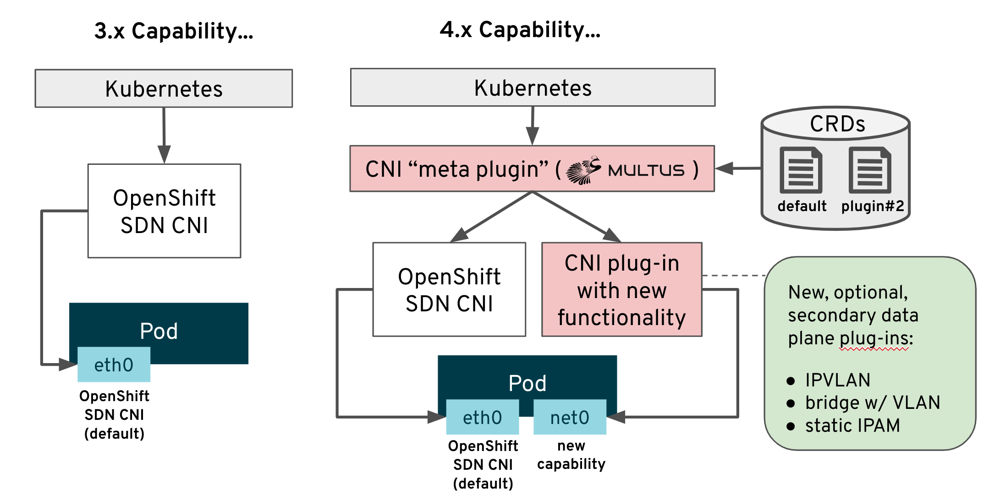
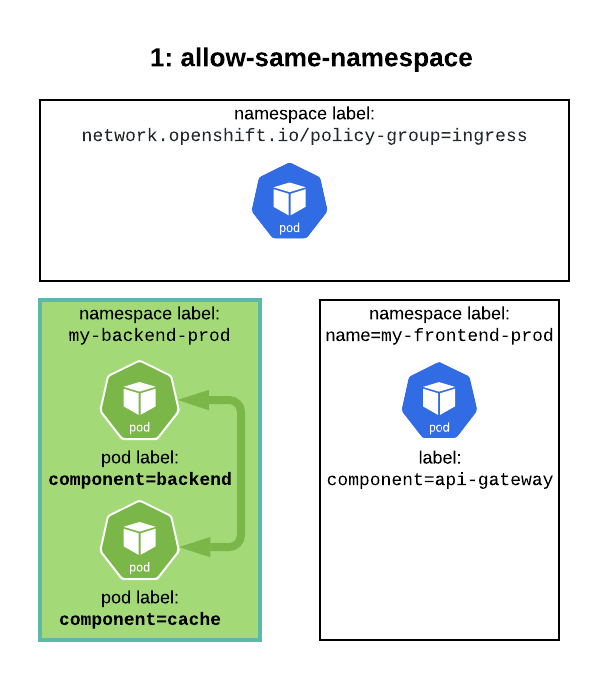
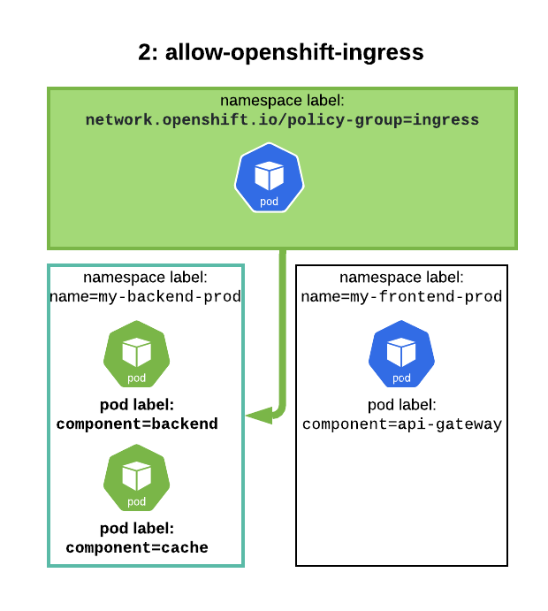
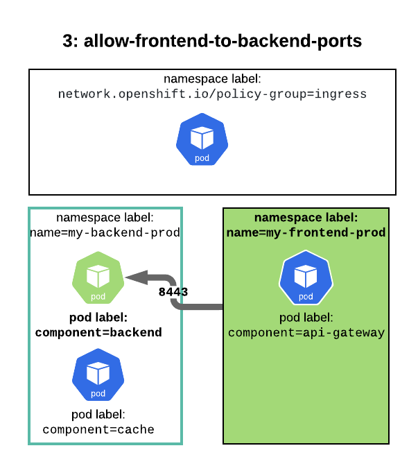
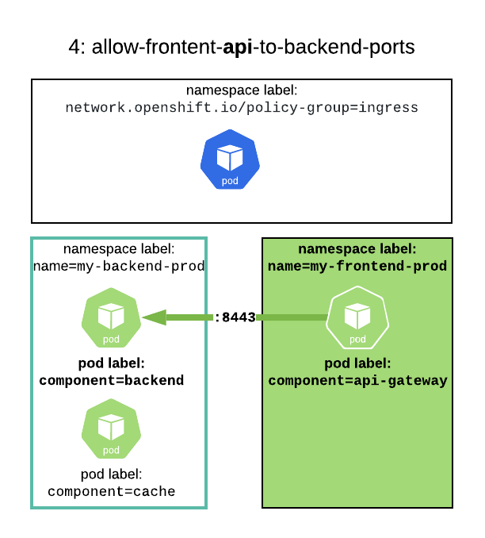
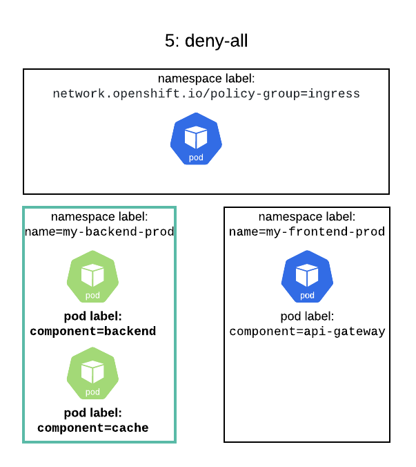

ifdef::revealjs_slideshow[]

[#cover,data-background-image="image/1156524-bg_redhat.png" data-background-color="#cc0000"]
== &nbsp;

[#cover-h1]
Advanced Red Hat OpenShift Deployment and Management

[#cover-h2]
Networking

[#cover-logo]
image::{revealjs_cover_image}[]

endif::[]

== Module Topics

* Overview
* Networking
* Cluster Egress
* NetworkPolicy
* NetworkPolicy - Examples

ifdef::showscript[]

Kubernetes ensures that Pods are able to network with each other, and allocates each Pod an IP address from an internal network. This ensures all containers within the Pod behave as if they were on the same host. Giving each Pod its own IP address means that Pods can be treated like physical hosts or virtual machines in terms of port allocation, networking, naming, service discovery, load balancing, application configuration, and migration.

How it happens using SDN (software defined network) on top of the physical network.
Every node needs to talk to each other using IP.

https://docs.openshift.com/container-platform/4.4/networking/understanding-networking.html

endif::showscript[]

== Networking

.Overview

* OpenShift uses software-defined networking (SDN) approach
** Uses `vxlan` overlay with Open vSwitch (OVS)
** `openshiftSDN` now; `openshiftOVN` later
* Ensures Pods can communicate with each other
** Every Node gets a /23 subnet
** Every Pod gets an IP from the host subnet
** Pods get "plugged in" to OVS

ifdef::showscript[]

SDN lets network managers configure, manage, secure, and optimize network resources very quickly via dynamic, automated SDN programs, which they can write themselves because the programs do not depend on proprietary software.

OpenShift SDN provides three SDN modes for configuring the Pod network:

The network policy mode allows project administrators to configure their own isolation policies using NetworkPolicy objects. Network policy is the default mode in OpenShift Container Platform 4.4.

The subnet mode provides a flat Pod network where every Pod can communicate with every other Pod and Service. The network policy mode provides the same functionality as the subnet mode.

https://docs.openshift.com/container-platform/4.4/networking/openshift_sdn/about-openshift-sdn.html

VXLAN is a tunneling protocol that encapsulates Layer 2 Ethernet frames in Layer 3 UDP packets, enabling you to create virtualized Layer 2 subnets, or segments, that span physical Layer 3 networks. Each Layer 2 subnet is uniquely identified by a VXLAN network identifier (VNI) that segments traffic.

Open vSwitch is an example of a software-based virtual network switch that supports VXLAN.

Every node gets a /23 (owns private network of 23 ip address)

. The open vswitch node. 
. The pods get plugged into the open vswitch. 

To see details on OVS config:
`oc rsh ovs-chmq6 -n openshift-sdn`
`sh-4.2# ovs-vsctl show`

To see details on OpenFlow:
`oc rsh ovs-chmq6 -n openshift-sdn`

`sh-4.2# ovs-ofctl dump-flows br0 -O OpenFlow13`

endif::showscript[]

== Networking
.Overview (cont'd)

* OpenShift 4 SDN default mode: `networkpolicy`
** Acts as "flat" network out of box
** You create more granular network policies if desired
* Three primary network operators:
** Cluster Network Operator (CNO)
** DNS Operator
** Ingress Operator

== Networking
.Cluster Network Operator (CNO)

* Deploys and manages cluster network components
* Implements `network` API from `operator.openshift.io` API group
* Responsible for deploying OpenShift SDN plugin using `DaemonSet`
** Can also deploy different SDN plugin

ifdef::showscript[]
The Cluster Network Operator (CNO) deploys and manages the cluster network components on an OpenShift Container Platform cluster, including the default Container Network Interface (CNI) network provider plug-in selected for the cluster during installation.

The Cluster Network Operator implements the network API from the operator.openshift.io API group. The Operator deploys the OpenShift SDN default Container Network Interface (CNI) network provider plug-in, or the default network provider plug-in that you selected during cluster installation, by using a DaemonSet.

https://docs.openshift.com/container-platform/4.4/networking/cluster-network-operator.html
endif::showscript[]

== Networking
.Cluster Network Operator (CNO)

[source,textinfo]
----
$ oc get clusteroperator/network

NAME      VERSION   AVAILABLE   PROGRESSING   DEGRADED   SINCE
network   4.4.0     True        False         False      50m
----
ifdef::showscript[]
View the state of the Cluster Network Operator:
https://docs.openshift.com/container-platform/4.4/networking/cluster-network-operator.html
endif::showscript[]

== Networking
.Cluster Network Operator (CNO)

[source,textinfo]
----
$ oc get network.operator/cluster -oyaml

apiVersion: operator.openshift.io/v1
kind: Network
metadata:
  name: cluster
spec: <1>
  clusterNetwork:
  - cidr: 10.128.0.0/14 <2>
    hostPrefix: 23 <2>
  defaultNetwork: <2>
    type: OpenShiftSDN
    openshiftSDNConfig: <3>
      mode: NetworkPolicy
      vxlanPort: 4789
      mtu: 1450
      useExternalOpenvswitch: false
  serviceNetwork:
  - 172.30.0.0/16 <2>
----
<1> Desired state of network configuration
<2> Configurable at installation time
<3> Default values and do not show up unless changed

== Networking
.Cluster Network Operator (CNO)

[source,textinfo]
----
apiVersion: operator.openshift.io/v1
kind: Network
metadata:
  name: cluster
spec:
  clusterNetwork: 
  - cidr: 10.128.0.0/14
    hostPrefix: 23
  serviceNetwork: 
  - 172.30.0.0/16
  defaultNetwork: 
    ...
  kubeProxyConfig: 
    iptablesSyncPeriod: 30s 
    proxyArguments:
      iptables-min-sync-period: 
      - 30s
----
ifdef::showscript[]

. ClusterNetwork: A list specifying the blocks of IP addresses from which Pod IPs are allocated and the subnet prefix length assigned to each individual node.
. serviceNetwork: A block of IP addresses for services. The OpenShift SDN Container Network Interface (CNI) plug-in supports only a single IP address block for the service network.
. defaultNetwork: Configures the default Container Network Interface (CNI) network provider for the cluster network.
. kubeProxyConfig: The parameters for this object specify the Kubernetes network proxy (kube-proxy) configuration. If you are using the OVN-Kubernetes network provider, the kube-proxy configuration has no effect.
. iptablesSyncPeriod: The refresh period for iptables rules. The default value is 30s. Valid suffixes include s, m, and h and are described in the Go time package documentation.
. iptables-min-sync-period: The minimum duration before refreshing iptables rules. This parameter ensures that the refresh does not happen too frequently. Valid suffixes include s, m, and h and are described in the Go time package.
https://docs.openshift.com/container-platform/4.4/networking/cluster-network-operator.html
endif::showscript[]

== Networking
.Cluster Network Configuration

[source,textinfo]
----
$ oc describe network.config/cluster

Name:         cluster
Namespace:
Labels:       <none>
Annotations:  <none>
API Version:  config.openshift.io/v1
Kind:         Network
Metadata:
  Self Link:           /apis/config.openshift.io/v1/networks/cluster
Spec: 
  Cluster Network:
    Cidr:         10.128.0.0/14
    Host Prefix:  23
  Network Type:   OpenShiftSDN
  Service Network:
    172.30.0.0/16
Status: 
  Cluster Network:
    Cidr:               10.128.0.0/14
    Host Prefix:        23
  Cluster Network MTU:  8951
  Network Type:         OpenShiftSDN
  Service Network:
    172.30.0.0/16
Events:  <none>
----
ifdef::showscript[]
Viewing the cluster network configuration:
Every new OpenShift Container Platform installation has a network.config object named cluster.

The Spec field displays the configured state of the cluster network.
The Status field displays the current state of the cluster network configuration.

https://docs.openshift.com/container-platform/4.4/networking/cluster-network-operator.html
endif::showscript[]

== Networking
.DNS Operator

* Deploys and manages CoreDNS in the cluster
* Implements `dns` API from the `operators.openshift.io` API group
* Deploys CoreDNS using a `DaemonSet`
* Creates `Service` for `DaemonSet`
* Configures `kubelet` to instruct pods to use CoreDNS service IP
** Uses IP address *172.30.0.10*

ifdef::showscript[]
https://docs.openshift.com/container-platform/4.4/networking/dns-operator.html

The DNS Operator deploys and manages CoreDNS to provide a name resolution service to pods, enabling DNS-based Kubernetes Service discovery in OpenShift.

The DNS Operator implements the dns API from the operator.openshift.io API group. The operator deploys CoreDNS using a DaemonSet, creates a Service for the DaemonSet, and configures the kubelet to instruct pods to use the CoreDNS Service IP for name resolution.
endif::showscript[]

== Networking
.DNS Operator

[source,textinfo]
----
$oc get clusteroperator/dns
NAME      VERSION     AVAILABLE   PROGRESSING   DEGRADED   SINCE
dns       4.1.0-0.11  True        False         False      92m
----
ifdef::showscript[]
Use the oc get command to view the state of the DNS Operator:
AVAILABLE, PROGRESSING and DEGRADED provide information about the status of the operator. AVAILABLE is True when at least 1 pod from the CoreDNS DaemonSet is reporting an Available status condition.

https://docs.openshift.com/container-platform/4.4/networking/dns-operator.html
endif::showscript[]

== Networking
.DNS Operator

[source,textinfo]
----
$oc describe dns.operator/default

Name:         default
Namespace:
Labels:       <none>
Annotations:  <none>
API Version:  operator.openshift.io/v1
Kind:         DNS
...
Status:
  Cluster Domain:  cluster.local 
  Cluster IP:      172.30.0.10 
...
----
ifdef::showscript[]
Use the oc get command to view the state of the DNS Operator:
Every new OpenShift Container Platform installation has a dns.operator named default.

* The Cluster Domain field is the base DNS domain used to construct fully qualified Pod and Service domain names.
* The Cluster IP is the address pods query for name resolution. The IP is defined as the 10th address in the Service CIDR range.
https://docs.openshift.com/container-platform/4.4/networking/dns-operator.html
endif::showscript[]

== Networking
.Ingress Operator

* Deploys and manages one or more HAProxy based _Ingress Controllers_
* Implements the `ingresscontroller` API from the `config.openshift.io` API group
* Additional ingress controllers can be created, which will result in new HAProxy pods + load balancers (if supported by cloud provider)
* Ingress Controller is initially deployed with 2 replicas
** Modified by changing the number of replicas in `ingresscontroller` CR
* Routers are created in `openshift-ingress` namespace

ifdef::showscript[]
The Ingress Operator implements the ingresscontroller API and is the component responsible for enabling external access to OpenShift Container Platform cluster services. The Operator makes this possible by deploying and managing one or more HAProxy-based Ingress Controllers to handle routing. You can use the Ingress Operator to route traffic by specifying OpenShift Container Platform Route and Kubernetes Ingress resources.

Every time you create a ingresscontroler, it’ll launch a haproxy and load balancers.
To balance the ingress controllers, you don’t need to setup the haproxy. 
The default deploy is 2 replicas - it needs at least 2 workers node 

https://docs.openshift.com/container-platform/4.4/networking/ingress-operator.html
endif::showscript[]

== Networking
.Ingress Operator

* Router replicas and nodes
+
[source,textinfo]
----
apiVersion: operator.openshift.io/v1
kind: IngressController
metadata:
  namespace: openshift-ingress-operator
  name: default
spec:
  replicas: 3
  nodePlacement:
    nodeSelector:
      matchLabels:
        node-role.kubernetes.io/infra: ""
----

* Sharding
+
[source,textinfo]
----
apiVersion: operator.openshift.io/v1
kind: IngressController
metadata:
  namespace: openshift-ingress-operator
  name: internal-apps
spec:
  domain: internal-apps.dmace.devcluster.openshift.com
  routeSelector:
    matchLabels:
      environment: internal
----

ifdef::showscript[]

The first example shows how you could change the number of replicas as well as which nodes the routers will run on. Here, there will be 3 replicas and they will run on nodes with the `node-role.kubernetes.io/infra: ""` label.

The second example shows how you can deploy router shards to horizontally scale your ingress controllers more effectively. Here, the new Ingress controller will watch for routes labeled with `environment: internal`. You could also configure the router shard to watch for all routes in a specific namespace. 

Ingress Controller sharding by using namespace labels means that the Ingress Controller serves any route in any namespace that is selected by the namespace selector.

Ingress Controller sharding is useful when balancing incoming traffic load among a set of Ingress Controllers and when isolating traffic to a specific Ingress Controller. For example, company A goes to one Ingress Controller and company B to another.

See link:https://docs.openshift.com/container-platform/4.2/networking/configuring-ingress-cluster-traffic/configuring-ingress-cluster-traffic-ingress-controller.html#nw-ingress-sharding-route-labels_configuring-ingress-cluster-traffic-ingress-controller[Sharding docs^] for more details.

endif::showscript[]

== Networking
.Multus

ifdef::showscript[]

Multus CNI is a container network interface (CNI) plugin for Kubernetes that enables attaching multiple network interfaces to pods.  Typically, in Kubernetes each pod only has one network interface (apart from a loopback) -- with Multus you can create a multi-homed pod that has multiple interfaces. This is accomplished by Multus acting as a "meta-plugin", a CNI plugin that can call multiple other CNI plugins.
https://github.com/intel/multus-cni

* Multus is a CNI plugin that can call other CNI plugins - a 'meta plugin'
* Historically, pods have had only one `eth0` interface
* Multus allows for multiple interfaces to separate traffic for:
** Performance - ability to separate data path traffic from administrative traffic
** Security - ability to further separate sensitive traffic in multi-tenant environments
* All pods still have `eth0` interface for cluster-wide connectivity
* New interfaces are added as `net0`, `net1`, etc.

https://docs.openshift.com/container-platform/4.4/networking/multiple_networks/understanding-multiple-networks.html

OpenShift Container Platform provides the following CNI plug-ins for creating additional networks in your cluster:

bridge: Creating a bridge-based additional network allows Pods on the same host to communicate with each other and the host.

host-device: Creating a host-device additional network allows Pods access to a physical Ethernet network device on the host system.

macvlan: Creating a macvlan-based additional network allows Pods on a host to communicate with other hosts and Pods on those hosts by using a physical network interface. Each Pod that is attached to a macvlan-based additional network is provided a unique MAC address.

ipvlan: Creating an ipvlan-based additional network allows Pods on a host to communicate with other hosts and Pods on those hosts, similar to a macvlan-based additional network. Unlike a macvlan-based additional network, each Pod shares the same MAC address as the parent physical network interface.

SR-IOV: Creating an SR-IOV based additional network allows Pods to attach to a virtual function (VF) interface on SR-IOV capable hardware on the host system.

endif::showscript[]

== Cluster Egress
.Egress Options

* NAT from worker
** Default behavior
* Egress IP per project
** Assign egress IP to project and host
** SDN handles getting traffic from Pod to host with egress IP
* Egress routers
** Pod + service that redirects traffic to specific remote server
** Incompatible with cloud providers that don't support macvlan
* "Just a bunch of hosts"
** Set your Pods `nodeAffinity` so they run on specific hosts
** Any originating IPs will be the IP of those hosts

ifdef::showscript[]

Egress IP per project:
* Egress IP assigned to namespace
* All outgoing connections from pods in that project use the fixed IP(s)
* IPs can be manually or automatically assigned to nodes in the cluster

Egress Router:
* A pod + service that redirects traffic to specific remote server
* Enables source IP whitelisting by remote server
* Adds second IP address and MAC address
** To node’s primary network interface
** To specific remote server
* Private source IP for remote server whitelist
* No AWS or Azure--incompatible with macvlan
* Can use HTTP or iptables or DNS
* Support multiple destinations

endif::showscript[]

== Cluster Egress

.Control Egress Network Policy

* EgressNetworkPolicy resources are defined by the network.openshift.io api
** Not to be confused with NetworkPolicy egress policy types, which are not supported with OpenShift
* One EgressNetworkPolicy per project
** `EgressNetworkPolicy` resource definitions restrict from pods to resources external to the SDN
** Each egress rule includes type Allow/Deny
** Order of egress rules is important, first match wins
* Set at pod-selector or project level
* Rules for targets built with `cidrSelector` and `dnsName`
* Only cluster-admins can define EgressNetworkPolicy in default RBAC

== Cluster Egress

.Sample Cluster Egress Network Policy

[source,text]
-----------------------------------
---
kind: EgressNetworkPolicy
apiVersion: network.openshift.io/v1
metadata:
  name: default
spec:
  egress:
  - type: Allow
    to:
      cidrSelector: 1.2.3.0/24
  - type: Allow
    to:
      dnsName: www.foo.com
  - type: Deny
    to:
      cidrSelector: 0.0.0.0/0
-----------------------------------

ifdef::showscript[]

. egress:	A collection of egress firewall policy rule objects.
. Type: Specify the type of rule. The value must be either Allow or Deny.
. To: Specify a value for either the cidrSelector key or the dnsName key for the rule. You cannot use both keys in a rule.
. cidrSelector: Specify an IP address range in CIDR format.
. dnsName: Specify a domain name.

https://docs.openshift.com/container-platform/4.4/networking/openshift_sdn/configuring-egress-firewall.html#nw-egressnetworkpolicy-object_configuring-an-egress-firewall

endif::showscript[]

== Network Policy

.Overview

* Enabled on OCP 4 by default
* Enables fine-grained port-based access control
* Traffic can be controlled at namespace, pod, port levels using labels
* Uses OpenVSwitch OpenFlow rules
* Plan and secure your application deployment and integration with other services in the cluster

ifdef::showscript[]
A network policy is a specification of how groups of pods are allowed to communicate with each other and other network endpoints.

NetworkPolicy resources use labels to select pods and define rules which specify what traffic is allowed to the selected pods.

https://kubernetes.io/docs/concepts/services-networking/network-policies/

endif::showscript[]

== Network Policy

.Network Isolation

* Use `NetworkPolicy` objects to:
** Limit access to projects and their pods
** Allow access from projects and pods by label

*Production-Level Security*
. No Policies = AllowAll
. Create Global Blacklist Policy
. Whitelist all proper services and destination

ifdef::showscript[]
By default, pods are non-isolated; they accept traffic from any source.

Pods become isolated by having a NetworkPolicy that selects them. Once there is any NetworkPolicy in a namespace selecting a particular pod, that pod will reject any connections that are not allowed by any NetworkPolicy. (Other pods in the namespace that are not selected by any NetworkPolicy will continue to accept all traffic.)

Network policies do not conflict; they are additive. If any policy or policies select a pod, the pod is restricted to what is allowed by the union of those policies' ingress/egress rules. Thus, order of evaluation does not affect the policy result

endif::showscript[]

== Network Policy

.Policy Basics

* Scoped to namespaces (projects)
* Unidirectional: *OpenShift NetworkPolicy supports ingress policy only* (kube supports egress policies)
* Additive: Many policies allowed in single namespace
* Use label selectors to select destination pods and source namespaces and pods
* Do not need `cluster-admin`
** Project-Admin can add, change, delete policies
** Access to manage NetworkPolicy is included in `admin` and `edit` cluster roles

ifdef::showscript[]
In a cluster using a Kubernetes Container Network Interface (CNI) plug-in that supports Kubernetes network policy, network isolation is controlled entirely by NetworkPolicy Custom Resource (CR) objects. In OpenShift Container Platform 4.4, OpenShift SDN supports using NetworkPolicy in its default network isolation mode.

https://docs.openshift.com/container-platform/4.4/networking/configuring-networkpolicy.html

endif::showscript[]

== Network Policy

.Policy Group Labels

* Custom namespace labels for common purposes
** Only cluster-admins can label namespaces
** Label namespaces with name labels
** Define custom network policy group labels
* OpenShift 4 introduces namespace label `network.openshift.io/policy-group`
** `network.openshift.io/policy-group=ingress` selects openshift-ingress router namespace
** `network.openshift.io/policy-group=monitoring` selects openshift-monitoring namespace
+
[source,bash]
-------------------------------------------------------------------------
oc label namespace myapp-database name=myapp-database
oc label namespace myapp-database network.openshift.io/policy-group=myapp
-------------------------------------------------------------------------

== Network Policy- Best Practices

.Policy Planning

* Focus the Purpose of a Policy
** Single source and destination per NetworkPolicy resource
* Allow same namespace
** Only closely related services should be in the same namespace
* Allow openshift-ingress namespace
** Access for Openshift ingress routers
* Allow specific traffic from related namespaces
** Access for application to containerized back-end services
* Deny by default
** Failsafe to lock down access if no other NetworkPolicy is defined

[NOTE]
====
All examples assume `oc create -f <filename>.yaml -n <namespace>`:

[source,bash]
--------------------------------------------------------
oc create -f ./deny-by-default.yaml -n my_secure_project
--------------------------------------------------------
====

== Network Policy - Examples

.Example 1 - Allow Same Namespace

* Accept connections from pods within project
** Empty `spec.podSelector` matches all pods in namespace
** Empty `spec.ingress.from.podSelector` matches all pods in same namespace
** Existence of _any_ NetworkPolicy in a namespace implies default deny
+
[source,text]
--------------------------------
kind: NetworkPolicy
apiVersion: networking.k8s.io/v1
metadata:
  name: allow-same-namespace
spec:
  podSelector:
  policyTypes:
  - Ingress
  ingress:
  - from:
    - podSelector: {}
-------------------------------- 

ifdef::showscript[]

Only accept connections from Pods within a project:

To make Pods accept connections from other Pods in the same project, but reject all other connections from Pods in other projects, add the following NetworkPolicy object:

https://docs.openshift.com/container-platform/4.4/networking/configuring-networkpolicy.html
endif::showscript[]
== Network Policy - Examples

.Example 1 - Allow Same Namespace

== Network Policy - Examples

.Example 2 - Allow `openshift-ingress` Namespace

* Match by label to allow openshift-ingress namespace:
** Empty `spec.podSelector` matches all pods in namespace
** `spec.ingress[0].from[0].namespaceSelector` matches all pods in namespaces with label `network.openshift.io/policy-group=ingress`
* Additional NetworkPolicy resources may allow additional sources
** Existence of _any_ NetworkPolicy in a namespace implies default deny
+
[source,text]
----------------------------------------------------
kind: NetworkPolicy
apiVersion: networking.k8s.io/v1
metadata:
  name: allow-openshift-ingress
spec:
  podSelector: {}
  ingress:
  - from:
    - namespaceSelector:
        matchLabels:
          network.openshift.io/policy-group: ingress
----------------------------------------------------

ifdef::showscript[]

Only allow connections from the OpenShift Container Platform Ingress Controller

If the Ingress Controller is configured with endpointPublishingStrategy: HostNetwork, then the Ingress Controller Pod runs on the host network. When running on the host network, the traffic from the Ingress Controller is assigned the netid:0 Virtual Network ID (VNID). The netid for the namespace that is associated with the Ingress Operator is different, so the matchLabel in the allow-from-openshift-ingress network policy does not match traffic from the default Ingress Controller. Because the default namespace is assigned the netid:0 VNID, you can allow traffic from the default Ingress Controller by labeling your default namespace with network.openshift.io/policy-group: ingress.

https://docs.openshift.com/container-platform/4.4/networking/configuring-networkpolicy.html
endif::showscript[]

== Network Policy - Examples

.Example 2 - Allow `openshift-ingress` Namespace

== Network Policy - Examples

.Example 3 - Allow traffic from other namespaces

* Namespace selector defines source namespaces
** Requires consistent namespace labels (recommend label: `name: <NAMESPACE NAME>`)
** Simple operator may be used to label namespaces
* `spec.podSelector` matches all pods in namespace
* `spec.ingress[0].from[0].namespaceSelector` matches by `name` label
* `spec.ingress[0].ports[0]` defines allowed target ports
+
[source,texinfo]
-----------------------------------
kind: NetworkPolicy
apiVersion: networking.k8s.io/v1
metadata:
  name: allow-frontend-to-backend-ports
spec:
  podSelector:
    matchLabels:
      component: backend
  ingress:
  - from:
    - namespaceSelector:
        matchLabels:
          name: myapp-frontend-prod
    ports:
    - protocol: TCP
      port: 8443
----------------------------------- 

== Network Policy - Examples

.Example 3 - Allow traffic from other namespaces

== Network Policy - Examples

.Example 4 - Allow traffic from specific pods in other namespaces to pods:ports

* Include `namespaceSelector` and `podSelector` in same `spec.ingress[].from`
* `spec.ingress[0].from[0].namespaceSelector` matches by `name` label
* `spec.ingress[0].from[0].podSelector` matches by `pod` label within the namespace
+
[source,texinfo]
-----------------------------------
kind: NetworkPolicy
apiVersion: networking.k8s.io/v1
metadata:
  name: allow-frontend-api-to-backend-ports
spec:
  podSelector:
    matchLabels:
      component: backend
  ingress:
  - from:
    - namespaceSelector:
        matchLabels:
          name: myapp-frontend-prod
      podSelector:
        component: api-gateway
    ports:
    - protocol: TCP
      port: 8443
----------------------------------- 

== Network Policy - Examples

.Example 4 - Allow traffic from specific pods in other namespaces to pods:ports

== Network Policy - Examples

.Example 5 - Default Deny

* Existence of any NetworkPolicy resource will cause any unmatched traffic to be dropped.
* If you need to delete all your rules and *fail safe* use DenyAll
* A "deny-by-default" network policy may be used to restrict all inbound traffic.
** Empty `spec.podSelector` matches all pods
** No `spec.ingress` rules results in all traffic being blocked
* Additional NetworkPolicy resources override default deny
** Existence of _any_ NetworkPolicy in a namespace implies default deny
+
[source,texinfo]
--------------------------------
kind: NetworkPolicy
apiVersion: networking.k8s.io/v1
metadata:
  name: deny-by-default
spec:
  podSelector: {}
  policyTypes:
  - Ingress
-------------------------------- 

== Network Policy - Examples

.Example 5 - Default Deny

== Summary

* Overview
* Networking
* Cluster Egress
* NetworkPolicy
* NetworkPolicy - Examples
