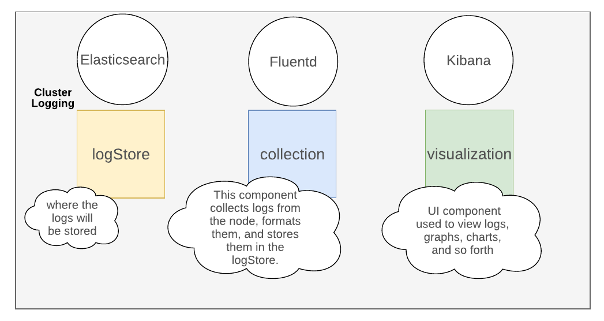
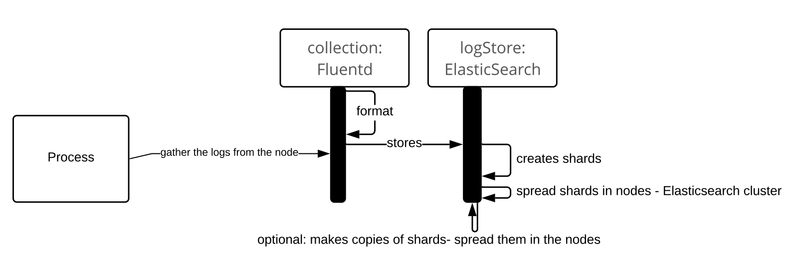

ifdef::revealjs_slideshow[]

[#cover,data-background-image="image/1156524-bg_redhat.png" data-background-color="#cc0000"]
== &nbsp;

[#cover-h1]
Advanced Red Hat OpenShift Deployment and Management

[#cover-h2]
Cluster Logging

[#cover-logo]
image::{revealjs_cover_image}[]

endif::[]

== Module Topics

* Cluster Logging Overview
* Logstore
* Logging Collector
* Logging Visualization
* Logging Curation
* Forwarding Logs to external Logstores

== Cluster Logging Overview

* Cluster Logging is not installed by the installer
** Unlike OpenShift 3
* Requires post installation configuration
** Deploy Elasticsearch Operator
** Deploy Cluster Logging Operator
* Configure Logging using the *Cluster Logging* custom resource

ifdef::showscript[]
=== Transcript

endif::showscript[]

== Cluster Logging Overview
.Logging Components

== Cluster Logging Overview
.Logging Components

* The major components of cluster logging are:
** Collection - This is the component that collects logs from the node, formats them, and stores them in the log store. The current implementation is *Fluentd*.
** Log Store - This is where the logs are stored. The default implementation is *Elasticsearch*. You can use the default Elasticsearch log store or forward logs to external log stores. The default log store is optimized and tested for short-term storage.
** Visualization - This is the UI component used to view logs, graphs, charts, etc. The current implementation is *Kibana*.
** Curation - This is the component that trims logs by age. The current implementation is *Curator*. Curation only applies to OpenShift 4.4 and earlier.

ifdef::showscript[]
=== Transcript

endif::showscript[]

== Logstore
.Overview

* OpenShift Container Platform uses *Elasticsearch (ES)* to organize the log data from Fluentd into datastores, or indices.
* Optionally, you can use the log forwarding features to forward logs to external log stores using Fluentd protocols, syslsog protocols, or the OpenShift Container Platform Log Forwarding API.
* The cluster logging Elasticsearch instance is optimized and tested for short term storage, approximately seven days.
** If you want to retain your logs over a longer term, it is recommended you move the data to a third-party storage system.
* Elasticsearch subdivides each index into multiple pieces called shards, which it spreads across a set of Elasticsearch nodes in an Elasticsearch cluster.
* You can configure Elasticsearch to make copies of the shards, called replicas.
* Elasticsearch also spreads these replicas across the Elasticsearch nodes.
* Each Elasticsearch node is deployed using a unique Deployment that includes its own storage volume.
* A highly-available Elasticsearch environment requires at least *three* Elasticsearch nodes, each on a different host.

ifdef::showscript[]
=== Transcript

endif::showscript[]

== Logging Collector
.Overview

* OpenShift Container Platform uses *Fluentd* to collect data about your cluster.
* The logging collector is deployed as a DaemonSet in OpenShift Container Platform
* By default, the log collector uses the following sources:
** journald for all system logs
** /var/log/containers/*.log for all container logs

ifdef::showscript[]
=== Transcript

endif::showscript[]

== Logging Visualization
.Overview

* OpenShift Container Platform uses *Kibana* to display the log data collected by Fluentd and indexed by Elasticsearch.
* Kibana is a browser-based console interface to query, discover, and visualize your Elasticsearch data through histograms, line graphs, pie charts, heat maps, built-in geospatial support, and other visualizations.
* Default configuration is rudamantary.
** Customization necessary to create desired reports etc.

ifdef::showscript[]
=== Transcript

endif::showscript[]

== Logging Curation (4.5 and newer)
.Configuring Log Retention Time

* You can specify how long the default Elasticsearch log store keeps indices using a separate retention policy for each of the three log sources:
** Infrastructure logs
** Application logs
** Audit logs.
* The retention policy, which you configure using the maxAge parameter in the Cluster Logging Custom Resource (CR), is considered for the Elasticsearch roll over schedule and determines when Elasticseach deletes the rolled-over indices.
* If you do not create a retention policy for any of the log sources, logs are deleted after *seven days* by default.
* Rolling over indices happens via 6 Cronjobs

ifdef::showscript[]
=== Transcript

* You can specify how long the default Elasticsearch log store keeps indices using a separate retention policy for each of the three log sources:
** Infrastructure logs
** Application logs
** Audit logs.
* The retention policy, which you configure using the maxAge parameter in the Cluster Logging Custom Resource (CR), is considered for the Elasticsearch roll over schedule and determines when Elasticseach deletes the rolled-over indices.

Elasticsearch rolls over an index, moving the current index and creating a new index, when an index matches any of the following conditions:

The index is older than than the rollover.maxAge value in the Elasticsearch CR.

The index size is greater than 40 GB × the number of primary shards.

The index doc count is greater than 40960 KB × the number of primary shards.

Elasticsearch deletes the rolled-over indices are deleted based on the retention policy you configure.

If you do not create a retention policy for any of the log sources, logs are deleted after seven days by default.

Rolling over indices happens via 6 Cronjobs
endif::showscript[]

== Logging Curation (4.4 and earlier)
.Overview

* The Elasticsearch Curator tool performs scheduled maintenance operations on a global and/or on a per-project basis.
** You *must* add configuration to the curator - or your disk *will* fill up.
* Curator performs actions daily based on its configuration.
* Only *one* Curator Pod is recommended per Elasticsearch cluster.
* In OpenShift 4.5 only used when the cluster has been upgraded from a previous release.

image::./images/curator_flow.png[width=100%]

ifdef::showscript[]
=== Transcript

endif::showscript[]

== Logging Curation (4.4 and earlier)
.Configuration

* Curator performs actions daily based on its configuration.
* Edit configmap `curator` in project `openshift-logging`
* Granular configuration down to project level

[source,sh]
----
spec:
  curation:
  type: "curator"
  resources:
  curator:
    schedule: "30 3 * * *" 
----

ifdef::showscript[]
=== Transcript

endif::showscript[]

== Logging Curation (4.4 and earlier)
.Deleting indeces

* In the configmap edit the file `config.yaml`
+
[source,sh]
----
config.yaml: |
  project_name:
    action
      unit:value
----

* *project_name*: The actual name of a project, such as myapp-devel. For OpenShift Container Platform operations logs, use the name .operations as the project name.
* *action*: The action to take, currently only delete is allowed.
* *unit*: The period to use for deletion, days, weeks, or months.
* *value*: The number of units

ifdef::showscript[]
=== Transcript

endif::showscript[]

== Logging Curation (4.4 and earlier)
.Example

[source,sh]
----
# Logging example curator config file

# uncomment and use this to override the defaults from env vars
.defaults:
  delete:
    days: 2

# to keep ops logs for a different duration:
.operations:
  delete:
    days: 3

.regex:
- pattern: '^project\..+\-dev\..*$'
  delete:
    days: 1
----

ifdef::showscript[]
=== Transcript

endif::showscript[]

== Logging Curation (4.4 and earlier)
.Run Curator Manually

* Curator installed as a Cronjob
* Create a job manually from a cronjob to force cleanup

.Example
[source,sh]
----
oc create job --from=cronjob/curator cleanup -n openshift-logging
----

ifdef::showscript[]
=== Transcript

endif::showscript[]

== Cluster Logging CR
.Common

* Full Documentation: link:https://docs.openshift.com/container-platform/4.5/logging/config/cluster-logging-configuring-cr.html[^]

[source,yaml]
----
apiVersion: "logging.openshift.io/v1"
kind: "ClusterLogging"
metadata:
  name: "instance"
  namespace: openshift-logging
spec:
  managementState: "Managed"
----

== Cluster Logging CR
.Log Store

[source,yaml]
----
  logStore:
    type: "elasticsearch" 
    retentionPolicy: <1>
      application:
        maxAge: 1d
      infra:
        maxAge: 7d
      audit:
        maxAge: 7d
    elasticsearch:
      nodeCount: 3
      resources:
        limits:
          memory: 16Gi
        requests:
          cpu: "1"
          memory: 16Gi
      storage:
        storageClassName: "gp2"
        size: "200G"
      redundancyPolicy: "SingleRedundancy"
----
<1> OCP 4.5 and newer

ifdef::showscript[]
=== Transcript

The `retentionPolicy` section replaces the role of the Curator in OCP 4.5+. For OCP 4.4 this section does not exist.

endif::showscript[]

== Cluster Logging CR
.Visualization

[source,yaml]
----
  visualization:
    type: "kibana"
    kibana:
      resources:
        limits:
          memory: 1Gi
        requests:
          cpu: 500m
          memory: 1Gi
      replicas: 1
----

== Cluster Logging CR
.Curation

[source,yaml]
----
  curation:
    type: "curator"
    curator:
      resources:
        limits:
          memory: 200Mi
        requests:
          cpu: 200m
          memory: 200Mi
      schedule: "*/10 * * * *"
----

== Cluster Logging CR
.Collection

[source,yaml]
----
  collection:
    logs:
      type: "fluentd"
      fluentd:
        resources:
          limits:
            memory: 1Gi
          requests:
            cpu: 200m
            memory: 1Gi
----

== Forwarding Logs to external Logstores
.Overview

* Elasticsearch and Cluster Logging must be installed
* Configure cluster logging to send logs to destinations outside of your OpenShift Container Platform cluster instead of the default Elasticsearch log store using the following methods:
** Fluentd forward protocol. Create a Configmap to use the Fluentd forward protocol to securely send logs to an external logging aggregator that accepts the Fluent forward protocol. Deprecated in 4.5
** Syslog. Create a Configmap to use the syslog protocol to send logs to an external syslog (RFC 3164) server. Deprecated in 4.5
** Log Forwarding API, currently in Technology Preview (on 4.5).
* Full Documentation: link:https://docs.openshift.com/container-platform/4.5/logging/cluster-logging-external.html[^]

ifdef::showscript[]
=== Transcript

endif::showscript[]

== Forwarding Logs to external logstores
.Log Forwarding API

* Log Forwarding API enables you to configure custom pipelines to send container and node logs to specific endpoints within or outside of your cluster.
* Can send logs by type to the internal OpenShift Container Platform Elasticsearch instance and to remote destinations not managed by OpenShift Container Platform cluster logging, such as an existing logging service, an external Elasticsearch cluster, external log aggregation solutions, or a Security Information and Event Management (SIEM) system.
* Can send different types of logs to different systems allowing you to control who in your organization can access each type.
* Optional TLS support ensures that you can send logs using secure communication as required by your organization.

ifdef::showscript[]
=== Transcript

endif::showscript[]

== Forwarding Logs to external logstores
.LogForwarding Example

[source,yaml]
----
apiVersion: "logging.openshift.io/v1alpha1"
kind: "LogForwarding"
metadata:
  name: instance <1>
  namespace: openshift-logging
spec:
  disableDefaultForwarding: true <2>
  outputs: <3>
   - name: elasticsearch <4>
     type: "elasticsearch" <5>
     endpoint: elasticsearch.openshift-logging.svc:9200 <6>
     secret: <7>
        name: fluentd
   - name: elasticsearch-insecure
     type: "elasticsearch"
     endpoint: elasticsearch-insecure.svc.messaging.cluster.local
     insecure: true <8>
   - name: secureforward-offcluster
     type: "forward"
     endpoint: https://secureforward.offcluster.com:24224
     secret:
        name: secureforward
  pipelines: <9>
   - name: container-logs <10>
     inputSource: logs.app <11>
     outputRefs: <12>
     - elasticsearch
     - secureforward-offcluster
   - name: infra-logs
     inputSource: logs.infra
     outputRefs:
     - elasticsearch-insecure
   - name: audit-logs
     inputSource: logs.audit
     outputRefs:
     - secureforward-offcluster
----

ifdef::showscript[]
=== Transcript
Forwarding cluster logs using the Log Forwarding API requires a combination of outputs and pipelines to send logs to specific endpoints inside and outside of your OpenShift Container Platform cluster.

If you want to use only the default internal OpenShift Container Platform Elasticsearch logstore, do not configure any outputs and pipelines.

An output is the destination for log data and a pipeline defines simple routing for one source to one or more outputs.

An output can be either:

elasticsearch to forward logs to an external Elasticsearch v5.x cluster, specified by server name or FQDN, and/or the internal OpenShift Container Platform Elasticsearch logstore.

forward to forward logs to an external log aggregation solution. This option uses the Fluentd forward protocols.

A pipeline associates the type of data to an output. A type of data you can forward is one of the following:

logs.app - Container logs generated by user applications running in the cluster, except infrastructure container applications.

logs.infra - Logs generated by both infrastructure components running in the cluster and OpenShift Container Platform nodes, such as journal logs. Infrastructure components are pods that run in the openshift*, kube*, or default projects.

logs.audit - Logs generated by the node audit system (auditd), which are stored in the /var/log/audit/audit.log file, and the audit logs from the Kubernetes apiserver and the OpenShift apiserver.

To use the Log Forwarding API, you create a custom logforwarding configuration file with outputs and pipelines to send logs to destinations you specify.

The following example creates three outputs:

* the internal OpenShift Container Platform Elasticsearch logstore,
* an unsecured externally-managed Elasticsearch logstore,
* a secured external log aggregator using the forward protocol.

Three pipelines send:

* the application logs to the internal OpenShift Container Platform Elasticsearch logstore,
* the infrastructure logs to an external Elasticsearch logstore,
* the audit logs to the secured device over the forward protocol.

<1>	The name of the log forwarding CR must be instance.
<2> Parameter to enable log forwarding. Set to true to enable log forwarding.
<3> Configuration for the outputs.
<4> A name to describe the output.
<5> The type of output, either elasticsearch or forward.
<6> The log forwarding endpoint, either the server name or FQDN. For the internal OpenShift Container Platform Elasticsearch logstore, specify elasticsearch.openshift-logging.svc:9200.
<7> Optional name of the secret required by the endpoint for TLS communication. The secret must exist in the openshift-logging project.
<8> Optional setting if the endpoint does not use a secret, resulting in insecure communication.
<9> Configuration for the pipelines.
<10> A name to describe the pipeline.
<11> The source type, logs.app, logs.infra, or logs.audit.
<12> The name of one or more outputs configured in the CR.
endif::showscript[]

== Forwarding Logs to external Logstores
.Enabling Log Forwarding API

* Must turn on the Log Forwarding API

+
[source,yaml]
----
apiVersion: "logging.openshift.io/v1"
kind: "ClusterLogging"
metadata:
  annotations:
    clusterlogging.openshift.io/logforwardingtechpreview: enabled <1>
  name: "instance"
  namespace: "openshift-logging"
spec:

[...]
  collection: <2>
    logs:
      type: "fluentd"
      fluentd: {}
----

ifdef::showscript[]
=== Transcript

<1> Enables and disables the Log Forwarding API. Set to enabled to use log forwarding. To use the only the OpenShift Container Platform Elasticsearch instance, set to disabled or do not add the annotation.
<2> The spec.collection block must be defined to use Fluentd in the Cluster Logging CR.
endif::showscript[]

== Forwarding Logs to external Logstores
.Example: User Created Elasticsearch

[source,yaml]
----
apiVersion: logging.openshift.io/v1alpha1
kind: LogForwarding
metadata:
  name: instance
  namespace: openshift-logging
spec:
  disableDefaultForwarding: true
  outputs:
    - name: user-created-es
      type: elasticsearch
      endpoint: 'elasticsearch-server.openshift-logging.svc:9200'
      secret:
        name: piplinesecret
  pipelines:
    - name: app-pipeline
      inputSource: logs.app
      outputRefs:
        - user-created-es
    - name: infra-pipeline
      inputSource: logs.infra
      outputRefs:
        - user-created-es
    - name: audit-pipeline
      inputSource: logs.audit
      outputRefs:
        - user-created-es
----

ifdef::showscript[]
=== Transcript

endif::showscript[]

== Summary

* Cluster Logging Overview
* Logstore
* Logging Collector
* Logging Visualization
* Logging Curation
* Forwarding Logs to external Logstores
