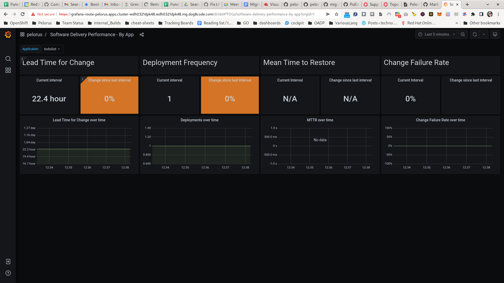

# Pelorus Samples & Use Cases: Todolist

## Lead Time for Change and Deployment Frequency

* "Lead Time for Change" utilizes the committime exporter to measure git commits
* "Deployment Frequency" utilizes the deploytime exporter to measure deployments

## Todolist application
* We'll need a sample application to measure the commits and deployments
  *  Fork [the konveyor mig-demo-apps repo](https://github.com/konveyor/mig-demo-apps) to https://github.com/your_org/mig-demo-apps
  * Note: We'll be using the todolist-mongo-go application

## Additional Reference
* [The definitive Pelorus install guide can be found on our readthedocs page.](https://pelorus.readthedocs.io/en/latest/Install/)

## Pelorus install steps
1. Create the pelorus namespace
```
oc create namespace pelorus
```
2. Install the required granfa and prometheus operators
```
helm install operators charts/operators --namespace pelorus
```
3. Install Pelorus
```
helm install pelorus charts/pelorus --namespace pelorus
```
4. Check the install
```
oc get all -n pelorus
```
***Note*** pause to allow the install to fully complete.

## Pelorus configuration
1. Make a copy of [the values.yaml file in the pelorus repo](https://github.com/konveyor/pelorus/blob/master/charts/pelorus/values.yaml) ([raw link for curl-ing](https://raw.githubusercontent.com/konveyor/pelorus/master/charts/pelorus/values.yaml)) and save it to /var/tmp/values.yaml
```
cp charts/pelorus/values.yaml /var/tmp/
```
2. Update the /var/tmp/values.yaml file with the following example:
```yaml
exporters:
  instances:
  - app_name: deploytime-exporter
    source_context_dir: exporters/
    extraEnv:
    - name: APP_FILE
      value: deploytime/app.py
    - name: LOG_LEVEL
      value: DEBUG
    - name: NAMESPACES
      value: mongo-persistent
    source_ref: master
    source_url: https://github.com/konveyor/pelorus.git
  - app_name: committime-exporter
    source_context_dir: exporters/
    extraEnv:
    - name: APP_FILE
      value: committime/app.py
    - name: LOG_LEVEL
      value: DEBUG
    source_ref: master
    source_url: https://github.com/konveyor/pelorus.git
```
3. [Documentation regarding values.yaml can be found on our readthedocs page.](https://pelorus.readthedocs.io/en/latest/Configuration/)
  Apply the updated values for Pelorus by executing:
```
helm upgrade pelorus charts/pelorus --namespace pelorus --values /var/tmp/values.yaml
```
***Note*** pause to allow the committime exporter pod to build and deploy.

Pelorus should now be installed and configured to measure the todolist sample app. We'll have to deploy the sample application to view measurements from Pelorus's Grafana dashboard.

## Todolist sample application install steps

1. git clone the forked copy of konveyor/mig-demo-apps
```
git clone https://github.com/your_org/mig-demo-apps.git
```
2. Install the todolist-mongo-go sample application
```
cd mig-demo-apps/apps/todolist-mongo-go
export GITHUB_ORG=<YOUR_REAL_GITHUB_FORK_ORG>
sed -i.original 's/your_org/${GITHUB_ORG}/g' mongo-persistent.yaml
oc create -f mongo-persistent.yaml
```

The todolist application and mongo database should now build and deploy into the mongo-persistent namespace.

3. Check the build
```
oc get all -n mongo-persistent
```
***Note*** pause to allow the todolist pod to build and deploy.

## View the Pelorus measurements

1. In your OpenShift Pelorus project page, open the link to granafa or get the link via the cli:
```
oc get route grafana-route -o=go-template='https://{{.spec.host | printf "%s\n" }}'
```
2. Navigate to *"pelorus / Software Delivery Performance - By App"*
3. Select the todolist application

You should now see at least one measurement for "Lead time for Change" and "Deployment Frequency"




## Optional Developer steps

1. Fork the Pelorus git repo
To develop a Pelorus exporter please fork the Pelorus git source and branch
  * Fork [the pelorus repo](https://github.com/konveyor/pelorus) to https://github.com/your_org/pelorus

2. If you have forked Pelorus to a private git repository
Create a GitHub Personal Access Token and store it as a secret in Openshift:
```
oc create secret generic github-secret --from-literal=API_USER=<username> --from-literal=TOKEN=<personal access token> --namespace pelorus
```

Ensure you configure the exporters in /var/tmp/values.yml to use the github-secret:
```
exporters:
  instances:
  - app_name: deploytime-exporter
    source_context_dir: exporters/
    extraEnv:
    - name: APP_FILE
      value: deploytime/app.py
    - name: LOG_LEVEL
      value: DEBUG
    - name: NAMESPACES
      value: mongo-persistent
    source_ref: master
    source_url: https://github.com/your_org/pelorus.git
  - app_name: committime-exporter
    env_from_secrets:
    - github-secret
    source_context_dir: exporters/
    extraEnv:
    - name: APP_FILE
      value: committime/app.py
    - name: LOG_LEVEL
      value: DEBUG
    source_ref: master
    source_url: https://github.com/your_org/pelorus.git
```

3. Setup the Pelorus developer environment
```
cd pelorus
make dev-env
source .venv/bin/activate
```

4. Execute the exporters locally after Pelorus is installed
* committime
```
oc login --token=<token> --server=<server>
cd pelorus/exporters/committime
./app
```
* deploytime
```
oc login --token=<token> --server=<server>
cd pelorus/exporters/deploytime
./app
```


