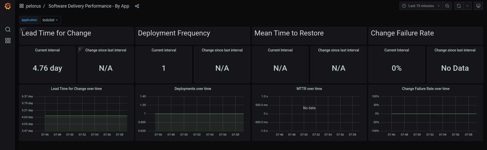

# Pelorus Demo

## Mean Time to Restore and Change Failure Rate

* `Mean Time to Restore` utilizes the failure exporter to measure bug resolution and bug resolution time stamp.
* `Change Failure Rate` utilizes the failure exporter to measure bug creation and creation time stamp.

## Todolist application
* We'll use the same forked Github repository that was used previously in the todolist-mongo example.  There is no need to refork the konveyor/mig-demo-apps git repository if you have a fork.
  *  Fork [the konveyor mig-demo-apps repo](https://github.com/konveyor/mig-demo-apps) to https://github.com/your_org/mig-demo-apps
  * Ensure that `Github Issues` are enabled in your Github settings.
     * https://github.com/your_org/mig-demo-apps/settings

## Additional Reference
* [The definitive Pelorus guide can be found on our readthedocs page.](https://pelorus.readthedocs.io/)

## Assumptions
- oc command line tools installed
- Logged into OCP Cluster
- Pelorus is installed and running
- The [todolist-mongo](todolist_commit_deploy.md) sample is deployed and the Lead Time for Change and Deployment Frequency measurements are monitoring the todolist application.
- Github issues are enabled in https://github.com/your_org/mig-demo-apps/settings<nbws><nbws>



## Goals
- Create and resolve bugs in Github issues that exercise Pelorus metrics
- View the changes to the `Mean Time to Restore` and `Change Failure Rate` metrics.


## Pelorus configuration
1. Make a copy of [the values.yaml file in the pelorus repo](https://github.com/konveyor/pelorus/blob/master/charts/pelorus/values.yaml) ([raw link for curl-ing](https://raw.githubusercontent.com/konveyor/pelorus/master/charts/pelorus/values.yaml)) and save it to /var/tmp/values.yaml
```
cp charts/pelorus/values.yaml /var/tmp/
```
2. Update the /var/tmp/values.yaml to match the following text. You may already have the deploytime and committime exporters configured from a previous example.

>Note:
> * A users [Github personal access token](https://github.com/settings/tokens) is required
> * The `PROJECTS` key's value is the fork of the mig-apps-demo repository.


```yaml
exporters:
  instances:
  - app_name: deploytime-exporter
    exporter_type: deploytime
    source_ref: master
    extraEnv:
    - name: NAMESPACES
      value: mongo-persistent
  - app_name: committime-exporter
    exporter_type: committime
    source_ref: master
  - app_name: failure-exporter
    exporter_type: failure
    source_ref: master
    extraEnv:
     - name: PROVIDER
       value: github
     - name: TOKEN
       value: ghp_J<snip>
     - name: PROJECTS
       value: <your_org>/mig-demo-apps
```
3. Documentation regarding values.yaml can be found on our [readthedocs page.](../docs/Configuration.md)
  Apply the updated values for Pelorus by executing:
```
helm upgrade pelorus charts/pelorus --namespace pelorus --values /var/tmp/values.yaml
```

>Note: pause to allow the failure exporter pod to build and deploy.

4. Check the output from the failure exporter.  No bugs should be found at this time.
```
curl $(oc get route -n pelorus failure-exporter -o=template='http://{{.spec.host | printf "%s\n"}}')
```

## Github Issues

### Configuration: Enable the appropriate tags

Pelorus will utilize two tags to determine if a Github issue is associated with the todolist-mongo application.  We'll need the default `bug` tag. Additionally, Pelorus requires that all issues associated with a particular application be labelled with the `app.kubernetes.io/name=<app_name>` label.  This works the same way as the deployment configuration.

* Navigate to https://github.com/your_org/mig-demo-apps/issues
  * Required Github issue tags:
    * `bug`
    * `app.kubernetes.io/name=todolist`


### Create a Github issues

Now we will create an issue in Github and set the appropriate labels.
Pelorus will register an issue as a deployment failure only if it is labeled as a `bug` and labeled with the application name `app.kubernetes.io/name=todolist`

1. Create a Github issue and label it appropriately to register a failure.


2. Now refresh the Grafana dashboard and you should see the Change Failure Rate go up.


3. Let's now create a non critical bug. A bug that does not indicate a deployment failure in your todolist application.  A the bug label however do *not* add the application label


4. Ensure that issue #2 is not impacting our failure rate metric by curl-ing the output of the failure exporter.

```
curl $(oc get route -n pelorus failure-exporter -o=template='http://{{.spec.host | printf "%s\n"}}')
```

*  Issue #1 should be found in the output of the curl.  Issue #2 will not be registered as a deployment failure because the issue is *not* tagged with `app.kubernetes.io/name=todolist`

>Note: Notice the message `failure_creation_timestamp`.  This indicates the time the issue was created.

```
failure_creation_timestamp{app="todolist",issue_number="1"} 1.654704543e+09
```

5. Now lets resolve issue #1 and see how that impacts our `Failure Rate` and the `Mean Time to Restore`

* close issue #1


* Check the output from the failure exporter again and we should see a `failure_resolution_timestamp`, which indicates when a bug was closed.

```
curl $(oc get route -n pelorus failure-exporter -o=template='http://{{.spec.host | printf "%s\n"}}')


failure_creation_timestamp{app="todolist",issue_number="1"} 1.654704543e+09
failure_resolution_timestamp{app="todolist",issue_number="1"} 1.654705784e+09
```

* Now we should also data in the `Mean Time to Restore` metric in Grafana


